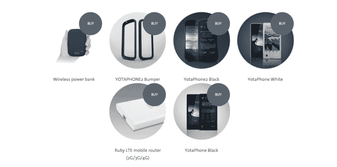

# 香港投资者以 1 亿美元收购俄罗斯双屏安卓手机制造商与太 65%的股份 

> 原文：<https://web.archive.org/web/https://techcrunch.com/2015/10/23/hong-kong-investor-buys-65-of-russias-yota-maker-of-dual-screen-android-phones-for-100m/>

# 一名香港投资者以 1 亿美元收购俄罗斯双屏安卓手机制造商与太 65%的股份

根据[的一份监管文件](https://web.archive.org/web/20221208065720/http://www.hkexnews.hk/listedco/listconews/sehk/2015/1019/LTN20151019121.PDF)，销售双屏安卓智能手机的俄罗斯公司与太设备在股东 Telconet Capital 以 1 亿美元的价格将其持有的 64.9%的股份出售给在香港上市的 [REX Global Entertainment](https://web.archive.org/web/20221208065720/http://www.rex-ent.com/en) 后有了新主人。

与太凭借一款独特的双屏智能手机引起了人们的注意，这款手机通过在背面提供电子墨水屏幕来瞄准日益同质化的手机设计。它的第一款设备——简称与太手机——于 2012 年 12 月问世，随后在欧洲、俄国和中东的 20 个市场销售。与太没有披露销售数据，但媒体报道显示销售情况不佳。

不过，这款设备确实在那些喜欢与众不同的人中间吸引了一批追随者，它的第二次发布——[与太手机 2](https://web.archive.org/web/20221208065720/https://beta.techcrunch.com/2014/02/23/next-gen-yotaphone/)——更受欢迎。事实上，[与太自己的 Indiegogo 运动](https://web.archive.org/web/20221208065720/https://beta.techcrunch.com/2015/05/19/yota-launches-crowdfunder-to-get-its-duel-screen-e-ink-smartphone-to-the-u-s/)将这款外形怪异的手机引入美国，最终获得了近 30 万美元的认捐，大大超过了最初 5 万美元的目标。

与太在德国、加拿大、芬兰、新加坡和俄国都设有办事处，但它之前曾表示，中国是其最重要的关注点，在北京、上海和深圳都设有办事处。

“就销量而言，中国将是最大的市场，这一点毫无疑问，”与太首席执行官弗拉德·马丁诺夫在二月份接受路透社采访时说。

鉴于 Telconet Capital 对中国的兴趣，它向一家亚洲投资者出售资产是有一定道理的，尽管这家投资者没有直接的智能手机经验。雷克斯环球娱乐公司的商业利益包括游轮，赌场，房地产，甚至伽马射线照射服务(！).

在撰写本文时，与太电话公司和 REX Global Entertainment 的代表没有回应我们关于投资的问题。(我们会在听到更多细节后更新这篇文章。)

尚不清楚与太对新投资者有什么计划，但我们怀疑，除了加大在中国的投入，它还将密切关注亚洲新兴市场的机会，特别是印度和东南亚。一加(Alibaba)和小米(Xiaomi)等其他安卓手机制造商一直专注于这些地区，在这些地区，智能手机的采用仍相对较新，但设备销量继续以两位数和三位数的速度增长。

马丁诺夫已确认将于下月在 T2 举行的 TechCrunch 中国活动上发表演讲，因此我们应该很快就会对即将发生的事情有一个更完整的了解。

与太设备公司的前身是其母公司的电信业务，主要提供移动宽带服务和无线设备。成立于 2006 年的与太作为首批 WiMAX 提供商之一而闻名，尽管今天它已经在俄罗斯超过 9 个城市提供 4G-LTE 服务。

[帽子尖 eu](https://web.archive.org/web/20221208065720/http://tech.eu/brief/hong-kong-company-buys-65-of-russias-yota-devices-for-100-million/)