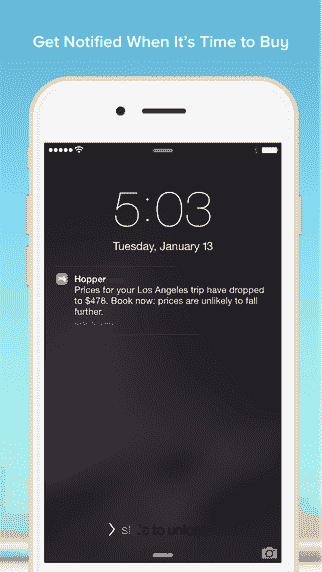
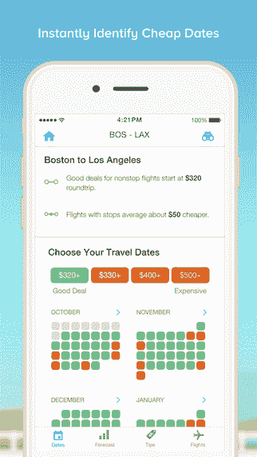

# Hopper 为一款告诉你最佳飞行时间的旅行应用筹集了 1600 万美元 

> 原文：<https://web.archive.org/web/https://techcrunch.com/2016/03/29/hopper-raises-16-million-for-a-travel-app-that-tells-you-the-best-time-to-fly/>

一款便捷的旅行应用软件的开发者[Hopper](https://web.archive.org/web/20221025222535/https://beta.techcrunch.com/2015/01/28/hoppers-new-travel-app-tells-you-the-best-time-to-fly/)告诉你最好的飞行时间，以便找到最好的交易，现在它已经筹集了额外的资金来继续发展业务。它还与美国航空公司建立了合作关系，允许它通过自己的应用程序销售 AA 的机票。在新的投资方面，该公司宣布在一轮增长融资中获得 1600 万美元，由 BDC Capital IT Venture Fund 牵头。现有投资者，包括 OMERS Ventures、共犯(前身为 Atlas Venture)和 Brightspark Ventures 也参与其中。

这使得这家初创公司迄今为止的融资总额达到 3800 万美元。

虽然旅行领域竞争激烈，但 Hopper 开发了一个有用的应用程序，可以帮助那些寻找更简单的方法来计算出*何时起飞，以便节省机票钱。它的预测引擎使用来自“数十亿”跟踪航班价格的数据和分析，来建议旅客何时应该购买机票。该公司声称，由于其服务，它能够为客户节省下 40%的下一次航班费用。*

虽然跟踪不断变化的机票价格是一件复杂的事情，但这些数据是通过 Hopper 的应用程序以易于阅读的格式呈现给 Hopper 的最终用户的。在这里，顾客可以查看彩色编码的日历，显示哪些日子是可以负担得起的(绿色)，一直到昂贵的日子(红色。)您还可以观看旅行，获得详细的预测数据，在票价下降时收到提醒等。

对顾客来说，最终结果是不用多付钱就能买到票——尽管更灵活的旅行日期当然会有所帮助。

Hopper 的另一个有趣之处是，它完全专注于通过移动应用程序而不是网站来交付产品。据 Hopper 的首席执行官兼创始人、Expedia 前副总裁弗雷德里克·拉隆德(Frederic Lalonde)称，该公司并不是一家“移动优先”的初创公司，而是“仅移动*”*

 *“我们从根本上相信，某种形式的移动应用体验将会接管所有的商务，”他说。“我们所做的一切都基于移动设备。除此之外，我们是一家非常注重沟通的公司，因为我们 90%的销售额来自推送通知。”

换句话说，当 Hopper 提醒用户现在是购买的时候时，他们就会购买。

虽然该公司没有披露其收入，但拉隆德会说，与其服务相关的一切都在以每月约 40%的速度增长，他相信今年夏天该应用程序的下载量将达到每月 100 万次。

Hopper 还是一家比较年轻的公司。它于 2015 年初发布，同年被苹果评为最佳应用第七名。它也是美国 App Store 排名第四的旅游应用，在几十个国家排名第一。

迄今为止，该应用程序已被下载超过 300 万次，并监测了超过 500 万次观看的旅行的票价，总预订价值超过 45 亿美元。该公司还向用户发送了超过 3800 万条推送通知，仅上个月就发送了 730 万条。

自首次亮相以来，Hopper 的准确性也有所提高，现在它声称，在预测未来一年的实际票价 5 美元以内的票价方面，其准确性达到了 95%。但是 Lalonde 指出，虽然 Hopper 自去年以来已经将其性能提高了 3 %,但这是在重要的领域——例如假日旅游。

除了新的资金，Hopper 现在还与美国航空公司签署了一项协议，将在其应用程序中提供美国航空公司和美国鹰航空公司的票价。这包括每天飞往 50 多个国家近 350 个目的地的约 6，700 次航班。这是值得注意的，因为 AA 是为数不多的坚持在 Hopper 提供票价的公司之一

如今，这款应用支持几乎所有主要航空公司的票价。该公司的商业模式包括航空公司的补偿和向消费者收取的 5 美元便利费。

[gallery ids="1298774，1298773，1298772，1298771"]

有了新的资本，Hopper 计划在蒙特利尔和剑桥扩大其 25 人的团队。

它很快将推出许多新功能，允许它向用户推送推荐，并提供更个性化的体验。例如，用户将能够指定一些事情，如避免长时间中途停留的愿望或有利于常规机票的超低成本票价，该应用程序将建议用户可能不知道寻找的事情，例如替代机场。

这家初创公司还计划在年底前增加对国际旅行的关注，重点是更准确的定价，无论用户在哪里预订。*