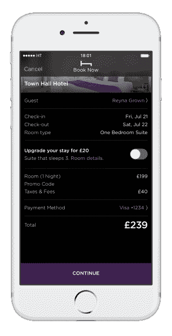

# HotelTonight 现在让您以 50%的折扣升级到套房 

> 原文：<https://web.archive.org/web/https://techcrunch.com/2017/07/26/hotel-tonight-now-lets-you-upgrade-to-a-suite-for-50-off/>

# HotelTonight 现在让您以 50%的优惠升级到套房

hotel night 刚刚推出了一项新功能，让用户以低廉的价格升级到套房。如果可用，该选项将在结账时弹出，并且价格始终低于标准升级价格的 50%。乍一看，应用程序中的价格似乎很实惠——一些酒店提供不到 50 美元的升级，只有少数酒店定价数百美元的升级。

HotelTonight 表示，这是客户和酒店要求最多的新功能。

虽然酒店会选择自己的套房类型来列出，但 HotelTonight 有一些房间必须满足的特定标准，比如有单独的座位或用餐区，并且比标准房间至少大 20%。

对旅行者的好处是显而易见的——住在酒店的每个人都想要一个更大的房间或套房，而这并不总是最容易得到的。通常只有最高级别的忠诚计划会员才能获得免费套房升级，而大多数酒店都不愿意以全价以外的价格提供套房。

“当传统在线旅游网站提供升级时，通常只不过是更高的楼层，这使得‘升级’一词在很大程度上毫无意义。对于 HotelTonight,“升级”意味着套房，简单明了。现在，只有手机版的最后一分钟预订应用程序才能提供这样的便捷和节省，”HotelTonight 首席执行官 Sam Shank 解释道。

这种升级功能对酒店来说也非常有价值。房产可以通过追加销售原本空置或未售出的套房来创造额外收入。这也让酒店有机会展示他们最好的房间，希望游客会非常喜欢它们，下次他们会提前支付。

正如传统客房价格一样，升级价格将根据夜间需求而变化，HotelTonight 要求所有升级价格至少比标准升级费用低 50%。如果你不想等到结账时才知道酒店是否提供升级，你可以在搜索栏中输入城市名称，然后输入“升级”(“迈阿密升级”)，专门搜索当晚有升级的酒店。