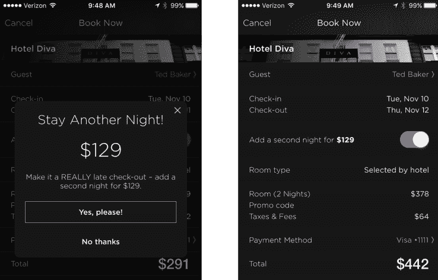

# HotelTonight 今晚推出+1，吸引客人多住一晚 

> 原文：<https://web.archive.org/web/https://techcrunch.com/2015/11/19/hoteltonight-launches-tonight-1-to-tempt-guests-to-stay-an-extra-night/>

# 酒店之夜今晚+1 推出，吸引客人多住一晚

[hotel night](https://web.archive.org/web/20221208205116/https://www.hoteltonight.com/)，最后一刻酒店预订应用程序，刚刚推出了一个名为“今夜+1”的新功能，允许用户在退房时增加第二晚，以获得额外的折扣。

它是这样工作的:当可用时，今晚+1 将在结账时自动出现，提示用户增加额外的住宿一晚。

只有当第二晚的价格与第一晚相同或比第一晚便宜时，才会显示第二晚的价格，并且通常会包括第二晚价格的 30%的额外折扣。

虽然这项新功能肯定会让那些想要多一天假期或需要超晚退房的顾客受益，但它也将使酒店能够吸引客人承诺比平时提前第二晚入住。

例如，该公司表示，他们三分之一的重复预订来自同一城市的同一客户，这意味着可能有很大一部分客户会在一晚住宿之间更换酒店。

通过今晚+1 提供额外折扣，酒店现在可以锁定那些已经预订了第二晚不同酒店的客人。

值得注意的是，该功能仅在结账时可用，这意味着该公司不会提示用户在住宿期间增加额外的一晚。然而，当被问及时，HotelTonight 表示，在客人入住期间的其他时间提供“今夜+1”是他们将来会考虑的事情。

这项新功能是在该公司裁员 20%的一周后推出的。然而，HotelTonight 的创始人兼首席执行官山姆·尚克(Sam Shank)表示，这不会改变公司的整体方向，主要是“一项战略举措，将使我们能够实现增长和收入目标。”