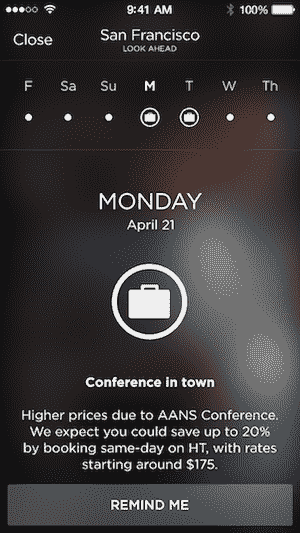

# HotelTonight 在其最后一分钟预订应用 TechCrunch 中增加了预测价格和可用性

> 原文：<https://web.archive.org/web/https://techcrunch.com/2014/04/15/hoteltonight-look-ahead/>

# HotelTonight 在其最后一分钟预订应用程序中增加了预测价格和可用性

[hotel night](https://web.archive.org/web/20221006003102/http://www.hoteltonight.com/)推出了一项新功能，这应该会让用户对他们能否通过当天预订应用程序获得房间更有信心。

有了这项新功能，HotelTonight 用户现在可以点击“展望”按钮，这将显示他们未来七天的估计价格和可用性。它还将显示可能会影响酒店客房需求的事件，如大型会议。

联合创始人兼首席执行官山姆·尚克认为，前瞻功能允许用户“自发地计划”例如，你可能不确定在某个晚上是否需要酒店，但是因为你担心当地的节日会使你很难得到一个负担得起的房间，所以你还是提前几周预订。

但是现在你可以提前检查酒店，在最后一分钟也能放心预订，因为你知道，用 Shank 的话说，“我们会支持你的。”

他补充说，HotelTonight 对其前瞻估计“非常有信心”。他说，该系统最初是为公司内部使用而构建的，现在正在向用户发布，因为该团队已经“向自己证明”它是可行的。

“酒店也很喜欢这里，”尚克说。“这有助于填满房间，并通过给他们更多自然的方式带来更多的客人。”

前瞻性预测最初将在纽约市、拉斯维加斯、洛杉矶、迈阿密、华盛顿、DC、芝加哥、旧金山、圣地亚哥和达拉斯提供。