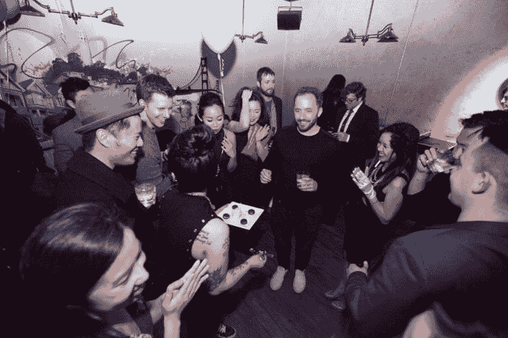

# 休斯顿、卡兰尼克和扎克走进头条 

> 原文：<https://web.archive.org/web/https://techcrunch.com/2017/03/10/houston-kalanick-and-zuck-walk-into-a-headline/>

和一家名为 SPiN 的酒吧，他们在那里打乒乓球的照片让周五的科技媒体心情大好。

原因？在休斯顿生日派对的同时，SPiN 也举办了自己独立的以“蒂凡尼的早餐”为主题的“宝贝与舞会”派对。

让我们从头开始:

上周末，Dropbox 首席执行官兼创始人德鲁·休斯顿(Drew Houston)在旧金山 Mission District 的 Babu Ji 举行了一场晚宴，庆祝他的生日，脸书首席执行官马克·扎克伯格和优步首席执行官特拉维斯·卡兰尼克出席了晚宴。

晚餐后，这群人去旧金山的 SPiN 打乒乓球。这就是“宝贝和球:蒂凡尼的早餐”派对发挥作用的地方。

三位首席执行官打乒乓球的照片出现在[“宝贝们&球”脸书相册](https://web.archive.org/web/20221210033607/https://www.facebook.com/pg/SPiNSanFrancisco/photos/?tab=album&album_id=1760758840919965)中，这就是他们如何在这场令人不快的光学狗屎风暴中结束的。

[gallery ids="1463487，1463482，1463481，1463444，1463447，1463443"]

目前还不清楚扎克伯格和卡兰尼克是否知道“Babes & Balls”派对将在 SPiN 举行，但休斯顿被列为前往/前往脸书的 BAB 派对。我们联系了 Dropbox，该公司没有立即回复我们的询问。如果有回音，我们会更新帖子。

我们还采访了派对的主持人陈艾湄、CMO，询问休斯顿的生日派对是否与宝贝们的舞会有关。

她说，她的朋友(出席了休斯顿的生日晚宴)知道“BAB”派对，是她安排在 SPiN 为该团体设立空间的。

“这个聚会根本不是为德鲁举办的，”常说。“他们只是碰巧在我们聚会的时候来了。因为是他的生日，我们像对待许多客人一样，拿出了生日甜点。”

显然，当一些科技界(也只是……世界上)最有影响力的人把他们的照片放在[【宝贝们】& Balls【脸书相册】](https://web.archive.org/web/20221210033607/https://www.facebook.com/pg/SPiNSanFrancisco/photos/?tab=album&album_id=1760758840919965)中时，看起来并不太好，尤其是如果其中一个人真的回复了以这个名字命名的活动。

当晚在 SPiN 的一位消息人士告诉 TechCrunch，扎克不知道他们要去一个俱乐部，也不知道这个聚会叫“宝贝与球”。其他消息来源告诉《财富》杂志《T4》，卡拉尼克在到达之前也不知道派对的主题。

这位优步公司的首席执行官将度过艰难的几周，尤其是在性别歧视方面。该公司最近因性骚扰指控而饱受抨击，这种文化要么保护性骚扰，要么忽视性骚扰。

更不用说卡兰尼克与一名优步司机就工资问题争吵的[视频](https://web.archive.org/web/20221210033607/https://beta.techcrunch.com/2017/02/28/in-video-uber-ceo-speaks-openly-about-impact-of-competitors-on-pricing/)或者最近曝光的[“灰球”](https://web.archive.org/web/20221210033607/https://www.nytimes.com/2017/03/03/technology/uber-greyball-program-evade-authorities.html)程序，据称优步利用该程序阻挠世界各地打击拼车服务的当局。

因此，当卡兰尼克、休斯顿和扎克参加一个名为“宝贝和舞会”的派对的消息浮出水面时，随之而来的头条新闻是不可避免的:

*   优步首席执行官特拉维斯·卡兰尼克和马克·扎克伯格在一个名为“宝贝和球”的派对上打乒乓球
*   优步首席执行官特拉维斯·卡兰尼克和马克·扎克伯格在“宝贝和舞会”派对上庆祝朋友的生日
*   马克·扎克伯格和特拉维斯·卡兰尼克在“宝贝和舞会”派对上开怀大笑
*   性别歧视的科技巨头因参加独家“美女与舞会”派对而受到抨击

在如此大的压力下，卡兰尼克想放松一下，和朋友们享受一个有趣的夜晚，这是有道理的。众所周知，他也按自己的规则行事，而且[会在事后](https://web.archive.org/web/20221210033607/https://beta.techcrunch.com/2017/02/28/travis-kalanick-apologizes-for-blowing-up-at-uber-driver-who-complained-about-drop-in-pay/)道歉，如果有的话。

但是你会希望那些塑造我们文化的人，每天为数以千计的年轻创业者树立榜样的人，会认识到公众对参加一个名为 Babes & Balls 的聚会的看法。他们有责任代表世界各地的广大劳动力、行业和企业家。

也就是说，如果扎克和卡兰尼克不知道他们来到了 SPiN 的 Babes & Balls 之夜——除了名字，据说相当平淡——我不知道什么是“正确”的行动方针。他们都离开了吗？他们拒绝拍照吗？他们离开后才知道派对的名字吗？

没有证据表明休斯顿、卡兰尼克和扎克除了和奥运会乒乓球运动员张丽莉打乒乓球之外，在 SPiN 做了其他事情。)并享用甜点。

是的，休斯顿知道他要去参加一个名为 Babes & Balls 的活动，他的回复证明了这一点。当然，他应该更加小心，避免将自己和他的朋友置于这种境地。但他没有说出派对的名字。所以我将我最大的判断保留给 SPiN 和陈艾湄，这是一个最严重的性别歧视，但也是有史以来最不聪明的头韵。

科技行业目前正“陷入”对其对待女性的态度和观点的公开指责，这就是一个相对蹩脚的生日派对如何成为新闻的原因。它强调了人们越来越意识到科技领域性别歧视的光学和现实。社区的免疫系统正在觉醒——让我们希望它能解决一些非常现实的问题，比如女性在科技工作场所的薪酬、雇佣和待遇。