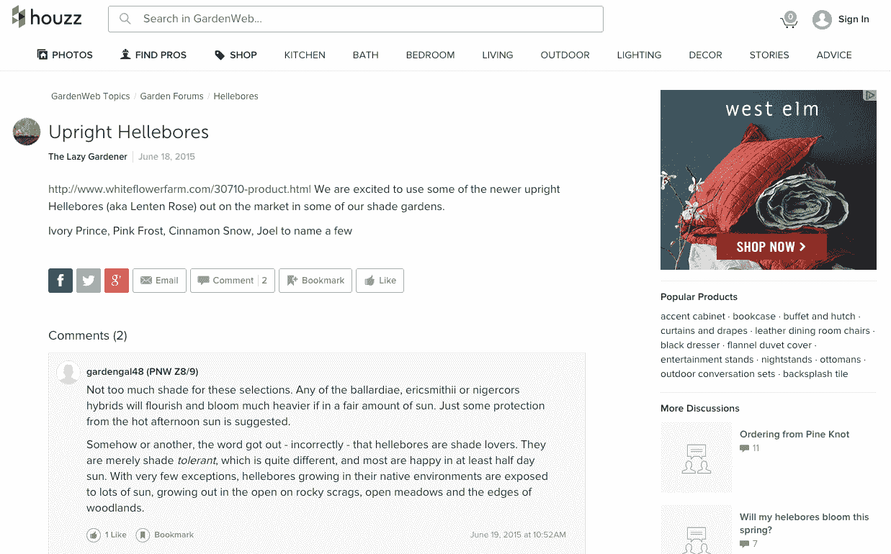

# Houzz 从 NBC 环球收购了家居和园艺社区网站 GardenWeb

> 原文：<https://web.archive.org/web/https://techcrunch.com/2015/08/25/houzz-acquires-home-and-gardening-community-site-gardenweb-from-nbcuniversal/>

# Houzz 从 NBC 环球收购了家庭和园艺社区网站 GardenWeb

在过去几年的几次大规模融资后， [Houzz](https://web.archive.org/web/20230403113116/http://www.houzz.com/) 现在进行了第一次收购。该公司今天宣布，它已经从 NBC 环球收购了[花园和家庭社区网站](https://web.archive.org/web/20230403113116/http://www.gardenweb.com/)，收购金额未披露。

GardenWeb 是 iVillage 网站组合的一部分，NBC 在 2006 年收购了 iVillage(iVillage 现在是 Today.com)。据 Houzz 称，该网站目前在其论坛上拥有超过 280 万个讨论线程，共有 1400 万个帖子，涉及 400 个讨论主题。论坛上的话题从关于职业范围的问题[到关于莫利斯的讨论](https://web.archive.org/web/20230403113116/http://ths.gardenweb.com/discussions/3322512/shopping-for-a-60-professional-range-consider-this)[等等。](https://web.archive.org/web/20230403113116/http://forums.gardenweb.com/discussions/1675831/help-with-my-molly-fish)

Houzz 说，它的网站上现在有超过 3500 万个独一无二的人，其中 90%是房主。这个网站已经有了自己的论坛，据 Houzz 称，每个月都有“数百万人”参与其中。

Houzz 已经开始将 GardenWeb 的论坛整合到自己的网站中，并对 GardenWeb 进行了全面的重新设计，但目前看来该网站将继续使用自己的域名。正如公司发言人告诉我们的，“GardenWeb 本身就是一个充满活力的社区，我们一直致力于为这两个社区创造最佳的网络体验。”

“我们很高兴欢迎难以置信的 GardenWeb 社区加入 Houzz，它与我们的社区成员一样热爱家园和花园，”Houzz 首席执行官 Adi Tatarko 今天在一份录音声明中说。“通过 Houzz 平台将 GardenWeb 充满活力和参与度的用户、论坛和资源结合在一起，将为统一的社区提供更丰富的内容体验。”

该公司今天还推出了它的前两个电视广告。

Houzz 已经在四轮中为筹集了总计 2.136 亿美元的资金。毫不奇怪，这家自 2009 年成立以来经历了快速增长的公司现在正考虑进行收购，以推动增长和扩大营销努力。