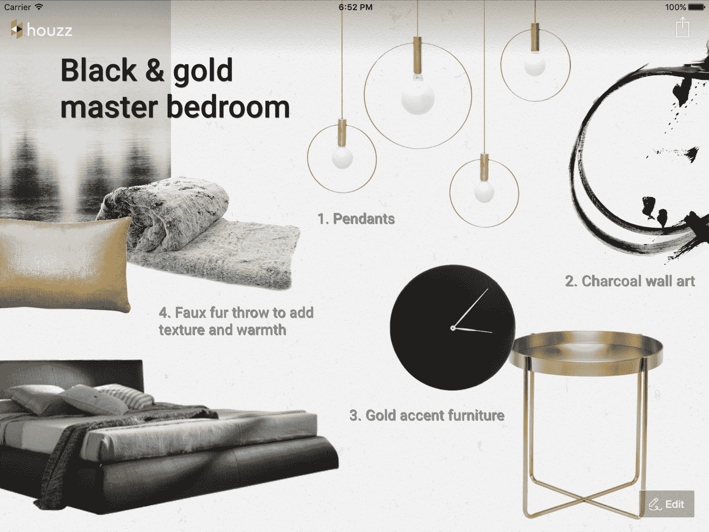

# Houzz 为其 iOS 应用程序 带来了新的协作工具

> 原文：<https://web.archive.org/web/https://techcrunch.com/2015/12/10/houzz-brings-new-collaboration-tools-to-its-ios-apps/>

热门服务 Houzz 为你提供房屋嫉妒，并为你联系合适的家庭专业人士来治愈它，今天它为其 iOS 用户推出了一个有趣的新功能。新的草图功能使房主更容易在服务上标注照片，以便与室友和专业人士讨论他们的改造想法。

该公司今天还宣布，现在[每月有超过 3500 万独立用户](https://web.archive.org/web/20230403113128/https://techcrunch.com/2015/09/22/houzz-ceo-adi-tatarko-wants-to-redefine-the-term-unicorn/)，超过 100 万家庭专业人士(即承包商、设计师、建筑师等。)也在使用这项服务。大约一年前，Houzz 称其每月有 2500 万独立用户。

这项服务已经筹集了 2.14 亿美元，目前活跃在美国、英国、澳大利亚、法国、德国、俄罗斯、日本、意大利、西班牙、瑞典和丹麦。

“我们一直在寻找方法，让家居装修和设计过程变得更加有趣和富有成效，”Houzz 总裁兼联合创始人阿龙·科恩说。“Sketch 是hous ZZ应用中一个强大的新功能，它使人们能够将hous ZZ的产品添加到任何照片中，并通过照片与他们的家庭专业人员或参与该项目的其他人更有效地交流和协作。”

用户将能够上传他们自己的图片或目前该服务上 800 万张照片中的任何一张，并向其中添加来自 Houzz Marketplace 的产品、贴纸和文本(并根据需要调整所有这些内容的大小)。不出所料，他们还可以在图片上画画。这也不一定是一个孤独的过程。用户可以同时与多人就他们的设计想法进行协作。

除了允许用户处理照片(现在网站上的每张照片上都出现了 Sketch 按钮)，Sketch 还提供了情绪板和平面图支持。

Houzz 团队告诉我，草图功能也已经针对 iPad Pro 和 Apple Pencil 进行了优化。一位公司发言人告诉我，Android 版本也正在开发中，应该会在未来几周内推出。

这里的想法显然是为了帮助 Houzz 加深其用户和专业人士之间的联系。但这也有一个货币化的部分。显然，Houzz 不仅仅是将用户与专业人士联系起来，还希望他们回到它的服务中来使用市场(然后可能从市场中购买)。

