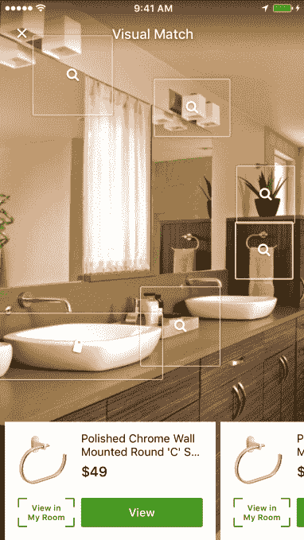

# Houzz 现在使用深度学习来帮助你在其照片中找到并购买产品

> 原文：<https://web.archive.org/web/https://techcrunch.com/2016/09/14/houzz-now-uses-deep-learning-to-help-you-find-and-buy-products-in-its-photos/>

# Houzz 现在使用深度学习来帮助你在它的照片中找到并购买产品

由于它拥有大量漂亮的照片，家居改造平台 [Houzz](https://web.archive.org/web/20230403112857/http://www.houzz.com/) 可以很容易地给你一个家庭羡慕的大案例。但是如果你想让你的家达到那些家的标准，Houzz 早就允许你买那些照片里看到的产品了。现在，该公司让购买更多产品变得更加容易。该服务现在使用一种新的基于深度学习的系统，该系统扫描照片，并将其与产品数据库中的桌子、灯具、沙发、镜子或管道固定装置进行比较。

 Houzz 目前拥有 1100 万张家庭照片，并向其用户提供来自 15000 家商家的约 600 万件产品。该公司早在 2014 年就推出了市场。虽然 Houzz 没有透露其服务上实际销售了多少商品，但该公司表示，2015 年购买的商品总数增加了四倍。当然，这可能意味着该公司在 2015 年销售了四个烛台，但鉴于移动和网络上每月有 4000 万个独一无二的烛台，这个数字可能会更高。Houzz 表示，其最畅销的产品是浴缸和沙发等高价商品。

“人们来Houzz是因为他们想在一个地方获得改善他们的家园所需的一切，从灵感到实施，”Houzz 的联合创始人兼总裁阿龙·科恩在今天的声明中说。“视觉匹配让人们更容易根据灵感采取行动，使他们能够在 Houzz 应用程序中查看照片，点击照片中他们喜欢的产品，并在购买前使用“我房间的视图”在自己的空间中查看产品。”

假设其市场是 Houzz 收入的主要驱动力，那么仅仅因为它现在可以向用户展示更多相关产品，就能够销售更多产品，这对该公司来说将是一件大事。

这一举动也表明了深度学习在电子商务中的应用，当谈到应用这种技术时，这通常不是你首先想到的事情。