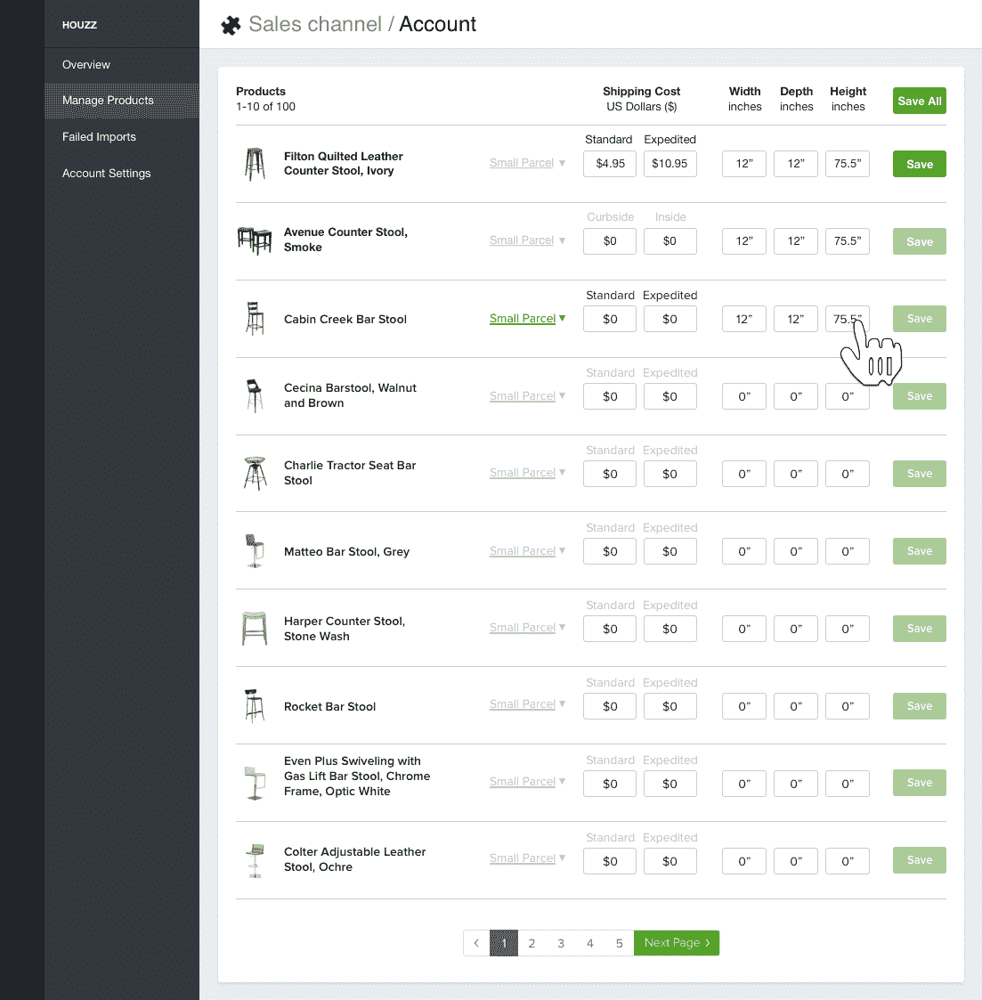

# Houzz 向第三方供应商开放其商业 API

> 原文：<https://web.archive.org/web/https://techcrunch.com/2016/03/22/houzz-opens-its-commerce-api-to-third-party-vendors/>

# Houzz 向第三方供应商开放其商业 API

专注于让你羡慕房子的房屋改造网站 Houzz ，今天宣布向第三方开发者开放其商业 API。

虽然你可能主要把 Houzz 看做一个移动应用程序和网站，以漂亮的家居改造摄影为特色，努力将你与这些项目背后的专业人士联系起来，但这项服务也以[蓬勃发展的市场](https://web.archive.org/web/20230403113131/http://www.houzz.com/photos/lighting)为特色，[旨在](https://web.archive.org/web/20230403113131/https://www.houzz.com/sell)向你出售完成下一次厨房或浴室改造所需的产品。

正如 Houzz 团队告诉我的，它最近推出的[在我的房间里查看功能](https://web.archive.org/web/20230403113131/http://www.houzz.com/ideabooks/61877912/list/inside-houzz-introducing-view-in-my-room)，让你看到某个产品在你家里会是什么样子，也推动了相当多的销售。通过 Houzz 应用程序购买东西的用户中，大约有一半使用了该功能。

该公司表示，目前其网站上有来自 10，000 多家商家的约 500 万种产品。

Houzz 总裁兼联合创始人 Alon Cohen 告诉我，这个 API 将对所有销售家用商品的商家开放。科恩说:“我们知道，商家希望以快速、无缝的方式与 Houzz 集成，以提交产品、处理订单并保持库存最新，而商业 API 将帮助我们提供这种体验。”。

例如，Houzz 新 API [的发布伙伴是 Shopify](https://web.archive.org/web/20230403113131/http://shopify.com/houzz) ，它现在为用户提供了一个 Houzz 销售渠道。通过这个渠道，Shopify 用户可以在 Houzz 上发布他们的产品，而那些使用不同服务的用户将能够使用新的 API 来整合他们现有的后端系统和 Houzz 的系统。

目前，使用该 API 还没有相关的成本。

想要访问 API 的潜在合作伙伴可以在这里申请(那些已经在 Houzz 上获得批准的卖家可以从该服务的卖家中心页面申请)。

