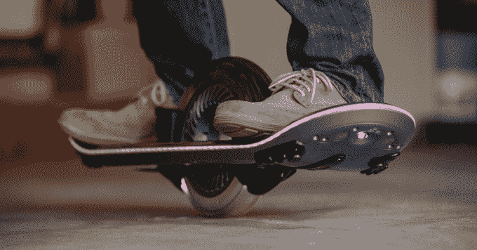
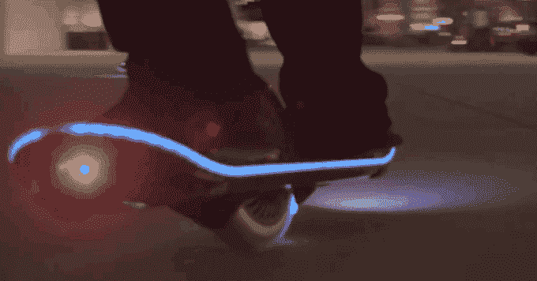
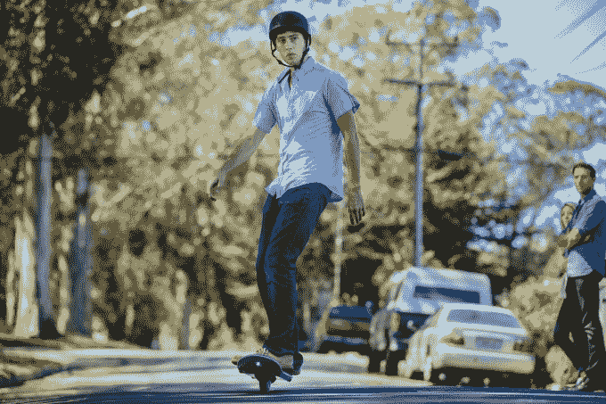
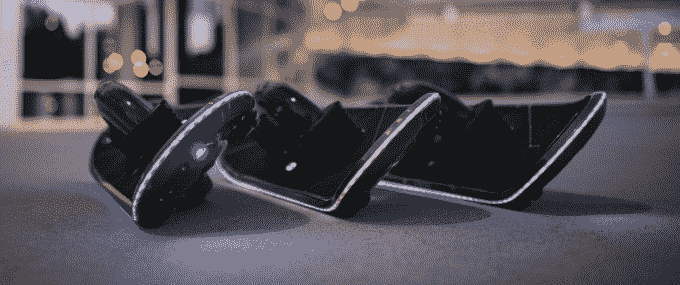

# 骑上这个他们称之为“悬浮滑板”的独轮陀螺滑板

> 原文：<https://web.archive.org/web/https://techcrunch.com/2015/09/01/hoverboard-technologies/>

创办了[悬浮滑板技术](https://web.archive.org/web/20221206193539/http://www.hoverboard.com/)的疯狂科学家称他的飞行器是一次“挣来的体验”这意味着它很难骑。尽管名字如此，这个悬浮滑板并不会悬浮。相反，它使用像赛格威一样的陀螺仪来帮助你在中间一个巨大的直排轮式车轮的两侧保持平衡。

悬浮滑板技术公司今天发布了一个预览视频，并将于 9 月 17 日在 Kickstarter 上以大约 4000 美元的价格上市，明年发货。

悬浮滑板*由一个电动马达驱动，随着你的倾斜加速或刹车。转弯时，你不会像普通的滑板或滑雪板那样转移重心，而是扭动腰部来改变方向。

[* =我将把这款设备称为悬浮板，但要明确的是，它不像真正的磁悬浮板那样悬浮，例如 [Hendo 悬浮板](https://web.archive.org/web/20221206193539/https://beta.techcrunch.com/2014/12/07/an-elevated-experience/)。

我花了一个小时试图掌握这个悬浮滑板的窍门，最后我可以轻快地走直线，几乎不转弯也不会掉下来。这是一个相当陡峭的学习曲线，因为我拥有一个助推板电动滑板，已经玩了 12 年的长板，会滑雪，还能站在冲浪板上。

这是迄今为止我尝试过的最强悍的个人电动车。预计一开始会有很多挫折，类似于学习滑雪板。即使那样，我也不确定你会不会想用这玩意上下班。

从好的方面来看，它每次充电 15 英里的里程数超过了大多数电动滑板，它的时速可以达到 20 英里。充电需要一到两个小时，或者用可选的增压器大约 12 分钟。据说它可以上山。该板由镁等高质量组件制成，并且是模块化的，因此您可以将其拆开、更换零件或自己修理。

不幸的是，电池寿命和高级硬件使它非常重——大约 20 到 25 磅。它很难手提，也不适合放在背包里。费用也高得令人望而却步。除非你是某个富有的极限运动迷或者想宠坏你的孩子，否则我不确定谁会买。

不过，这从来都不是重点。罗伯特·比格勒(Robert Bigler)在以一堆战利品卖掉他的机器人自动化初创公司 Animatics 后，发明了这种陀螺滑板。他曾梦想有一个悬浮滑板，并决心将它变成现实。他告诉我，如果 Kickstarter 失败了，他只会为朋友和家人做几十块板，然后就此打住。

如果这个东西在一年前推出，可能会引起更大的轰动。但从那以后，Arx Pax 和雷克萨斯推出了一些真正的(尽管由于需要金属地板而不切实际)悬浮滑板。每个人都把那些 HoverTrax/Cyboard 迷你赛格威误标为悬浮滑板。

最终，这可能只是一个富有的科学家的中年危机，而不是交通的飞跃。但是你可以花你的财富发明更糟糕的东西。