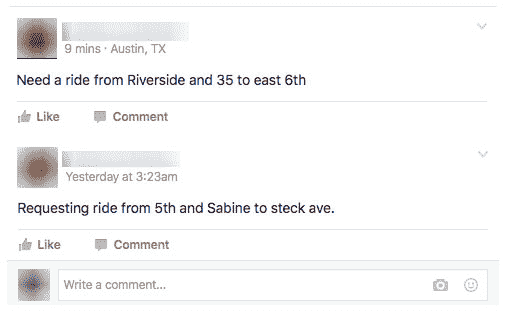
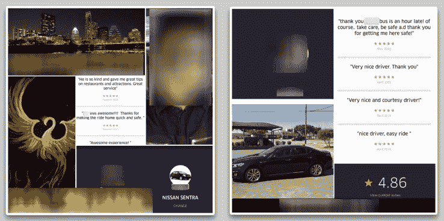

# 一个拥有 3 万名成员的脸书集团如何填补优步和 Lyft 留下的空白

> 原文：<https://web.archive.org/web/https://techcrunch.com/2016/06/07/how-a-30k-member-facebook-group-filled-the-void-left-by-uber-and-lyft-in-austin/>

整整一个月前，[优步和 Lyft 暂停了在奥斯丁的运营](https://web.archive.org/web/20230328202921/https://techcrunch.com/2016/05/07/uber-and-lyft-shutdown-in-austin-after-voters-defeat-proposition-1/),此前选民否决了 1 号提案，该提案试图推翻对优步和 Lyft 司机进行强制性指纹背景调查的规定。

美国第 11 大城市的近百万居民现在失去了可靠的交通选择，即优步和 Lyft，没有人真正知道会发生什么。

虽然一些守法的应用程序涌现出来取代了优步和 Lyft 的位置，但似乎大量需求已经转移到了一个不太可能的提供商——一个不受监管的 P2P 脸书集团。

该团体名为[街机城 Austin / Request A Ride](https://web.archive.org/web/20230328202921/https://www.facebook.com/groups/ArcadeCityAustin/) ，目前拥有超过 3 万名成员。那么它是如何工作的呢？

骑手发布他们的请求，这通常是接送目的地以及期望的时间(大多数是尽快)。然后，在几分钟内，潜在的司机会回复 ETA，价格和电话号码，以确认取件。然后，乘客被要求在确认乘车后删除帖子，以免弄乱页面。

司机们甚至开始张贴定制的“宣传册”图片，通常有他们的汽车照片，他们的优步或 Lyft 账户截图(显示他们已经通过背景调查)，以及电话号码。

虽然它完全以点对点的方式运营，但该组织是由 [Arcade City](https://web.archive.org/web/20230328202921/http://arcade.city/) 创建的，这是一个新的拼车应用程序，虽然尚未推出，但希望最终提供一个完全分散的拼车解决方案，包括支付、身份和声誉管理。

这到底是什么意思？

好吧，街机城将允许乘客和司机决定费用并自行处理付款——无论是现金、文莫还是拥抱。虽然该应用程序将处理信用卡支付作为一种方便的功能，但这不是一种必要的甚至是不鼓励的支付方式。

虽然这似乎可行，但当你开始试图搞清楚背景调查和身份验证时，去中心化就变得更加棘手了。但是 Arcade City 相信他们有一个解决方案可以保护乘客，同时仍然保持分散。

这家初创公司解释说，每个司机都将有一个配置文件，可以嵌入脸书或 Twitter 的配置文件，背景调查，联邦调查局检查，驾驶执照，物理地址证明，等等。每个司机都可以根据自己的喜好附加或多或少的验证选项，应用程序将使用这些选项来汇编一个分数，总结每个司机的可信度。从本质上说，由于骑手总是可以选择他们的司机，选择不验证的司机应该被淘汰出平台。

分散模式也意味着他们公司不会提供商业拼车保险，但会向用户显示他们的司机是否亲自携带保险，这样他们就可以在上车前做出自己的决定。

这当然为主要的安全责任敞开了大门，比如车手可能会选择一个未经验证或保险的车手。即使拱廊城将责任转移到了玩家身上，如果发生事故，他们的公关仍然会受到影响。

更别提这个脸书集团的巨额负债了。尽管司机会发布他们的优步应用程序的图片，以表明他们得到了平台的批准和背景调查，但这些图片很容易被伪造。总会有一个明确的风险，那就是你进入了一个完全陌生的人的车，这个人从来没有背景调查，甚至可能没有有效的驾照。

但是现在，这个组织似乎在起作用。通过创建脸书集团，Arcade City 能够利用奥斯汀在过去一个月中面临的交通空白，现在拥有超过 3 万名热切的客户群，希望一旦推出，他们能够迁移到自己的应用程序。

*更新阐明街机城的保险政策。*