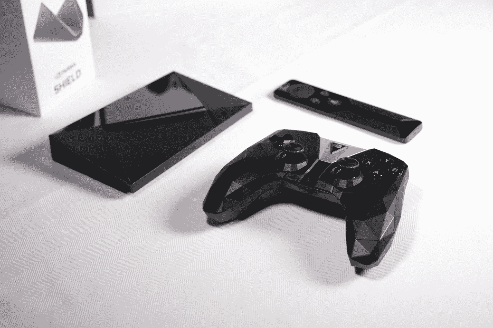
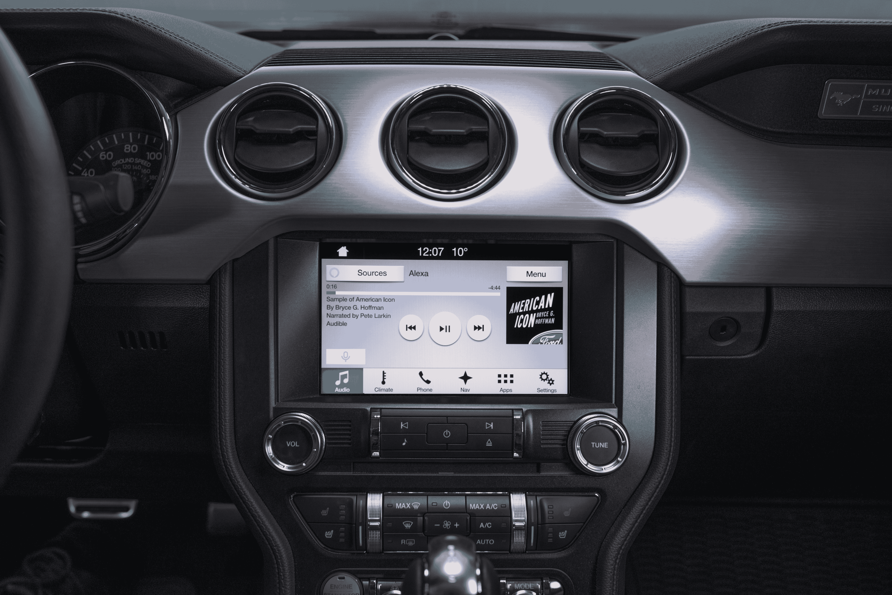

# 亚马逊和英伟达如何赢得今年的 CES 

> 原文：<https://web.archive.org/web/https://techcrunch.com/2017/01/08/how-amazon-and-nvidia-won-ces-this-year/>

今年的 CES 在生产领域方面展示了相当广泛的组合，从可穿戴设备到健康，到虚拟现实等类别都有大量的代表——但明显的赢家是两家公司，两家公司的成功主要是通过合作伙伴关系，而不是直接展示自己的消费产品。

## 英伟达是如何胜出的

在这两家公司中，英伟达的存在要直接得多；GPU 制造商的首席执行官黄仁勋(Jen-Hsun Huang)做了开场主旨发言，并在三部分的演示中加入了大量新闻。英伟达也有自己的展厅，包括无人驾驶汽车展示，展示了自己的测试车 BB8，以及一辆配备相同软件和硬件的奥迪 Q7，它也可以无人驾驶。

英伟达的[核心业务已经成为几乎所有其他规模和重要性的科技公司的核心业务](https://web.archive.org/web/20230109063927/https://techcrunch.com/2017/01/05/nvidia-hits-prime-time-at-ces-this-year/)；人工智能是谷歌、脸书、苹果和其他公司感兴趣和投资的主要领域之一，英伟达的 GPU 使人们有可能创建神经网络和服务器系统，在广泛的人工智能保护伞下支持机器学习、图像识别和其他技术。

与此同时，英伟达的消费者业务也取得了一些重大进展。例如，新的 Shield TV 看起来很棒，今年晚些时候将推出的谷歌助手功能可以帮助它实现成为你需要的唯一客厅娱乐和智能家居设备的目标。

同样，英伟达的流媒体服务也利用了其在 GPU 技术方面的巨大进步，为动力不足的 PC 和 MAC 等设备提供比游戏机质量更好的远程游戏流媒体，这些设备通常无法提供高水平的游戏体验。与英伟达从人工智能无处不在和自动驾驶汽车的大趋势中受益的能力相比，这两者和 Shield 业务线仍然是适度的，但这是一个整洁的对冲，有很大的潜力可挖。此外，Nvidia 是虚拟现实领域的强大玩家，这是 CES 上的另一个趋势，尽管它仍然是一个缓慢的燃烧，但有足够的空间和注意力。

## 亚马逊是如何胜出的

零售巨头亚马逊在 CES 上也几乎无处不在，没有太多的官方存在。该公司的 Alexa 虚拟助手基本上出现在任何有意义的地方——甚至在某些地方它肯定不会出现。

然而，Alexa 的出现大部分是受欢迎的。例如，对于虚拟助理来说，冰箱是一个完美的地方，因为它已经基本上是一个日历、购物和待办事项列表，只是没有磁铁。[福特的车载 Alexa 与 SYNC 3 的集成是一个天才之举](https://web.archive.org/web/20230109063927/https://techcrunch.com/2017/01/04/fords-going-to-put-alexa-in-cars-starting-later-this-year/)，这可能有助于汽车制造商在预测下一波车载体验时取得早期领先，这很可能集中在虚拟的语音助手上。

这只是 Alexa 在 CES 上出现的无数地方中的两个，即使公司没有宣传与亚马逊助手软件的新集成，他们也在提醒媒体和与会者以前的技能介绍，包括现代的 Blue Link 软件，以及宝马的 Alexa 功能连接集。

亚马逊很早就开始确保 Alexa 对所有想要加入的硬件和软件制造商开放，这有助于通过基本的功能集和 Echo 硬件使这款助手从一开始就受到用户的喜爱。CES 只是展示了这些努力走向成熟的开始，2017 年可能会在这方面取得更多进展。

## 潮流引领者

亚马逊和英伟达今年赢得了 CES，不是因为他们在制造任何让其他人刮目相看的特定消费电子产品，而是因为他们同时成为了许多领域的关键运营商，吸引了公众和其产品服务于公众的公司的注意力。很少遇到个人玩家能够产生这种深远影响的 CES，但 2017 年闪电两次击中了这两位科技巨头。