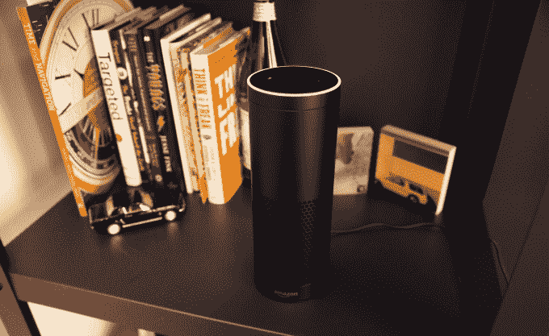

# 亚马逊如何将混合现实带入客厅 

> 原文：<https://web.archive.org/web/https://techcrunch.com/2015/07/24/how-amazon-could-drive-blended-reality-into-the-living-room/>

长期以来，亚马逊一直在积累计算机视觉专业知识。并将继续这样做。在 [LinkedIn 上搜索该公司的计算机视觉职位](https://web.archive.org/web/20221209205813/https://www.linkedin.com/job/amazon/%22computer-vision%22-jobs/?trk=jserp_companies_xlinks)，目前返回了 50 多个职位——大部分分布在研究和软件工程岗位上。但是，这家电子商务巨头对能够感知周围世界的技术的兴趣，真的比看上去的要大吗？

亚马逊新生的无人机送货项目 [Prime Air](https://web.archive.org/web/20221209205813/https://beta.techcrunch.com/2014/08/20/despite-faa-setbacks-amazon-prime-air-makes-notable-engineering-nasa-and-aerospace-hires/) ，是雇佣具有机器学习和计算机视觉基础的科学家的一个明显驱动力，因为无人机需要在现实世界环境中导航。如果你正在追逐一个自动送货无人机的梦想，[就像亚马逊是](https://web.archive.org/web/20221209205813/https://beta.techcrunch.com/tag/amazon-prime-air/)一样，那么精确的物体检测和动态防撞是必不可少的。

同样，亚马逊迄今为止进军智能手机[的尝试也遭遇了失败](https://web.archive.org/web/20221209205813/https://beta.techcrunch.com/2014/10/23/amazon-fire-phone-flops/)，去年推出了首款 Fire 手机。这款手机的旗舰功能是一个 [3D 界面](https://web.archive.org/web/20221209205813/https://beta.techcrunch.com/2014/06/18/amazons-fire-phone-uses-depth-and-3d-effects-to-stand-out/)，它使用来自四个前置摄像头的数据在屏幕上生成三维效果，通过计算观众的目光落在哪里来计算。

这款设备还有一个按钮触发的条形码和物体扫描功能，名为 [Firefly](https://web.archive.org/web/20221209205813/https://beta.techcrunch.com/2014/06/18/amazons-fire-phone-introduces-firefly-a-feature-that-lets-you-identify-and-buy-things-you-see-the-real-world/) ，让你可以将手机用作一种“电子商务魔杖”——其后置摄像头成为识别现实世界中物品的眼睛(同样由计算机视觉驱动)。

之后，只需轻轻一点，就能买到你刚刚找到的东西。这当然仍然是这家电子商务巨头的优先事项，它将扩大服务，提供更多激励措施，让人们继续在 Amazon.com 购物。

在基本层面上，计算机视觉指的是寻找方法为计算机提供处理和理解视觉数据的能力的研究领域——就像人脑解释通过人眼接收的光线一样。将机器学习添加到 CV 系统中，你就有了一种自适应算法，可以解释更多的动态视觉数据，例如[微软的 Kinect 传感器](https://web.archive.org/web/20221209205813/https://beta.techcrunch.com/2014/06/05/developers-can-now-pre-order-the-new-kinect-for-windows-sensor-for-199/)能够识别各种人的身体姿势。或者[谷歌的无人驾驶汽车](https://web.archive.org/web/20221209205813/https://beta.techcrunch.com/topic/subject/google-driverless-car/)能够在各种环境和路况下自主导航。

前亚马逊高级科学家的 LinkedIn 个人资料中有一个有趣的细节(截屏如下)，他写道，在 2013 年 11 月离开公司之前，他一直在从事 Firefly 的工作，这指向了亚马逊仍然“藏在引擎盖下”的一个“重大”计算机视觉项目:

与此同时，亚马逊相对较新的设备首席技术官，[乔恩·麦科马克](https://web.archive.org/web/20221209205813/https://www.linkedin.com/in/jonmccormack)，前雅虎工程副总裁，于今年 3 月加入该公司，在他的 LinkedIn 个人资料中有一个更通用的说明——称他正在致力于“打造让你惊喜的产品”。产品，复数。

TechCrunch 了解到，该公司已经联系了至少一家英国初创公司，将计算机视觉技术应用于时尚电子商务领域——尽管目前尚不清楚该公司在这一阶段的意图是什么。也就是说，它是在寻求建立合作伙伴关系，还是在四处寻找收购潜力——也许是为了填补其一些突出的计算机视觉空缺。

加强其无人机专业知识仍然是一种可能，特别是考虑到 Prime Air 无人机技术是亚马逊位于英国剑桥的 R&D 实验室的 R&D 重点，正如我们去年 11 月报道的[。该实验室配备了许多前 Broadcom 工程师，他们是在亚马逊关闭其位于剑桥的图像处理部门后被亚马逊聘用的。当然也需要高端计算机视觉智能来自主执行精密的无人机送货操作。但 Prime Air 绝对不是一个仍在引擎盖下的亚马逊项目。早在 2013 年 12 月](https://web.archive.org/web/20221209205813/https://beta.techcrunch.com/2014/11/11/amazon-cambridge-lab/)[日](https://web.archive.org/web/20221209205813/https://beta.techcrunch.com/2013/12/01/amazon-is-experimenting-with-autonomous-flying-delivery-drones/)，杰夫·贝索斯本人就在美国电视黄金时段公开了他对无人驾驶飞机送货的愿景。

所以，除了无人机，亚马逊还会考虑用计算机视觉技术颠覆什么呢？

# 盯着它

另一个在我看来很有潜力的现有产品是[亚马逊 Echo](https://web.archive.org/web/20221209205813/https://beta.techcrunch.com/tag/amazon-echo/) :它的连接扬声器加语音助手( [Alexa](https://web.archive.org/web/20221209205813/https://beta.techcrunch.com/2015/06/25/amazon-unbundles-alexa-virtual-assistant-from-echo-with-new-dev-tools/) )，可以获取信息并响应各种命令，以及[控制其他一些智能家居设备](https://web.archive.org/web/20221209205813/https://beta.techcrunch.com/2015/04/08/amazon-echo-can-now-control-your-smart-home/)。

鉴于第一代 Echo 不包括摄像头，任何未来的版本都将是相当新的和不同的东西。可以说，一个有大脑、耳朵和眼睛的连接扬声器…

亚马逊 Echo 之所以有趣，有几个原因。首先，这似乎是该公司在硬件方面的成功，至少与 Fire Phone 相比是如此。在这一点上，它也不是真正能与任何[的竞争对手小发明](https://web.archive.org/web/20221209205813/https://beta.techcrunch.com/2015/01/21/robotics-co-jibo-says-domo-arigato-to-25-3-million-in-cash/)直接竞争的产品。或者还没有大规模市场渗透。它因与众不同而脱颖而出，而在智能手机领域情况正好相反，在智能手机领域，[亚马逊要想取得任何成功都面临着一场艰难的攀登。](https://web.archive.org/web/20221209205813/https://beta.techcrunch.com/2014/07/23/amazon-fire-phone-review/)

回声也很有趣，因为它生活的地方。这是一款家用产品，可能通常放在客厅的某个地方。也许就在用户的电视旁边，在他们沙发的听力范围内。可以说，它处于一个黄金位置，可以充当一个语音激活设备，可以将媒体内容传输到另一个屏幕(比如电视或用户的智能手机)。

现在想象一下，如果你给 Echo 增加一个摄像头，它也可以向用户显示他们自己和他们客厅的实时视频。为什么会有意思呢？用来自亚马逊在线市场的数字化产品来增强这些实时视觉效果，Echo 可能是打开亚马逊虚拟市场的桥梁技术，并将数字试穿和可视化带到购物者的家中——只需说“Alexa，让我穿上红色的裙子”,让计算机视觉技术来完成剩下的工作……

通过帮助消费者直观地看到适合和合身的衣服来降低退货率，仍然是电子商务的一个持续挑战，尤其是在购买服装时。时尚是变化无常的，合身是棘手的。

多家初创公司正在虚拟试衣间领域尝试解决这一问题，它们采用了许多不同的方法——从刚刚被乐天收购的[fits . me](https://web.archive.org/web/20221209205813/https://beta.techcrunch.com/2015/07/12/rakuten-buys-virtual-fitting-room-startup-fits-me-in-a-fashion-commerce-play/)的机器人人体模型，它可以根据消费者的尺寸进行调整，以显示衣服可能的样子；到[易贝拥有的 PhiSix](https://web.archive.org/web/20221209205813/https://beta.techcrunch.com/2014/02/19/ebay-acquires-phisix-to-integrate-3-d-virtual-try-on-technology-across-the-marketplace-and-more/) ，它开发了 3D 衣服建模技术；到总部位于伦敦的 [Metail](https://web.archive.org/web/20221209205813/https://beta.techcrunch.com/2014/10/17/metail/) ，它从 2D 的照片中创建了购物者的真实感 3D 人体模型，并将衣服数字化，以便消费者可以在虚拟的数字肖像上试穿零售商的产品

鉴于易贝和乐天等其他在线市场巨头正在涉足虚拟试衣间领域，亚马逊推出自己的产品肯定只是时间问题。

有什么比肖像更好的呢？当然是真货。如果你想让一个人的直播视频看起来非常流畅，用数字化的衣服或配饰来增强它无疑是一个技术挑战。但它不需要新的技术飞跃(挑战更多的是后端的图形处理能力，以及以现实方式渲染和模拟织物/材料移动的软件)。事实上，通过网络摄像头进行的虚拟试戴已经存在于更静态的产品中，如眼镜。亚马逊总是可以在交错的阶段实现这种功能，比如首先提供更多静态的产品，如配件或家具供试穿/展示。

> 完成这项工作所需的所有技术都已经存在——现在的问题是把它们放在一起并很好地打包。

它甚至可以在不给 Echo 增加摄像头的情况下提供这种选择——比如通过与一家已经为时尚购物创建 3D 人体模型的初创公司合作，并通过数字相似性路线进行虚拟试穿。但是，使用任何一种数字人体模型，无论多么逼真，作为消费者的替身，仍然会在购物者和产品之间设置一层屏障。一个真正个性化的虚拟购物体验应该是既更真实又更具互动性的。换句话说，是真实和数字的结合。因此，混合虚拟现实/增强现实开始看起来可能非常适合电子商务。

“这方面的技术已经存在。而且实际上是以非常低的功耗形式，”奥利弗·伍德福德说，当时我勾画了一个 Echo 的场景，用相机作为桥梁，使亚马逊购物者能够试穿数字化的 3D 产品。“我认为实现这一目标所需的所有技术都已经存在——问题是把它们放在一起，并很好地打包。”

“如果你想把你的客厅变成一个市场，本质上你想把产品放在那个区域，这正是(微软)Hololens 所做的。它会实时计算你房间的几何形状，并把虚拟的东西投射到房间里。微软已经拥有这项技术，”他补充道。

“实时部分是跟踪，这是(微软)Kinect 已经可以做到的……我认为 Kinect 背后的技术是众所周知的，我当然认为亚马逊有可能相对直接地复制这一点。”

伍德福德拥有计算机视觉相关研究的博士学位，目前是 3D 图像捕捉应用程序 [Seene](https://web.archive.org/web/20221209205813/https://beta.techcrunch.com/2013/10/19/seene-uses-computer-vision-to-create-unique-and-eerie-3d-images-on-iphone/) 的高级科学家，之前曾在东芝和夏普工作过，研究计算机视觉的不同应用。谈到电力需求，他指出 Seene 正在使用智能手机硬件来计算和捕捉 3D 图像。

“我们赋予人们在手机上捕捉 3D 世界的能力。特别是目前我们正在努力捕捉他们自己的脸，然后他们就可以在视频游戏和虚拟环境中使用，”他说，并补充说:“手机正变得越来越强大。特别是，如果你能利用他们的 GPU 的力量，他们会非常强大。”

毫无疑问，如果目标是在移动的身体上实时准确地 3D 建模织物窗帘，处理的复杂性可能会急剧增加。但亚马逊通过其 AWS 云计算平台拥有大量后端处理能力。它的员工中也有很多计算机视觉专家。

伍德福德表示，亚马逊在其 R&D 实验室和 AWS 积累了“大量的专业知识”。“他们不断提供新技术，比如机器学习工具箱，”他指出。“所以他们肯定有丰富的专业知识来整合这些东西，如果不收购有专业知识的小初创公司是他们习惯做的事情的话。”

时间框架呢？微软 Kinect 传感器的产品开发过程从构思到推出消费产品大约需要四到五年的时间。从那时起，计算机视觉领域显然已经从大量研究中受益，伍德福德认为亚马逊*可以在更短的时间内——比如说在未来两年内——推出回声传感器，前提是企业完全支持这一想法，并尽一切努力将这样的产品推向市场。*

或许，通过计算机视觉的力量在购物者家中打开亚马逊市场的更大挑战，与其说是开发有效的传感和建模技术，不如说是拥有足够多的可以利用它的数字库存。毕竟，Kinect 可以说受到了数量有限的游戏和其他有效利用其身体跟踪功能的内容的限制。但是，创业公司已经在致力于简化将衣服等产品以数字 3D 形式呈现出来的流程，并降低将现实世界的物体转化为 3D 模型的成本。

> 我们正致力于在您的手机上捕捉 3D 世界。这是亚马逊市场上的商家可以非常便宜地将他们的 3D 产品推向市场的一种方式。

“实际上，有很多企业都在解决这个问题，”伍德福德说。“从软件的角度来看，它是可扩展的，但你希望硬件便宜，以便能够获得大量产品。”

虽然一些初创公司正在使用“相对昂贵”的专用相机设备来数字化产品，但伍德福德指出，包括 Seene 在内的其他公司只是使用手机来做这件事。“有几家初创公司……他们出售技术来虚拟化你的商店。所以你只需要拿着相机到处走，就能捕捉到产品，”他说。“显然，Seene 技术，我们正致力于在您的手机上捕捉 3D 世界。这是亚马逊市场上的商家可以非常便宜地将他们的 3D 产品推向市场的一种方式。

“所以我想亚马逊会根据你的商品有多贵来考虑一系列技术。你想花多少钱把它数字化，你就可以用定制的硬件或手机得到更高或更低质量的模型。”

# 眼镜 vs 屏幕

“眼睛回声”有趣的另一个原因是，它可以为虚拟现实提供一种替代的交付机制——这种机制可能更具大众市场吸引力，因为它不需要用户通过戴上一副连接的眼镜来放弃对他们的视觉环境的控制。

谷歌眼镜未能吸引消费者不足为奇。这个产品还没有完全消失，但是谷歌现在看起来正在把它推向一个更加小众的、面向企业的方向。(亚马逊还[申请了一对智能眼镜](https://web.archive.org/web/20221209205813/http://www.cheatsheet.com/gear-style/why-amazon-is-building-a-google-glass-clone.html/?a=viewall)的专利，尽管这可能是一种防御手段——或者也是出于企业用例的考虑，因为它自己的仓库员工需要快速识别和挑选货架上的产品。)

山景城也是[隐形 AR 初创公司 Magic Leap](https://web.archive.org/web/20221209205813/https://beta.techcrunch.com/2014/10/21/magic-leap-tech/) 的主要投资者，该公司正在开发某种轻型可穿戴设备，以允许[看起来主要是游戏玩家](https://web.archive.org/web/20221209205813/https://beta.techcrunch.com/2015/03/19/watch-magic-leaps-video-of-seamless-augmented-reality-office-game-play/)在他们的现实世界环境中获得交互式虚拟内容的混合视图。

当然，微软也盯上了这个领域，如上所述，今年早些时候，它推出了增强现实耳机 holo lens T1。与此同时，有几十家公司在制造完全沉浸式的虚拟现实头戴设备，让佩戴者完全脱离他们的现实世界环境——就像 T2 脸书的 Oculus Rift T3。但是，如果谷歌眼镜对普通大众来说太乏味，一个完全沉浸式的耳机不会在主流中赢得更多的朋友。就大众市场采用而言，这些现实干扰耳机都没有希望像多面智能手机一样流行和主流。

从表面上看，这似乎是一个微妙的区别，但是，当你真正想一想，通过要求人们在脸上佩戴一项技术来完全沉浸在数字增强环境中，与授权消费者能够控制他们可以选择观看的屏幕上的增强现实视图之间有着天壤之别——就像配备摄像头的声控 Echo 可以做到的那样。

此外，眼镜本质上是向外看，远离身体；而家用遥控摄像机提供了审视自我的能力，就像一面高科技镜子一样，反映出一个人是如何看向同一个人的。(用两个词来强调消费者对这样做的巨大胃口？自拍杆……)

Magic Leap 的未来可穿戴设备据称包括将激光直接射到视网膜上，这表明用户甚至不必通过镜片来增强视力(尽管，据推测，他们仍然需要在眼睛附近佩戴一个装置来容纳激光)。这种方法可能非常聪明，但它也完全消除了用户的代理——假设他们和技术之间几乎没有空气间隙(除非他们把装置从脸上撕下来)。

会有一群人真正喜欢这个主意，而且——我敢打赌——会有更多的人说‘不要了，谢谢’。因此，如果虚拟现实不仅仅是极客和游戏玩家的小众玩物，它就需要以一种既有用*又不会让*感到个人或社会疏远的方式来应用。将该技术用作电子商务的反射使能层，以个性化和改善在线购物体验，这肯定感觉像是 AR/VR 的一个更主流的应用，而不是在办公室里射杀僵尸。

# 谁在监视谁？

这并不是说，允许亚马逊窥探你的客厅的想法没有任何问题。如果虚拟现实耳机很无聊，一个连接的摄像头正对着你和你的东西可能会非常非常令人毛骨悚然。看看今年早些时候关于三星联网电视隐私政策措辞的狂热吧，人们称之为“奥威尔式”。带有连接摄像头的 Echo 肯定需要清晰的用户控制和强大的内置隐私保护措施，以避免被视为过度侵入。

在我们的谈话中，伍德福德自己提出了一个问题，我认为亚马逊在多大程度上让“一个设备在你家里看着你，看着你在做什么，会令人毛骨悚然”？我不得不承认，我不会急于报名参加。但是，这种设备的一般用途和便利性可以减少网上购物的一些猜测，可能会让一些消费者很容易对邀请亚马逊窥视他们的家视而不见——至少在他们希望的时候。互联技术通常需要在便利性和隐私性之间进行某种权衡。许多人仍然对前者感到惊叹，这显然使他们能够放下对使用某项特定服务会放弃多少个人数据的担忧。

> 亚马逊的 Echo 为你播放音乐。它能为你播放适合你心情的音乐吗？

也就是说，感应眼是一种非常强大的东西。伍德福德描绘的一个可能的场景是，家用计算机视觉硬件也可以用来分析它所观察的人的情绪——并使用这些情绪观察来根据它认为的人的感受定制产品和服务建议。“亚马逊的 Echo 为你播放音乐。它能为你播放适合你心情的音乐吗？”他假设。“将来，如果它能看到你在做什么，看到你的样子——以及你脸上的表情——它就能根据你的心情来定制音乐。我认为这将是一个很大的进步。”

“如果你有足够高的面部图像，你就可以计算出某人的情绪状态。事实上，一家名为 [Affectiva](https://web.archive.org/web/20221209205813/https://beta.techcrunch.com/2014/02/13/affectiva-mobile-sdk/) 的公司已经拥有在手机上实现这一功能的技术，”他补充道。

现在事情要么变得非常有趣，要么非常糟糕，这取决于你的观点。伍德福德开玩笑说，例如，这种“情绪智能”的联网技术可以用于根据何时认为某人可能处于“购物狂模式，因为你情绪低落”来定向购物推荐。在这一点上，回声所有者可能会发现自己质疑 Alexa 在那个特定时刻为他们提供一点零售疗法的动机。

有一点很清楚，时尚电子商务是亚马逊的一大重点。就在本周，该公司在伦敦开设了一家新的时尚摄影工作室，毫无疑问，它将被用来提高其市场上销售的产品的 2D 图像的质量。但是，也可以部署一个充满高端摄影套件的专用工作室，对服装的 3D 模型进行数字化，以推动下一代增强现实技术在 Amazon.com 的服装购买体验。

所谓的“[百货店](https://web.archive.org/web/20221209205813/http://www.amazon.com/The-Everything-Store-Bezos-Amazon/dp/0316219282)”肯定会在电子商务领域长期存在。大约十年前，T4 引用贝佐斯自己的话说，亚马逊需要学习如何销售服装和食品，以便成为沃尔玛规模的 2000 亿美元的公司。而且，没人需要在买胡萝卜之前知道它是什么样的——他们会相信杂货店的送货服务会送来一个新鲜的。但是一件胡萝卜色的衬衫？那是完全不同的另一回事。

最后一句话:在本周的 Q2 收益中，亚马逊的价值超过了 2500 亿美元——比沃尔玛多 200 亿美元。不过，不要指望贝佐斯会满足于此。亚马逊的巨大愿景实际上是颠倒商业，将水果市场、商业街和更衣室——所有的一切——带入客厅。