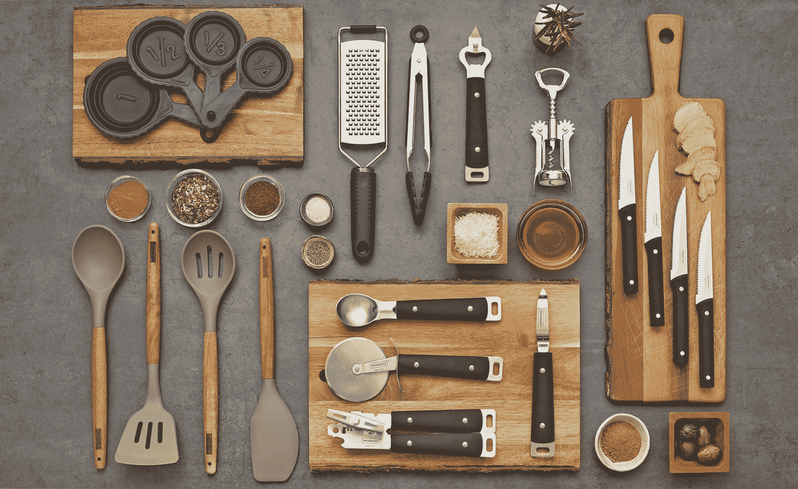
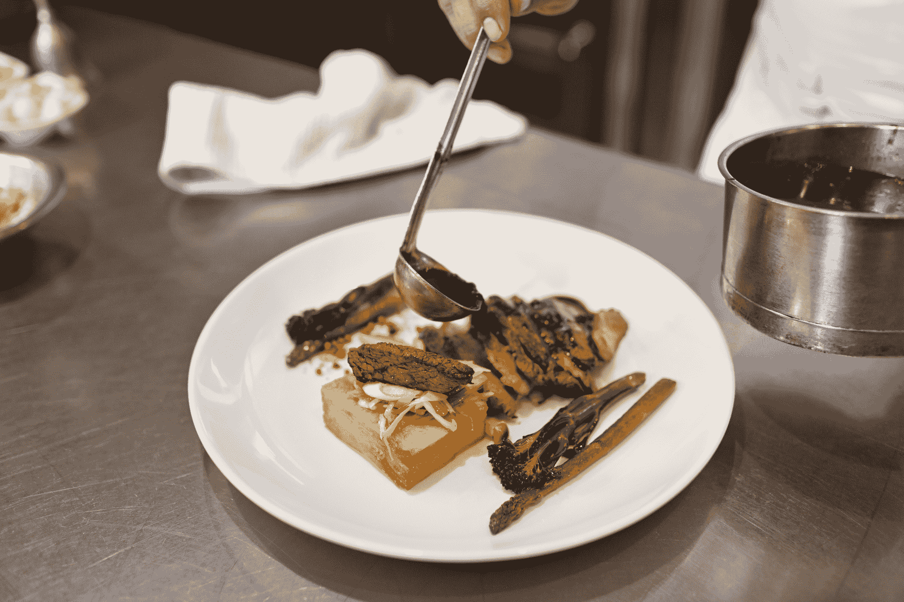

# 增强和虚拟现实将如何重塑食品行业

> 原文：<https://web.archive.org/web/https://techcrunch.com/2017/12/25/how-augmented-and-virtual-reality-will-reshape-the-food-industry/>

[Jenny Dorsey](https://web.archive.org/web/20230304132001/http://jennydorsey.com/)

是专业厨师。她的烹饪作品被刊登在《时尚芭莎》、《喧嚣》、《Brit+Co》、《食品网络》和《氧气电视》等出版物上，她的文章也可以在《Girlboss》、《赫芬顿邮报》、《品味》上找到。公司和斯威。

从酒瓶到宜家的产品目录，增强现实内容随处可见，虚拟现实体验更加详细，从手控器到凝视触发器都有丰富的互动层次，一部 [虚拟现实电影甚至获得了奥斯卡](https://web.archive.org/web/20230304132001/https://www.theverge.com/2017/10/27/16562434/alejandro-gonzalez-inarritu-carne-y-arena-oscar-special-award-vr) 。随着苹果和谷歌都推出了增强现实平台(分别是 ARKit 和 ARCore)，脸书对其 Oculus 耳机进行了大量投资，亚马逊推出了增强购物功能 ，AR 和 VR 已经准备好改变我们日常生活的许多方面。

在食品行业内部，AR 和 VR 也开始取得进展。虽然开发成本仍然很高，但越来越多的 F & B 商家开始意识到 AR/VR 的潜力，并将其视为一项值得的投资。到目前为止，三个主要领域——人力资源、客户体验和食品——已经成为 AR/VR 开发的最集中领域，并将继续推动 AR & VR 在行业内的用例。

*精简员工培训*

AR/VR 技术最切实的回报之一是使用它进行一致和全面的员工培训。当前开发培训材料的流程不仅成本高昂，而且质量因团队、商店或地区而异。很多时候，人力资源面临着在低接触、高效率(即大规模小组研讨会，潜在的负面影响是低保留率和缺乏个性化学习)和高接触、高成本(即店内实时培训的小组会议)之间做出选择的难题。

进入虚拟现实。虚拟现实可以为员工创造一个详细的视觉世界，使他们能够安全地与未来的日常工作环境进行互动，并从精神和身体上学习所需的任务。这些虚拟现实课程从 [管理沃尔玛的假日购物高峰](https://web.archive.org/web/20230304132001/http://www.businessinsider.com/walmart-using-virtual-reality-employee-training-2017-6) 到 [在 Honeygrow](https://web.archive.org/web/20230304132001/https://www.klip.tv/honeygrow-vr/) 煮面条到 [完善浓缩咖啡](https://web.archive.org/web/20230304132001/https://www.blog.google/products/google-vr/daydream-labs-teaching-skills-vr/) 。

另一方面，增强现实通过在员工的直接视图上叠加附加信息，允许并排培训和执行。例如，一项研究发现 [AR 可以有效地帮助受试者直观地估计每份食物的份量](https://web.archive.org/web/20230304132001/https://ijbnpa.biomedcentral.com/articles/10.1186/s12966-017-0516-9) 。保养维修，这种美食界的必备之恶，得益于 [为技术人员配备 AR 耳机](https://web.archive.org/web/20230304132001/https://www.fastcompany.com/40484853/virtual-and-augmented-reality-can-protect-the-american-workforce) 无需现场即可拆装产品。

这些为各种规模的企业提供的新的学习和发展机会不仅提高了培训材料的有效性，还让企业能够雇佣更多具有不同需求和学习风格的员工。随着耳机开始降价，越来越多的开发者涌入 AR/VR，很可能越来越多的公司将开始试用和 A/B 测试这些新的学习平台。也许有一天，我们甚至会带着和送牛奶的人一样的怀旧之情去参观以前的大型研讨会。

*在客户体验中创造奇迹*

“体验式营销”从根本上改变了食品和酒店活动的目的和结构。千禧一代尤其将体验视为社会资本的一种方式，分享他们出席和参与时尚体验是他们策划的社会身份的重要组成部分。冰淇淋博物馆和 29 个房间等活动的成功说服了许多品牌——灰鹅、红牛、捷步达康等——开始将广告资金重新分配给体验和赞助。

增强现实和虚拟现实自然而然地融入了这一转变。两者都是激活所有感官并让消费者沉浸在特定品牌体验中的工具。尤其是虚拟现实体验在食品&饮料活动中的应用越来越受欢迎。一个很好的例子是“Boursin Sensorium”，这是一个基于 CGI 的虚拟现实体验，它将 Boursin 奶酪的运动(通过移动椅子)、气味和品尝样品配对。Patron tequila 使用 360°视频向 [展示其活动展台](https://web.archive.org/web/20230304132001/https://www.360rize.com/2015/05/vr-advertising-takes-flight-firstborn-creates-a-vr-experience-for-patron/) 的幕后制作过程，Innis & Gunn beer 使用协调的 [VR 镜头补充其啤酒](https://web.archive.org/web/20230304132001/https://www.campaignlive.co.uk/article/brew-view-craft-beer-maker-innis-gunn-unveils-vr-campaign/1405456) 的味道。餐馆和酒吧也注意到了这一点:芝加哥的洗礼瓶推出了虚拟现实之旅，与实物苏格兰威士忌搭配； [伊比沙岛的 SubliMotion 让食客去跳伞](https://web.archive.org/web/20230304132001/http://www.news.com.au/travel/travel-ideas/luxury/inside-the-worlds-most-expensive-restaurant/news-story/f1502c6c2985beeb56993f3ebf052b59) 三星 Gear VR 太空针已经推出了 [天价 VR 吧](https://web.archive.org/web/20230304132001/http://markets.businessinsider.com/news/stocks/Space-Needle-Launches-New-Virtual-Reality-Installation-The-VR-Bar-1002128452) 。

用有趣的和可分享的内容来充实现实世界已经成为体验营销中增强现实的焦点。雷米·马丁和麦卡伦都使用了全息视觉效果，分别用于他们微软全息透镜特有的 [【根植于卓越】](https://web.archive.org/web/20230304132001/https://www.youtube.com/watch?v=_eeUPfBVIII) 和 [麦卡伦画廊体验](https://web.archive.org/web/20230304132001/https://www.psfk.com/2017/10/scotch-brands-augmented-reality-app-takes-viewers-behind-the-barrels.html) 。鉴于 Hololens 的高昂价格(基础开发版为 3000 美元)，大多数其他品牌都坚持使用移动 AR——例如可口可乐的 [圣诞魔术活动](https://web.archive.org/web/20230304132001/https://vimeo.com/120791649) ，该活动让用户能够在纽约的品牌公交车站看到虚拟圣诞老人和隐藏的场景，或者顾客的 [与迷你酒保](https://web.archive.org/web/20230304132001/https://www.cnet.com/news/patron-tequila-ar-app-for-ios-lets-you-experience-tequila-without-a-hangover/) 的 AR 体验。实体场所也在玩弄有趣的 ar 元素，伦敦的 City Social 首次亮相 [配备增强视觉效果的鸡尾酒杯垫](https://web.archive.org/web/20230304132001/http://www.telegraph.co.uk/luxury/drinking-and-dining/city-social-mirage-augmented-reality-cocktails-bar-review/) 和印度的连锁啤酒咖啡馆 [使用 AR 来教育饮酒者每种啤酒的原产地、ABV、类别和口味](https://web.archive.org/web/20230304132001/http://www.bgr.in/news/this-augmented-reality-app-will-tell-you-everything-about-the-beer-you-are-drinking/) 。

如果过去几年有任何迹象的话，更多 AR/VR 的未来应用很快就会出现。视觉享受是任何饮食体验的主要部分，品牌已经开始接受虚拟叠加——无论是沉浸在 VR 中还是增强在 AR 中——作为教育、激励和促使消费者采取行动的一种方式。在一个极端的场景中，就像世界 [项目滋养](https://web.archive.org/web/20230304132001/http://www.projectnourished.com/) 描绘的那样，我们可能都在吃和感知两种完全不同的东西！

厨师在厨房里给菜倒酱

*给产品添加交互性*

自从比尔·盖茨 1996 年发表那篇著名的文章以来,“内容为王”这句格言就一直被大大小小的公司所铭记。近几年来，Instagram 和 Pinterest 等平台的崛起——以及由此产生的社会影响力和博客名人——更加清楚地表明，以数字方式与消费者接触会产生实际行动。产品和零售地点可能仍然是静态的，但其内容必须超越物理空间，以吸引潜在和回头客的注意。

增强现实可以在消费者、产品和产品内容之间架起一座桥梁。在特定物品上叠加额外信息、视觉刺激和互动的能力，让产品公司有机会以有针对性的无缝方式将数字世界与物理世界结合起来。食品和饮料公司已经开始以创新的新方式利用 AR:Treasury Wine Estates 的产品线[《19 个罪行》在 AR](https://web.archive.org/web/20230304132001/https://vimeo.com/227373042) 将每个标签的罪犯照片带入生活； [雀巢将电影《里约》中的一个角色用于一款 AR 游戏](https://web.archive.org/web/20230304132001/http://onvert.com/guides/ar-examples/nestle-rio-augmented-reality-game/) ，该游戏已有 2600 万个票房； [沃尔玛和卡夫联手进行 AR 支持的夏季抽奖活动](https://web.archive.org/web/20230304132001/http://www.adweek.com/digital/kraft-fuels-mobile-sell-more-summer-cheeseburgers-158350/) 以销售更多的卡夫产品。最近的一个令人痛心的例子是，餐馆老板常伟通过耐克的 AR 应用程序 SNKRS 发布了他的限量版 [Momofuku x Nike 运动鞋，这将只允许粉丝在福库东村所在地购买该鞋。](https://web.archive.org/web/20230304132001/https://www.psfk.com/2017/06/augmented-reality-sells-sneakers-for-nike.html)

增强现实丰富实体内容的知识和视觉效果的强大能力超越了营销目的。公司可以利用技术 [教育消费者营养信息和产品成分](https://web.archive.org/web/20230304132001/https://mobile-ar.reality.news/news/apple-ar-learn-what-your-food-is-made-using-augmented-reality-0178874/) 甚至 [让健康但平淡无奇的食物看起来更有吸引力](https://web.archive.org/web/20230304132001/https://augmented.reality.news/news/augmented-reality-can-make-good-for-you-food-look-more-attractive-making-easier-eat-well-0176795/) 。AR 还允许物理内容，如烹饪书，与数字内容合并，以获得同步的跨媒体体验，如厨师 Dominique Crenn 的书 的 3D 菜肴渲染展示的[【holo yummy】。](https://web.archive.org/web/20230304132001/http://holoyummy.com/2016/)

随着消费者对 AR 越来越适应，它的存在将成为更持续的期待。Instagram 的崛起导致了全世界整个行业的专家，甚至允许小企业大量采用。AR 在同一个山脚下；大品牌已经在反复使用 AR 外联，但它仍然需要创作者、开发者和营销人员的推动，才能让任何人和每个人都可以访问它。