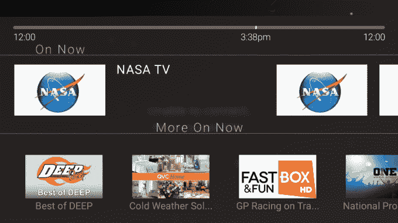
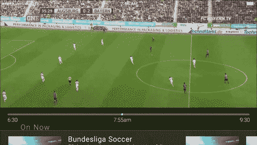

# BitTorrent Live 的“电缆杀手”P2P 视频应用终于登陆 iOS 

> 原文：<https://web.archive.org/web/https://techcrunch.com/2016/12/21/how-bittorrent-live-works/>

# BitTorrent Live 的“电缆杀手”P2P 视频应用终于登陆 iOS

有线电视公司统治着电视，因为它们控制着昂贵的电线和卫星，这些电线和卫星可以大规模提供低延迟的直播内容。然后，有线电视公司可以决定每月向频道所有者提供多少付费用户，因为现场直播几乎没有其他选择。有线电视公司可以向消费者收取过高的价格，因为它们有时是镇上唯一的游戏。

但 BitTorrent 现在已经为直播视频做了它为文件下载所做的事情:发明了点对点技术，将数据传输的负担从集中的来源转移到大众。代替电缆和卫星，BitTorrent 依靠用户的互联网带宽。

由于 P2P 直播比传统的直播方式便宜得多，BitTorrent 可以向频道所有者支付更多的费用。BitTorrent 可以向观众免费提供这些内容，或者比有线订阅便宜得多。传输技术和聚合这些频道的应用程序都被称为 [BitTorrent Live](https://web.archive.org/web/20221025222938/https://btlive.tv/) 。

现在，在该协议在智能电视上的[首次亮相](https://web.archive.org/web/20221025222938/https://variety.com/2016/digital/news/apple-tv-p2p-live-streaming-bittorrent-1201701129/)近一年后，以及本应在 iPhone 上发布的六个月后，BitTorrent Live 应用程序本周悄然在 [iOS](https://web.archive.org/web/20221025222938/https://itunes.apple.com/app/apple-store/id1108230445?mt=8) 上可用。到目前为止，它只存在于 Mac、Apple TV 和亚马逊 Fire TV 上——更不受欢迎的平台。这是在 2009 年开始开发[之后。](https://web.archive.org/web/20221025222938/https://beta.techcrunch.com/2012/02/13/bittorrent-live/)

该应用程序有 15 个频道，包括美国宇航局电视台、法兰西一号、QVC 之家和 TWiT(本周科技)，你可以现场观看。延迟大约为 10 秒，这可能比地面电缆以及像 Sling TV 这样的系统更快，这些系统可以延迟内容超过一分钟。

现在的问题是 BitTorrent Live 的频道选择非常缺乏活力。它仍在努力与更多知名品牌频道达成协议。它可以提供一些按次付费的节目，但由于广播成本的降低，比传统电视上的相同内容更便宜。

为了让频道注册，BitTorrent Live 将需要更多的观众…这将需要更好的内容。这有点儿鸡和蛋的问题。但随着今天的发布会将它带到一个大规模分布式移动平台，它可能会开始吸引值得吸引更好的渠道制造商的观众。