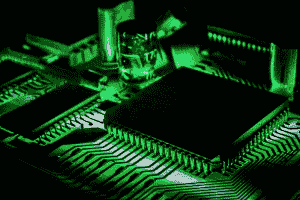
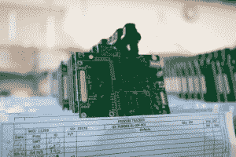

# 面对摩尔定律的挑战，计算将如何改变

> 原文：<https://web.archive.org/web/https://techcrunch.com/2017/04/13/how-computing-will-change-amid-challenges-to-moores-law/>

Mark paper master撰稿人

[Mark Papermaster](https://web.archive.org/web/20221208043544/http://www.amd.com/en-us/who-we-are/corporate-information/leadership/mark-papermaster)

是的首席技术官和高级技术副总裁

[AMD](https://web.archive.org/web/20221208043544/http://www.amd.com/en/home)

.

我们正处于计算领域的一个真正的转折点，我们每天与技术打交道的方式正在发生变化。

嵌入式传感器和互联网连接的快速加入正在将我们使用的大多数电器变成能够响应我们语音命令的“智能设备”，同时产生大量数据，这些数据反过来在网络边缘的中枢计算机或云中进行分析。

我们看到虚拟和增强现实现在刚刚开始普及，这些技术需要大量的计算和图形处理来获得更真实的体验。这与机器学习应用的显著进步相结合，这些应用可以被训练来筛选大量数据，并提供及时的上下文感知信息，或接管日常任务。这些新应用挑战着行业，要求其以更低的价格提供更多的计算能力。

满足这种对更多计算的需求尤其具有挑战性——半导体发展的摩尔定律步伐已经放缓。

摩尔定律被定义为通过更小的电路，芯片上的晶体管数量大约每两年翻一番的趋势，从而产生更高的性能和能效。过去，每一代半导体技术都可以使下一代计算机芯片更便宜、更快。

物理定律是不能被愚弄的，我们已经达到了一个水平，现在晶体管的小型化正在撞上物理极限。未来十年，新的半导体技术节点仍将带来显著的小型化和更低的功耗，但成本正在增加，速度也没有实现历史性的提高。

> 物理定律是不会被愚弄的，我们已经达到了这样一个水平，晶体管的小型化现在已经突破了物理极限。

因此，随着摩尔定律的历史性进步放缓，我们面临着一个二分法，而新的计算密集型应用程序需要指数级的更多能力。这是由消费者对更多数据和更多数据处理、更多实时信息和更快服务的永不满足的需求所驱动的。无人驾驶汽车、无人驾驶飞机和机器人都需要更实时的信息处理、推理和解释。

对于故障安全操作或快速响应，计算不能全部在云中完成。我们看到，计算需要走出网络边缘，向用户靠拢。新兴的智能应用和 AR/VR 接口要求高性能计算能力在本地(在您的汽车中、在您的家庭或企业中、在蜂窝塔中)，但仍连接到云。

数以百万计的“物联网”设备中无处不在的传感器，以及我们工作和个人生活的大多数方面的数字化，导致了数据爆炸。这个庞大的数据宝库推动了对海量数据进行实时处理和分析的需求。我们希望在混合 VR/AR 环境中以新的方式使用这些数据，使我们能够直观地看到信息的叠加，并将渲染的图像与我们所处的即时空间混合。这种需求从根本上改变了我们与技术的互动方式，并要求更高的万亿次计算性能。

这种能力使虚拟和增强现实能够在真实世界视图的顶部呈现逼真的图像和上下文相关信息或图形的增强叠加。

皇家医学院已经在 VR 中记录了手术，你可以很容易地想象一个 AR 覆盖图提供实时信息，以帮助外科医生更准确地进行手术。这些是真正的颠覆性应用。

[https://web.archive.org/web/20221208043544if_/https://www.youtube.com/embed/1vw1Z21v1EU?list=PLupIPWPmwyR4VSLeSs8B3NZdRBAqcK77e](https://web.archive.org/web/20221208043544if_/https://www.youtube.com/embed/1vw1Z21v1EU?list=PLupIPWPmwyR4VSLeSs8B3NZdRBAqcK77e)

视频

这种颠覆将影响工业，在工业之后，如果计算能够保持同步，在摩尔定律衰落的情况下，如何最好地保持它的运行？我们如何提供更多的计算？

事实证明，工程师可以操纵更多的杠杆来推动未来的性能提升。这就是我所说的摩尔定律加。这将要求工程师们更有创造力，跨学科，并利用跨行业的合作。摩尔定律为四大要素的创新打开了大门:

*   更小的半导体器件与新的低成本封装和互连技术的集成。这将有助于以新的方式灵活地整合芯片技术。
*   利用计算处理器(CPU 和 GPU)与专用加速器的异构混合，并向这些引擎提供来自高级内存的数据。
*   易于编程和利用异构计算的开源软件程序和开发框架。
*   软件应用生态系统，使用机器学习、数据分析和 VR/AR 渲染的高级计算，轻松编写应用程序。

在摩尔定律加时代，大学和行业将应用这些杠杆来推动绩效向前发展。在代工方面，极紫外光刻将是推动小工艺节点制造向前发展的有效技术，从而导致新的更小的晶体管。这些将与新的金属结构连接在一起，以降低电阻。半导体制造业将会有进一步的发展。

未来的应用将需要更多的内存，无论是在 PC、移动设备还是服务器上。对于服务器来说，某些工作负载，尤其是机器学习、虚拟化应用程序和数据库处理，对更多内存有着无法满足的需求。然而，我们每年的内存密度增长一直在下降。再一次，创新带来了新的收益，这可以从新的非易失性存储器和堆叠式存储器中看出。

在封装方面也有进步，在有机封装上连接多个管芯的技术成本较低。将会有更多的 CPU、图形、堆叠内存和其他芯片元件的 3D 芯片堆叠，而没有下面的底层晶片。再远一点，就是能够将光学互连直接引入芯片。这些不仅对性能很重要，而且对系统设计的灵活性也很重要，因为新的计算方法可以有效地连接更深、密度更大的非易失性永久存储器，这样当您关闭电源时内容不会丢失。

在我看来，如果你不能让编程这些新方法变得容易，那么保持 18-24 个月的摩尔定律加增长率的努力就是徒劳的。生态系统是为 CPU 准备的，但如果你想利用 GPU 和其他加速器，你需要一个开放的方法。有些采用专有方法，这种方法有效，但成本很高。

AMD 共同创立了[异构系统架构](https://web.archive.org/web/20221208043544/http://www.hsafoundation.com/) (HSA)基金会，以允许这些不同的技术——CPU、GPU 和固定功能加速器，包括 FPGA——一起工作，共享内存，并从系统的角度进行优化。

要在摩尔定律加世界中继续前进，需要在整个半导体行业中与不同的制造商进行联合工程和合作，与学术界和开放标准合作，以创建一个易于编程的环境。这就是为什么我相信公司将能够增加更多的晶体管，并管理成本曲线。

将所有这些放在一起，它确实推动了计算的进一步加速。有了摩尔定律 Plus，摩尔定律的速度就不会下降，这将继续加剧这种破坏。