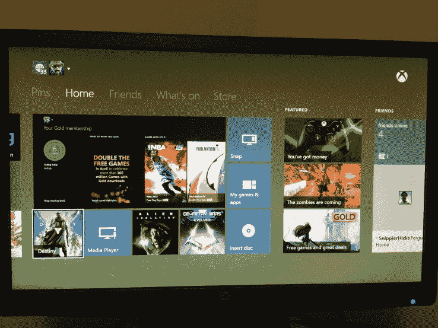
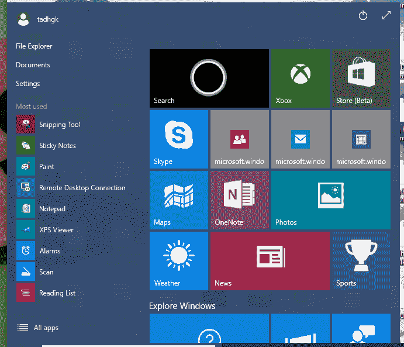

# 你如何像微软一样解决问题？

> 原文：<https://web.archive.org/web/https://techcrunch.com/2015/05/03/how-do-you-solve-a-problem-like-microsoft/>

More posts by this contributor

**编者按:** *Tadhg Kelly 是一名电子游戏设计顾问，也是领先博客* [*的创建者，什么游戏是*](https://web.archive.org/web/20230328073543/http://www.whatgamesare.com/) *。你可以在 Twitter 上关注他* [*这里*](https://web.archive.org/web/20230328073543/https://twitter.com/tiedtiger) *。*

看过夏威夷五比零吗？有没有注意到节目中有多少微软产品植入？有些剧集感觉像是围绕着枪击、追逐、冲浪等偶发事件的电视广告/教程。最近的一个例子显示，乔治·加西亚在 Windows phone 上使用 Cortana，并详细演示了近一分钟的逐路段地图功能。这不仅让人感到不舒服，也象征着消费者的现状——今天的微软:这家公司一遍又一遍地告诉我们它很酷。

## 微软是谁？

当我想到微软的时候(因为 Build 这个星期很多)，我倾向于认为有三个微软。有一个行业——微软用 Excel 征服了世界，而且不会很快消失。有一家技术公司——微软，它制造了众多开发人员钟爱的所有编码工具和服务器。此外还有消费者——制造手机、Xboxes 和各种网络服务的微软。商业——微软和技术——微软看起来一直很健康，提供利润和价值，做着大公司的基本工作。消费者——另一方面，微软应该是公司里最酷的人，是推销整体理念的人。

消费者——微软做得并不好。事实上从来没有。消费者——微软一直试图成为孩子们围着篝火谈论的 stylee 品牌之一。例如，最近几年，它在其产品中开发了一种设计语言。它在圆滑的新闻事件中发表广泛的声明和观点等等。然而，这些真的有用吗？没有。相反，它投射出这种怪异的光环，好像它的产品是装在盒子里的杰克，装着长满锯齿和痘子的小丑的头。问题是为什么，我认为这很大程度上与真实身份有关。

从牙膏到电子商务网站，从医疗保健提供商到珠宝商，在每一个消费者的选择中，往往都有对话的成分。一切都始于客户对公司身份的感受，无论是盟友还是敌人。这就是为什么产品之间的竞争几乎从来不是关于价值，也不是公平的。我们赞扬一个小部件，谴责另一个，是因为它的意义，而不是它是什么。它代表什么，如何融入营销故事，而不是它实际上做什么。表面上看很可笑(人们为了[手机选择](https://web.archive.org/web/20230328073543/http://www.theverge.com/2015/4/17/8444701/iphone-android-stabbing-tulsa-windows-phone-still-on-the-lam)互相捅刀子？)但我们还是做了。即使凭借这个帖子的标题，至少有半打微软的捍卫者会拔剑攻击这个帖子的评论。

这种行为适用于所有商业领域。对普通人来说，他们可能并不性感，但在他们自己的领域里，他们与顾客的对话和其他人一样。人类在叙述中感知世界，所以肯定有英雄和恶棍。必须有原型和身份。

要理解微软，你必须掌握该公司的身份，以及为什么在微软的特殊情况下，身份是断裂的。商业-微软、技术-微软和消费者-微软几乎就像三个完全不同的公司，只是碰巧共用一个银行账户，但有趣的是，它们的跨品牌恶作剧确实会感染和稀释彼此。微软是谁？这是干什么用的？反对什么？为什么它存在于赚取利润之上？没人真正知道。他们知道微软的某些部分想要做什么，但不是全部。

受影响最大的是消费者——微软。它很少或没有真正的身份。当然，个人电脑世界运行的是 Windows，但在绝大多数情况下，这些安装是通过商业世界的合作，而不是消费者的偏好。Windows 运行良好，Windows 操作系统的电脑比 MAC 便宜，所以它们是默认的选择。但是无论消费者多么努力，他们在消费者的叙述中没有任何意义——微软试图向我们推销他们有意义的想法。

该公司定期向其网络服务、搜索引擎和移动产品投入的资金数额惊人，但回报却很低。这些产品中的大部分都非常好用，然而尽管有这些促销活动，消费者的反应却通常很冷淡。甚至 Surface Pro 3 最近的成功也值得称赞，但它似乎确实找到了一个苹果很快就会夺走的类别。在消费者的世界里，苹果有自己的身份。微软就是没有。然而，这并不是因为缺乏尝试。

## 宏伟的愿景

微软基本上陷入了困境，被夹在三个自我之间，在问这个问题时，它大多会绕回一个熟悉的答案。因为这是一家无所不包的公司，所以它的核心是成为无所不包的供应商。这反过来又成为“我个人的，无处不在的每个人的”变化的宏伟计划和宏伟愿景。它们在沙漠里都没有生存的机会。无论是 Live.com 还是 Windows 无处不在，同样的代码无处不在，等等，公司最终总是寻找同样的通用踢。微软一直试图用各种复杂的技术来解决这个问题。但是普通人似乎从来没有真正听到过。为什么？

在商业世界中，捆绑包是必不可少的。你卖的不是一件商品，而是一系列商品。你把顾客变成了许可者，建立了品牌忠诚度、价值和锁定。在技术世界里，类似地，你销售给客户的是成套工具，而不是单一工具。让每个人都注册一套工具——比如像 Adobe 那样——你就轻松了。但这种方法对消费者来说并不那么有效，因为消费者很难将无形资产卖给他们。

对人来说，情况更像这样:有一种产品，一种做着很酷的事情的简洁产品。他们买了产品，发现它和他们希望的一样好，然后他们可能会买一个又一个。产品变得很酷，也许是疯狂的酷，如此循环。从 iPods 到 Jawbone 扬声器，从 FitBits 到特斯拉电池，都是一样的。消费者没有时间或耐心购买 visions。他们购买情感，这些情感很容易通过具有强烈认同感的单一对象来表达。他们买的是自拍杆，不是解决方案。

销售集成和复杂性很难，因为它是在销售对象之间的空间。这变成了许多无聊的专题讨论。还记得几年前索尼试图向我们推销蓝光的元理念，而任天堂向我们推销摇摆不定的 Wii 吗？卖给消费者就是这样。同样，还记得索尼抛弃了所有的大话，转而生产了一款强大的游戏主机，并把自己作为一款强大的游戏主机进行销售，而任天堂则疯狂地推出 Wii U 吗？一样。微软一直试图把它的消费者产品粘在一起，但消费者总是反应冷淡或怀疑。

更糟糕的是:坚守宏伟愿景意味着公司会牺牲其产品的核心效用。

## 微混沌

一旦你通过了所有的销售，产品最终会被使用。例如，我用 Gmail，已经用了很多年了。我被它的对话视图和智能过滤的想法所打动，但那是一百万年前的事了。我现在仍在使用 Gmail，部分原因是我的电子邮件被绑定在那里，但更大的原因是我信任它。透过闪亮的包装纸，事实证明它真的很好。最近许多消费者使用的微软产品的问题是它们不是。这里有一个简单的例子:

我的 Xbox One 可以显示广播电视:

它在哪里？

好好看看上面的截屏，告诉我:从这里怎么看电视？你会像大多数人一样认为这是显而易见的。对于一个幼儿园小朋友来说，应该有一个电视标签，一个游戏标签，这些标签上应该有一些奇怪的东西，比如电视节目和游戏。但当然不是因为微软。要激活像电视这样的主要功能，你必须进入我的游戏和应用程序并找到电视应用程序，或者转到页面上的内容并尝试理解它。或者也许中间的一个游戏手柄按钮可以做到这一点，但也可能不行。

这是一个例子，说明微软让自己陷入了多么混乱的消费者当中。该公司一贯采取伟大的工程，并埋葬在不透明的设计，名义上是所有的感觉，但实际上是所有的手淫。Xbox One 正是如此。这是一个伟大的机器，但作为一个产品，它是可悲的混乱，没有尘世的线索，它试图实现什么。最终结果是，我喜欢我的产品，但我讨厌 Xbox 的实际部分，即用户界面、商店和默认应用程序。他们太可怕了。真的非常可怕。《侠盗猎车手 V》在这个系统中很美,*和《外星隔离》*很黑暗和怪异，但他们生活在一个相当于你讨厌的朋友的系统中，如果他能克服自己五分钟，他会是一个很棒的人。

当你登录的时候，Xbox 很主动，但是在发现和导航方面很差。它热衷于向你解释它是如何做很酷的事情的，但寻找这些事情的潜在结构是根据一种跨维度的恐怖逻辑运作的，这在 Lovecraft 小说中不会出现。Xbox 有流畅的动画和声音，但似乎无法决定退出应用程序的简单规则(有时缩小，有时上翻，有时到主仪表板，有时到上一个应用程序)。Xbox 是光滑的高清晰度承诺，但它的许多功能，如快照诱发积极的恐惧。我拥有该系统已经 6 个月了，但仍然不记得如何进入和退出 Snap。

还在继续。许多你期望的普通功能，比如查找游戏列表，都需要工作。克服其引发愤怒的复杂性的唯一方法是寻找游戏，并将它们固定在一个收藏夹列表中。但是这个列表只有在你和机器联机时才会出现。(不，说真的。)弄清楚如何安装游戏有时会导致怪异的商店页面，但卸载游戏也需要调查。点击那个三线按钮有时会让你得到那个选项，取决于你在哪里点击它因为微软。与此同时，大量的仪表板空间推出了一个你永远不会使用的朋友功能，而它的数字商店页面设法同时向你显示四个选项。

Windows 8 也是如此，Windows 10 只是稍微好一点。是的，恢复“开始”菜单很好，但是看看里面到底有什么:

> (我知道这是一个预览产品，但它将在几个月后推出，所以不太可能有太大变化。)

有很多选择。有些是图像，有些不是。有些大小不一。有些是应用程序，有些是系统功能。有些是不同的颜色，而有些是相同的，所以他们彼此流血。让一个普通用户找到一个没有展示的应用程序，他们可能会丢失(所有应用程序，左下角)。让他们找到关机按钮，他们又会迷路(右上方)。

是的，这很糟糕，但我的观点是，这是微软独有的一种糟糕。它没有给出一两个简单的模式，而是给出了四个，让倒霉的用户自己去解决。为什么呢？再次，身份。消费者——微软似乎不知道 Xbox 是什么，或者意味着什么。它是一个游戏控制台，它是一个电视单元，它是一个流媒体盒子，它是一个 Skype 盒子，它是一个客厅里的电脑，它是一个消费者——微软同样不知道 Windows 是什么，或者应该是什么。它对命运的交叉操作系统有一些模糊的想法——但那只是回到了同样古老的宏伟愿景。实际使用这些产品就是看着他们的野心像袋子里的猫一样争夺你的注意力，并且对他们的后续行动毫无信心。

尽管微软拥有各种资源，但它矛盾的身份让它的产品看起来既愚蠢又单调，而且它似乎永远无法解释为什么你会想要它们，而不会听起来很邪恶，或者像你爸爸一样试图变得很酷。微软总是试图将用户带入一个更宏伟的愿景，但这个愿景的单一目的从来都不明显。微软总是对它所做的每一件事都挂着铃铛和口哨，但都是为了不言而喻的目的。因此，它所投射的身份是不连贯的，它的产品感觉几乎是不成熟的。

## 修复

让我们放弃为修复微软而提出的两种常见解决方案。首先，该公司要走出失败的行业，专注于自己擅长的领域。不错的想法，但在微软的特殊情况下，它会切断公司的许多创新途径，从而远远落后于竞争对手。我们并没有生活在一个办公室和家庭界限如此分明的时代，所以参与进来是很重要的。与此同时，第二个解决方案是将消费者部门分成一个或多个子公司，并给予它们自主权。Xbox 将是一个理想的候选人。然而，尽管这听起来很有吸引力，但历史表明，走这条路的公司(比如索尼)往往会陷入内战。

我认为还有第三条路，一条不需要取消部门或把公司分割成一个联盟的路，那就是微软在所有部分都接受自己的身份。

除了公关，消费者通常确切知道一个公司到底是谁或者是什么。品牌战略可能会暂时改变人们的看法，但无论如何，一个组织的真实自我都会显现出来。微软的设计团队长期以来一直试图让旧金山看起来很酷，以表明他们知道你想要什么，会觉得有吸引力和酷。但是，作为一个局外人，这不是该公司的真实自我。

微软更像西雅图，而不是旧金山，我的意思是说它是一个公司呆子，而不是一个公司潮人。一个技术高超、精明的公司呆子，有着燃烧的头脑和敏锐的想法，但仍然是一个公司呆子。它可能想变得圆滑，但事实并非如此。这就是为什么它的营销似乎总是以乔治·加西亚骑着轻便摩托车告诉你 Cortana(或等效物)而告终。这是一层印花棉布涂在极客的基底上。

微软拥抱它的身份实际上意味着什么？我认为这意味着承认这是一个巨大而强大的工程师公司，停止所有没有更好效用的设计。就像忘记努力成为消费者的梦想，取而代之的是依靠消费者喜欢实际上能做事情的产品。这要求很高吗？

为什么要迷失在用户界面设计的无氧世界中，而不是成为你真正的工程师，微软？为什么不拥抱平淡，而不是在时尚中穿梭呢？为什么不开发能真正提升产品实用性而不是其外观的功能呢？例如，在游戏机领域，对古怪的 Kinect 或全球 Bing 搜索没有太多需求。另一方面，有一个支持云的游戏租赁系统，让游戏的体验变得很便宜？玩家会非常喜欢的。为什么不基于无聊的想法为系统制作一个仪表板，比如通过明智的方式找到游戏和最小化导航，而不是陷入语义空洞、松散、摇摆不定的时间维米推理？

微软:做你真正的工程公司，不要太担心自己是否酷。你知道吗？