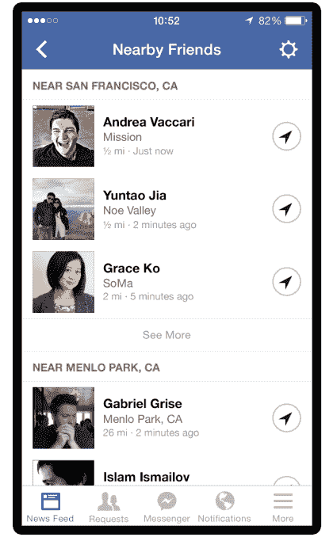

# 与脸书附近的朋友一起动手[视频]:不再签到 

> 原文：<https://web.archive.org/web/https://techcrunch.com/2014/04/20/how-does-facebook-nearby-friends-work/>

[脸书附近的朋友](https://web.archive.org/web/20221207043336/https://beta.techcrunch.com/2014/04/17/facebook-nearby-friends/)是基于广播你离朋友有多远，而不是你的确切坐标，这就是为什么它可以在其他定位应用失败的地方成功。但是，虽然我们可能愿意分享这种接近，但这并不意味着我们愿意在脸书这样做。

在功能上，脸书发现了一个接近的聪明的创新。要深入了解脸书附近的朋友是如何工作的，请阅读我在周四(T3)发布的文章。未来几周，iOS 和 Android 的选择加入功能将在脸书推出。本质上，它可以让你向一群朋友显示你与他们的大致距离，查看附近朋友的反馈，并向特定的人发送你几个小时内的确切位置。

这段视频和文章讲述了使用附近的朋友的感觉以及采用它的障碍。

有了像 Google Latitude 这样的服务，让任何人看到你一直在哪里，甚至是你最亲密的朋友，感觉有点令人毛骨悚然。如果你广泛分享这些信息，偶尔登录 Foursquare 这样的应用也会让你感到暴露。另外，仅仅因为有人在街边的咖啡馆，并不意味着他们想见你。他们可能在工作会议或约会。最后，你的确切位置对大多数人来说其实是无关紧要的。

真正重要的是，如果你们足够近，见面会很方便。这就是《脸书附近的朋友》的内容。如果是的话，你们可以交流一下，看看你们是否都有兴趣出去玩，然后分享你们的具体位置。在那之前，准确的位置更令人毛骨悚然而不是有用的。

只有当你拥有大量用户时，位置发现才真正有效。因此，脸书试图通过这种专注于接近度的策略来降低分享的门槛，并将其内置于其主要应用程序中，而不是一个独立的应用程序。不幸的是，这让附近的朋友感觉被埋在了界面的更多标签中。通知和订阅故事应该会让人们不会忘记它，但因为它在默认情况下是关闭的，所以可能需要脸书不断的宣传和劝说，才能让人们挖掘并打开它。如果我最终经常使用它，我可以预见我会希望它可以从脸书的主屏幕访问，或者作为一个独立的应用程序，或者可能与 Messenger 集成。

基本的接近功能使用起来相对简单。附近的朋友饲料智能排名的朋友，所以你可以看到最接近的好友在顶部。测量距离的决定精确到十分之一英里，但如果有人比这更近，则精度上限为半英里，这似乎是对隐私的一个很好的平衡。不过，知道世界各地朋友的当前城市确实有点奇怪，尤其是当显然没有办法和他们一起出去玩的时候。脸书可能会考虑不在列表中显示超过 100 甚至 1000 英里以外的人，以使该功能不那么跟踪。

当你决定与他人分享你的精确位置时，附近的朋友会变得更笨拙。触发这个的指南针图标按钮不是很直观。小小的到期滑块工作正常，但你可以发送的 40 个字符的位置信息有时太长，不适合通知或地图视图。出于安全考虑，如果你没有将自己的实时位置设置为在别人看不到的情况下过期，脸书会定期发送提醒警报，这样你就不会永远开着它。

对脸书来说，更保守的选择加入方式是明智的，因为强迫附近的朋友加入可能会引起极其强烈的反弹。你必须打开它，可以设置一个较小的朋友列表或群来查看你的邻近信息，还有一个简单的方法来关闭它。人们仍然应该考虑将他们的接近度的可见性设置为比所有朋友的默认可见性更小的组。总的来说，隐私控制看起来强大而简单。

但是，尽管脸书的社交图给了它一个很大的优势来建立像附近的朋友这样的东西，而且它建立得很好，人们可能不想在马克·扎克伯格的社交网络上分享这些信息。当脸书要求人们打开附近的朋友时，多年的隐私问题可能会反过来咬它的屁股。我已经证实脸书会利用你附近朋友的位置历史记录向你投放超级本地广告，这并没有帮助。这意味着使用这个功能是一种价值交换，如果你放弃 GPS 数据，你可以获得帮助。

或许有人有机会创造一个附近朋友的独立克隆体。【披露:我为一位大学朋友的秘密社交位置共享初创公司提供建议，该公司位于旧金山，代号为‘Signal’。AOL 和 TechCrunch 的编辑已经批准了这个顾问角色。]采用相同的近距离广播和与特定朋友的实时位置共享的平滑概念，而不是基于地址簿电话号码。很难获得脸书通过其庞大的现有智能手机用户群所获得的潜在普及性。但一家专注于隐私和安全的初创公司，就像 Secret 一样，可能能够说服那些对脸书感到担忧的人分享他们在哪里。

然而现在，我们必须观察世界是如何通过脸书变得热衷于近距离分享的。不幸的是，这种交错推出的过程并没有给脸书带来任何好处，让它像病毒一样传播开来。我的一些朋友有它，但似乎有些人没有，让整个集群使用它会产生巨大的网络效应。

就我个人而言，我已经发现附近的朋友有助于了解哪些朋友参加了音乐会，以及谁住在我家附近，可以一起吃早午餐。我很期待尝试用它在旧金山的多洛雷斯公园(Dolores Park)与朋友见面，它的创造者和前 Glancee 首席执行官安德里亚·瓦卡里告诉我的用例之一启发了这个功能。

为了让附近的朋友茁壮成长，脸书需要让人们了解它的隐私是如何工作的，以及为什么它与其他定位应用程序不同。它还应该尽可能地去除令人毛骨悚然的东西，比如把一千英里以外的人从 feed 中带出来，并提醒人们是否正在通过主屏幕上的一些指示器分享他们的大致或确切位置。最好的情况是，附近的朋友可以将错过的联系变成幸福的交集。但首先，它必须灌输一种新的观念，即分享亲密关系是安全的。