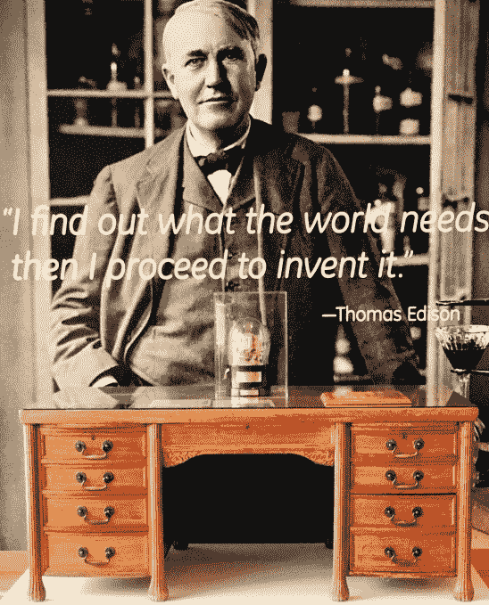

# 通用电气如何避免柯达的命运

> 原文：<https://web.archive.org/web/https://techcrunch.com/2017/04/29/how-ge-avoided-kodaks-fate/>

早在 1888 年，乔治·伊斯曼在纽约州罗彻斯特市创立了柯达公司。四年后，在距离纽约斯克内克塔迪 200 英里的地方，托马斯·爱迪生和一些朋友创立了通用电气公司。这两个 19 世纪的工业巨头已经发展了 100 多年，但通用电气的市值仍超过 2500 亿美元，柯达的市值为 4.66 亿美元，其大部分相机和胶片业务都被 20 世纪后期的数字化破坏了。问题是，通用电气是如何避免同样的命运的？

本月早些时候，通用电气公司邀请我参观位于纽约州尼斯卡尤纳的通用电气全球研究中心(T2 ),距离爱迪生先生在斯克内克塔迪建造的工厂只有几分钟的路程。事实上，正是爱迪生和他的合伙人在 1900 年开办了这个实验室，仅仅是在公司成立八年之后。也许公司的创始人[看到了不断重塑自我的需要](https://web.archive.org/web/20230225043742/http://www.geglobalresearch.com/timeline)，或者这只是爱迪生对实验的痴迷。

不管是什么原因，117 年后，这个实验室变成了一个庞大的校园，隐藏在纽约州美丽的起伏群山中，挤满了 2000 名展望未来工业生产的聪明人，不管工业生产将采取什么形式。虽然世界正在数字化，但一些基本的东西仍然留在物理领域，比如飞机引擎、火车机车、核电站和燃气轮机。

通用电气没有眼睁睁地看着柯达作为颠覆者慢慢地(然后非常快地)削弱其经济基础。该公司似乎天生就明白，如果它不不断地重新审视自己，它可能会像柯达一样完蛋。因此，它展望未来，数据和数字世界与它在过去 125 年中建造的巨大工业产品相交。

## 转向数字世界

世界正处于以数据为中心的巨大转变之中。如果你怀疑这一点，不妨将特斯拉视为现代数据驱动型组织的典型例子。特斯拉从事汽车业务，但埃隆·马斯克从一开始就认识到，来自汽车的数据和实体车辆本身之间有着千丝万缕的联系。随着特斯拉收集这些数据，它可以制造出更好、更智能、更高效的汽车——随着时间的推移，这种良性循环会自我反馈。

通用电气认识到，来自其制造和销售的工业机器的数据之间也有类似的联系。随着传感器变得越来越智能、越来越便宜，该公司可以根据对这些机器的详细了解，从工程和设计的角度，以及数据告诉他们的机器行为方式，开始建立新的商业模式。

为了让你对通用电气的工业范围的广度有所了解，通用电气全球研究副总裁 Danielle Merfeld 说:“通用电气目前在全球各行业拥有约 2 万亿美元的资产。这让我们能够大量接触到对我们的成功至关重要的系统和流程知识。”

默菲尔德补充说，当你把数字和物理结合起来，强大的事情就会发生。她表示，这一切都始于公司对这些实物资产在世界上如何运作的深刻理解。“我们不是在我们的物理世界上叠加数字，也不是用对它的数字理解来取代我们的物理世界，而是实际上将数字和物理结合起来，以获得比我们通过背景或专业知识获得的更多的部分。”

## 把它带到边缘

通用电气全球研究中心托马斯·爱迪生的办公桌。照片:TechCrunch 的罗恩·米勒

对于通用电气和全球研究中心来说——除了在纽约的一个实验室之外，在世界各地还有四个姐妹实验室——这体现在大胆的实验中。这意味着要关注那些刚刚开始崭露头角的技术，并想方设法将未来的技术融入通用电气的工业产品中。

该公司一些最雄心勃勃的项目正在今年 1 月开放的 Edge 实验室进行，他们正在那里研究一套循环的实验技术。他们目前正在研究的领域包括增强和虚拟现实、机器人和区块链。

“边缘实验室的目的是探索处于可行性边缘的技术，展示什么是可能的，”边缘实验室发展负责人 Ben Verschueren 说。他说，他们将这些实验与通用电气的领域知识结合起来，以找出如何将它们融入该公司的产品系列。

实验室应该是一个有生命的实体，因为项目存在的时间是有限的，参与每个项目的成员都是基于他们的专业知识，并且只在有限的时间内——项目的生命周期内——参与。这意味着随着项目的变化，实验室的工作人员会随着时间的推移而变化。

“一旦我们发现了一项任务并决定了它的目的，我们就为这项任务找到合适的技术专家，把他们带到实验室一段时间，让他们完成这项任务并提供我们需要的东西。然后他们回到[他们在通用电气的原职位]，我们转移到其他项目上，”Verschueren 解释说。

## 大胆的实验

在参观 Edge 实验室期间，以及在 ge 全球研究中心的一整天，我看到了一些这样的实验。

其中一项涉及使用微软的混合现实耳机 [HoloLens，来训练人们如何使用超声波机器和定位正确的器官。这种想法是，在农村地区，很难找到受过训练的专业人员来操作这些机器，增强现实可以作为一种教学设备。](https://web.archive.org/web/20230225043742/https://techcrunch.com/2016/08/02/anybody-can-now-buy-microsofts-3000-hololens/)

首先，你戴上 HoloLens，尝试拿起一个虚拟超声波探头，移动它，直到你根据提示识别出正确的器官。例如，它可能会显示心脏和肝脏，您需要选择肝脏。如果你答错了，你会通过设备得到反馈，说你选错了。

最终，该团队希望在使用 HoloLens 提供虚拟训练环境的同时，提供与实际探针类似的反馈水平。值得注意的是，通用电气公司销售超声波仪器，所以如果他们能把它们带到通常没有它们的地区，并培训没有特定医学背景的人员使用它们，想必他们能卖出更多。

另一个想法涉及混合机器人技术、虚拟现实和流式数据。想法是他们可以把机器人放在一个危险的地方，比如海洋中的石油钻塔或风力涡轮机上。一个安全地呆在岸上的人可以在虚拟现实中控制机器人并指导维修，而不是派一个人乘船在波涛汹涌的海洋上进行维修。

它的工作方式是你戴上一个 HTC Vive 耳机，每只手都有一个控制器。当你进入虚拟世界时，你可以看到一个机器人和两个控制器。其中一个控制器控制机器人的运动。另一个给你一个虚拟的 iPad，你可以从菜单中选择一个工具:“驱动”、“传送”和“手臂”模式。驱动可以让你控制机器人的运动。传送控制你在虚拟世界中的运动，手臂让你控制机械臂进行维修或捡起碎片(或任何需要做的事情)。

我在参观过程中看到的所有任务和项目都有一个目标，即最终使用这些先进技术来增强和改善通用电气在物理世界中使用其大型机器所做的事情，或者理解为什么某项特定技术可能行不通(至少在实验中是这样)。

该公司希望通过不断研究其全球研究中心的最新技术，可以避免其在罗切斯特的制造业堂兄弟的命运。有一点很清楚，他们不会坐以待毙。他们继续向前看，评估最新的技术，寻找下一个伟大的想法，就像托马斯·爱迪生 125 年前创办公司时所做的那样。