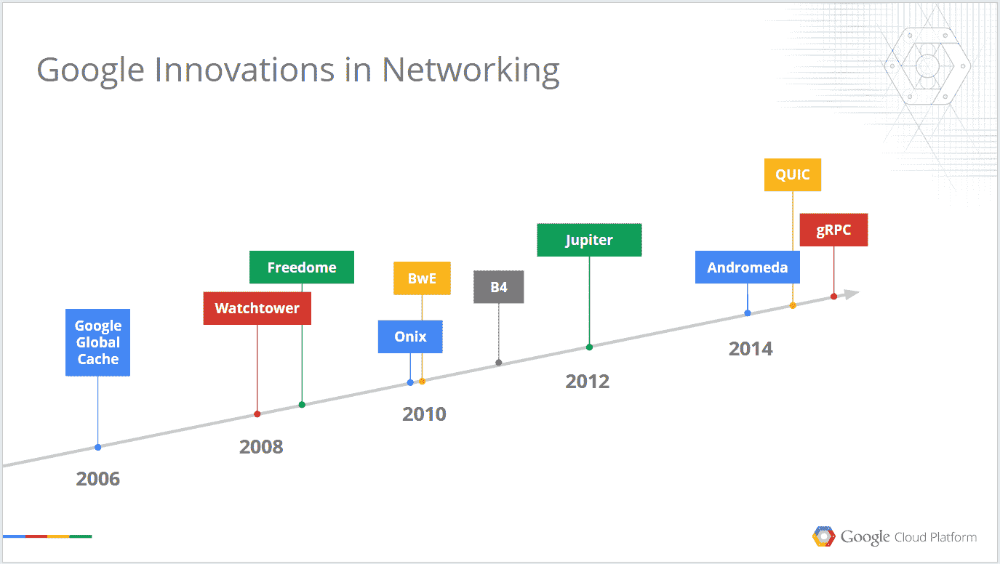
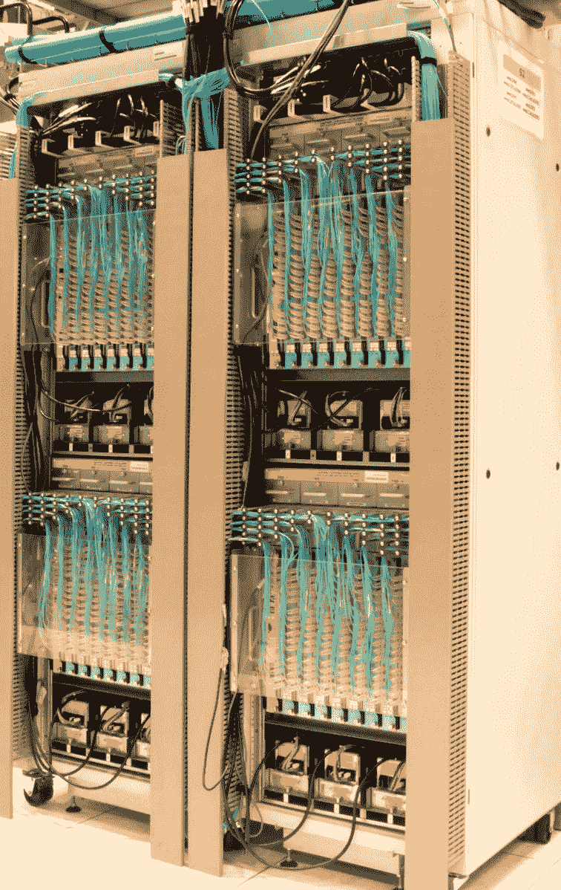
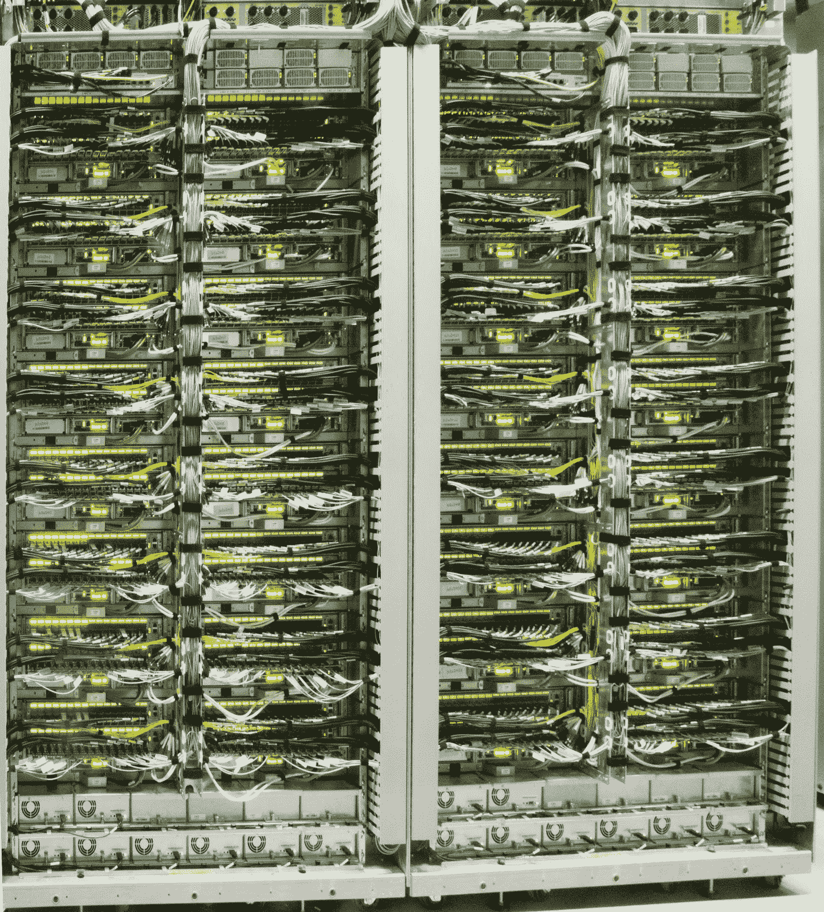

# Google 的网络基础设施在过去 10 年中是如何发展的 

> 原文：<https://web.archive.org/web/https://techcrunch.com/2015/08/18/how-googles-networking-infrastructure-has-evolved-over-the-last-10-years/>

Google today [宣布](https://web.archive.org/web/20221226065246/https://techcrunch.com/2015/08/18/google-launches-onhub-router-promises-faster-wi-fi-and-simpler-setup)它想修复你家的 Wi-Fi，但是在内部，它一直致力于更复杂的[网络问题。要连接组成谷歌数据中心的数十万台机器，你不能只使用几个基本的路由器和交换机。因此，为了管理其服务器之间流动的所有数据，谷歌一直在构建自己的硬件和软件，今天，它拉开帷幕，让我们看看其网络基础设施演变的背后。](https://web.archive.org/web/20221226065246/https://techcrunch.com/2015/06/17/google-pulls-back-curtain-on-its-data-center-networking-setup/)

谷歌目前的设置，即所谓的木星网络，比其第一代网络的容量多 100 倍，可以提供惊人的 1 千兆位/秒的总二分带宽。该公司表示，这种速度允许 10 万台服务器在不到十分之一秒的时间内读取国会图书馆的所有扫描数据。

“这样的网络性能极大地增强了谷歌的服务，”谷歌研究员阿明·瓦达特[今天写道。“工程师从针对不同级别的带宽层次优化代码中解放出来。例如，最初，在连接到同一个架顶式交换机的服务器的谨慎数据位置和放置与单个交换机故障导致的相关故障之间，存在痛苦的权衡。”](https://web.archive.org/web/20221226065246/http://googleresearch.blogspot.com/2015/08/pulling-back-curtain-on-googles-network.html)

然而，十年前，谷歌根本没有这种能力。这是在它收购 YouTube 之前，也是在它推出 Gmail、Google Earth 和 Google Maps 等产品之后不久，因此该公司的需求可能会变化得非常快。

这是 2005 年初的机器的样子:

[gallery ids="1197500，1197501，1197502"]

正如谷歌今天在一篇[论文](https://web.archive.org/web/20221226065246/http://static.googleusercontent.com/media/research.google.com/en//pubs/archive/43837.pdf)中所写的，该公司在 2004 年基本上仍然部署标准服务器集群，而这些 2005 年的机器是它在其 Firehose 1.0 数据中心架构中部署的网络的第一个例子。2005 年机器的目标是在 10，000 台服务器之间实现 1 Gbps 的二分带宽。为了实现这一目标，谷歌试图将交换结构集成到其自制的服务器上，但结果是“服务器的正常运行时间不太理想。”

在 Firehose 1.1 中，Google 部署了第一个定制的数据中心集群结构。该公司的工程师写道:“我们从 FH1.0 学到了不使用常规服务器来存放交换芯片。”相反，谷歌为其数据中心网络建造了定制的外壳，并转移到所谓的 [Clos](https://web.archive.org/web/20221226065246/http://www.networkworld.com/article/2226122/cisco-subnet/clos-networks--what-s-old-is-new-again.html) 架构。

到 2008 年，Firehose 1.1 已经发展成为 WatchTower，它转向使用 10G 光纤而不是传统的网络电缆。谷歌向全球所有数据中心推出了这一版本。

这些机架看起来是这样的:

一年后，瞭望塔变成了土星。虽然了望塔结构可以扩展到 87 Tbps，但 Saturn 在密度更高的机架上可以扩展到 207 Tbps。

[gallery ids="1197516，1197517，1197518"]

土星显然为谷歌提供了很好的服务，因为该公司坚持了三年，直到它的需求超过了土星的能力。

“随着每台服务器的带宽需求持续增长，数据中心所有集群的统一带宽需求也在增长。随着支持 40G 的高密度商用芯片的出现，我们可以考虑将我们的 Clos 结构扩展到整个数据中心，包含集群间网络层，”谷歌的工程师写道。

正是这种架构现在允许谷歌将单个数据中心视为一台巨型计算机，由软件处理网络上所有不同服务器上可用的计算和存储资源的分配。

Jupiter 硬件看起来肯定不同于谷歌最早构建定制网络设备的尝试，但在许多方面，这也是该公司迅速采用[软件定义网络](https://web.archive.org/web/20221226065246/https://www.opennetworking.org/sdn-resources/sdn-definition)的事实，这使其能够快速创新。

谷歌今天发布了四份文件，详细描述了其网络设置的各个方面。由于谷歌往往比其他公司更早触及传统硬件和软件架构的极限，类似的论文也经常在公司外部催生新一轮的创新。

不太可能有那么多初创公司需要建立自己的数据中心，但其他数据中心运营商肯定会详细研究这些论文，并可能随着时间的推移实施类似的解决方案(当然，这反过来也会使他们的用户受益)。

