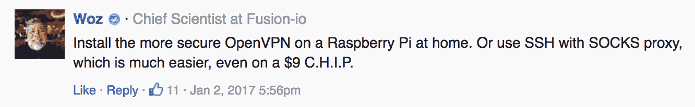
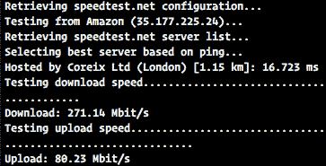

# 我如何在 15 分钟内制作自己的 VPN 服务器

> 原文：<https://web.archive.org/web/https://techcrunch.com/2017/04/09/how-i-made-my-own-vpn-server-in-15-minutes/>

随着参议院[投票](https://web.archive.org/web/20230319030219/https://techcrunch.com/2017/03/28/house-vote-sj-34-isp-regulations-fcc/)允许互联网提供商与广告商共享你的私人数据，人们(理所当然地)对他们的隐私感到恐慌。虽然保护你的隐私很重要，但这并不意味着你应该注册一个 VPN 服务，通过 VPN 服务器传输你所有的互联网流量。

## VPN 不会让你匿名

VPN 是什么鬼东西？我已经给[写了一篇文章](https://web.archive.org/web/20230319030219/https://techcrunch.com/2017/01/01/wtf-is-a-vpn/)，用简单的概念解释 VPN，甚至把 VPN 比作电影中的汽车追逐。

但是如果你想简单回顾一下，当你把你的电脑或电话连接到一个 VPN 服务器时，你就在你的设备和那个服务器之间建立了一个加密的隧道。没人能看到隧道中间发生了什么，甚至你的 ISP 也看不到。

然而，这并不能让你神奇地匿名。你只是把风险转移到了 VPN 隧道，因为 VPN 公司可以看到你所有的互联网流量。事实上，他们中的许多人已经把你的数据卖给了骗子和广告商。

这就是我不建议注册 VPN 服务的原因。你不能相信他们。

顺便提一下，现在许多网站依靠 HTTPS 在你的浏览器和你正在使用的网站之间建立安全连接，甚至是 TechCrunch。你应该安装 [HTTPS 无处不在](https://web.archive.org/web/20230319030219/https://www.eff.org/HTTPS-EVERYWHERE)扩展，以确保你尽可能多地使用 HTTPS。

但是 VPN 有时会很有用。有时，您不能从公共网络访问网站，因为它被阻止了。或者，您可能正在中国旅行，希望能够访问您的 Gmail 帐户。在这种情况下，当你使用 VPN 时，最大限度地降低风险是最重要的。

## 设置您自己的 VPN 服务器

正如沃兹在参议院崩溃之前对我以前的 VPN 文章的评论，你可以运行你自己的 VPN 服务器:

但是如果你不能信任你的家庭连接或者你的家庭连接上传速度很慢，那就不太实用了。

我玩了一下 [Algo VPN](https://web.archive.org/web/20230319030219/https://github.com/trailofbits/algo) ，这是一套让你在很短的时间内在云中建立 VPN 的脚本，即使你不太懂开发。我不得不说，我对比特踪迹的方法印象深刻。

我在一台[数字海洋](https://web.archive.org/web/20230319030219/https://www.digitalocean.com/)服务器、一个亚马逊网络服务实例和一台 [Scaleway](https://web.archive.org/web/20230319030219/https://www.scaleway.com/) 服务器上创建了 VPN 服务器。几分钟后，我就可以从我的 Mac 和 iPhone 连接到所有这些 VPN。

Algo VPN 使 VPN 安装过程自动化，这样您就不必与服务器建立 SSH 连接并运行复杂的命令行。

在您的计算机上安装依赖项需要三个命令行。之后，你应该注册一个像 DigitalOcean 这样的云提供商，在你的终端上运行 Algo VPN 设置向导。我不打算详述安装过程，因为在我发表这篇文章后它可能会改变，但一切都在官方的 [GitHub 库](https://web.archive.org/web/20230319030219/https://github.com/trailofbits/algo)上有解释。

在 DigitalOcean 上，您不必创建和配置自己的服务器。Algo VPN 会帮你解决这个问题，因为它使用 DigitalOcean 的 API 来创建服务器并安装一切。

在安装向导结束时，您将在本地硬盘上获得一些文件。例如，在 macOS 上，双击配置描述文件会将 VPN 服务器添加到您的网络设置中，并将您连接到您的 VPN 服务器。你不需要安装 VPN 客户端，它可以在 macOS 和 iOS 上本地工作。

所以这里有一个快速回顾:

1.  在云托管提供商上创建一个帐户，如 [DigitalOcean](https://web.archive.org/web/20230319030219/https://www.digitalocean.com/)
2.  [在你的本地电脑上下载](https://web.archive.org/web/20230319030219/https://github.com/trailofbits/algo/archive/master.zip) Algo VPN，解压
3.  使用本页的[命令行](https://web.archive.org/web/20230319030219/https://github.com/trailofbits/algo#deploy-the-algo-server)安装依赖项
4.  运行安装向导
5.  双击 configs 目录中的配置概要文件

## 一次性 VPN

运行你自己的 VPN 服务器并不意味着你在互联网上会更安全。你又一次将风险转移到了云托管提供商身上。

如果你在微软 Azure 实例上使用 Algo VPN，美国国家安全局仍然可以向微软询问更多关于你的信息，如果他们认为你是一个邪恶的人。Microsoft 有您的帐单信息。

但是 Algo VPN 有一些令人耳目一新的地方——它允许你设置一次性 VPN。您可以启动一个新的 VPN 服务器，并在几分钟内连接到这个 VPN。完成后，您可以删除您的实例，并假装这个 VPN 服务器从未存在过。

这比订阅 VPN 服务要便宜得多，因为你可以预期支付大约每小时 0.006 美元的使用费，如果是免费的，甚至更低。你将获得更好的性能，因为你不会与其他 VPN 用户共享你的 VPN 服务器。我从 AWS VPN 服务器获得了惊人的网络性能，例如:

虽然 Algo VPN 可以更容易地在 DigitalOcean、AWS、Microsoft Azure 和 Google Cloud 上设置 VPN 服务器，但我也尝试了在 Scaleway 上使用它，看看你是否可以在任何托管提供商上使用它。它在最小的 Ubuntu 云服务器上运行得非常好。

如果你有一点技术知识，我看不出你有什么理由在玩了 Algo VPN 之后还要注册一个商业 VPN 服务。我相信自己不会把我的数据交给当局(咄)。我不一定相信亚马逊和谷歌会为我的隐私而战，但我知道他们不会把我的托管数据卖给第三方广告商和骗子。我对他们消费者服务的个人数据不是很有信心，但那是另一篇文章的主题。