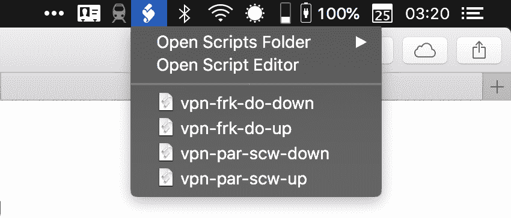

# 我如何制作自己的 WireGuard VPN 服务器

> 原文：<https://web.archive.org/web/https://techcrunch.com/2018/07/28/how-i-made-my-own-wireguard-vpn-server/>

你们中的一些人可能听说过 VPN 协议，它允许你在你的设备和服务器之间建立连接，例如 OpenVPN 和 IPsec。但是有一种全新的闪亮协议，承诺同时更快更安全——[wire guard](https://web.archive.org/web/20230326173021/https://www.wireguard.com/)。

但是 [WTF 反正是个 VPN](https://web.archive.org/web/20230326173021/https://techcrunch.com/2017/01/01/wtf-is-a-vpn/) ？VPN 是您面前的设备和数据中心的服务器之间的虚拟专用网络。如果您想要对本地网络上的其他人隐藏您的互联网流量，您可以在您的设备和服务器之间创建一个隧道。

你所有的网络流量都要通过这个连接，而且流量从一端到另一端通常都是加密的。这意味着你过分热心的 It 部门或中国的[防火长城](https://web.archive.org/web/20230326173021/https://en.wikipedia.org/wiki/Great_Firewall "Great Firewall of China")不能阻止任何服务。

然而，这也意味着操作服务器的人可以看到所有未加密的流量。这就是为什么我从不推荐使用免费的 VPN 服务，甚至不推荐付费使用一个账户。使用 VPN 并不意味着你在互联网上会更安全。你只是把风险转移到了 VPN 隧道。

许多 VPN 公司分析你的浏览习惯，卖给广告商，在不安全的页面上注入他们自己的广告，窃取你的身份，记录你的互联网流量，与执法部门共享信息等等。

说到 VPN 公司，不要相信任何人。

## 查看协议

创建点对点 VPN 隧道有多种方法。您的设备和服务器需要使用相同的协议来相互通信。最流行的协议是 [OpenVPN](https://web.archive.org/web/20230326173021/https://en.wikipedia.org/wiki/OpenVPN) 。这是一个安全的实现，几乎可以在任何设备上运行，只要你愿意安装一个应用程序。

IPsec 与 IKEv2 认证相结合，是另一种流行的协议。它可以在 iOS、macOS、Windows 和 Linux 上运行。这就是为什么它是无法安装任何应用程序的设备的绝佳选择。

你可能也听说过 PPTP 或 L2TP。但是这些协议并不安全，任何人都不应该再使用它们。

看起来已经有很多选择了。但是 OpenVPN 已经存在 17 年了。它很慢，而且不是为移动设备设计的。

OpenVPN 和 IPsec 也有一个巨大的代码库，这创造了一个更大的[攻击面](https://web.archive.org/web/20230326173021/https://en.wikipedia.org/wiki/Attack_surface)。目前还不清楚 NSA 是否发现了这些协议中的漏洞，因为审计大型代码库更加困难。WireGuard 的创建者杰森·唐恩菲尔德只为最初的发布写了【4,000 行代码。

连接到 WireGuard 服务器非常类似于使用 SSH 连接到远程服务器。您生成一组公钥和私钥，并与服务器交换公钥。既安全又难糊弄。

与其他 VPN 协议相比，WireGuard 依赖于您设备的网络接口。它添加了一个新的接口，无论您使用的是 Wi-Fi、以太网、LTE 等，都可以通过隧道本地路由所有流量。

普通 VPN 用户也知道，每次从 Wi-Fi 切换到 LTE 再到以太网时，您都必须重新连接到 VPN 服务器… WireGuard 服务器可以保持与您的设备的连接，即使您切换到另一个网络并获得新的 IP 地址。

WireGuard 仍然是相当新的和实验性的。例如，你找不到任何 iOS 版的 WireGuard 客户端。也很少有带有图形用户界面的 WireGuard 实现。

## 构建您自己的 VPN 服务器

如果你想试试 WireGuard，这并不难。你可能还记得我[过去讲过 Algo VPN](https://web.archive.org/web/20230326173021/https://techcrunch.com/2017/04/09/how-i-made-my-own-vpn-server-in-15-minutes/) 。这是一个很棒的开源项目，让你在几分钟内就可以设置好自己的 VPN 服务器。你不需要任何编码技能。

原来 [Algo VPN](https://web.archive.org/web/20230326173021/https://github.com/trailofbits/algo) 现在除了 IKEv2 还支持 WireGuard。换句话说，用 Algo VPN 创建一个 VPN 服务器将允许你使用两种协议连接到这个服务器。

Algo VPN 可以在任何 Ubuntu 服务器上运行，但是托管你的服务器最简单的方法是在 [DigitalOcean](https://web.archive.org/web/20230326173021/https://www.digitalocean.com/) 上创建一个账户。之后，您需要[下载一个 zip 文件](https://web.archive.org/web/20230326173021/https://github.com/trailofbits/algo#deploy-the-algo-server)并按照说明进行操作。

设置完成后，您的硬盘上应该会有一个新文件夹，其中包含连接到 VPN 服务器所需的所有内容。如果你在 Mac 上，你可以双击`.mobileconfig`文件，从你的 Mac 使用 IKEv2 连接到你的 VPN 服务器。

如果你想尝试 WireGuard，你需要一台运行 macOS 或 Linux 的电脑，或者一部 Android 手机。使用 WireGuard 最简单的方法是安装 [Android 应用](https://web.archive.org/web/20230326173021/https://play.google.com/store/apps/details?id=com.wireguard.android)，并将`.conf`文件添加到手机中。

在你的 Mac 上，你需要使用[自制软件](https://web.archive.org/web/20230326173021/https://brew.sh/) ( `brew install wireguard-tools`)安装 WireGuard。然后，您可以将`myvpnserver.conf`文件移动到硬盘上的`/etc/wireguard/`，并使用简单的命令行(`wg-quick up myvpnserver`和`wg-quick down myvpnserver`)进行连接。

我想更进一步，跳过终端窗口。在 macOS 上，您可以使用“脚本编辑器”应用程序创建 AppleScript，并通过在“设置”中启用“菜单栏”选项将其放入菜单栏中。

在我的脚本中，我还使用[icanhazptr.com](https://web.archive.org/web/20230326173021/https://icanhazptr.com/)获取我当前的主机名。然后，我在通知中显示我当前的主机名，以检查我是否连接到了 VPN 服务器。在这种情况下，我在 [Scaleway](https://web.archive.org/web/20230326173021/https://www.scaleway.com/) 上创建了一个 VPN 服务器:

这就是了。现在你不能说你更喜欢使用商业 VPN 服务，因为他们有一个很好的菜单栏应用程序。这种设置提供了同样的便利，但 VPN 连接更稳定。

再说一次，WireGuard 是实验性的。在生产层面使用 WireGuard 之前，您需要[评估您的风险](https://web.archive.org/web/20230326173021/https://techcrunch.com/2018/04/14/how-to-save-your-privacy-from-the-internets-clutches/)。如果你是爱德华·斯诺登，WireGuard 可能还没有为你准备好。您还需要适应有缺陷的实现。例如，我在关闭 WireGuard 连接后遇到了 DNS 问题，所以我不得不重置网络接口中的 DNS 设置。

但事实上，你可以关闭你的笔记本电脑，切换到另一个 Wi-Fi 网络，并保持连接到 VPN 服务器是非常整洁的。很明显，WireGuard 代表了 VPN 协议的未来。