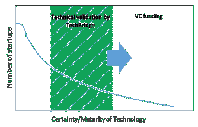

# 创新型创业公司如何在不断变化的清洁技术环境中蓬勃发展

> 原文：<https://web.archive.org/web/https://techcrunch.com/2017/08/27/how-innovative-startups-can-flourish-in-a-changing-cleantech-landscape/>

克里斯蒂安·赫普夫纳博士撰稿人

在当今不确定的政治优先事项和紧缩的 R&D 预算中，作为一家清洁技术创业公司，就像坐在过山车上，循环越来越大，看不到尽头。

但令人惊讶的是，这并没有阻止许多清洁能源初创公司迸发出创新的想法和创新，等待被推向市场。然而，随着[非软件清洁技术投资在过去几年中下降了 50%](https://web.archive.org/web/20230308214007/https://eere-exchange.energy.gov/Default.aspx?Search=DE-FOA-0001703&SearchType=),这些有前途的创新技术可能永远也不会跨越臭名昭著的“死亡之谷”。

有很多伟大的想法，但是越来越少的资金将这些想法推向市场。因此，促进清洁能源的创新意味着我们需要更有效的方式来配置日益有限的投资资本。

一个答案是将这些技术“去风险化”。通过第三方测试和验证降低新创新的风险表明，如果开发，该技术具有价值，能够以低成本产生关于潜在投资的有价值信息。技术验证和原型设计减少了投资者的不确定性，并被证明能够使投资的可能性翻倍，穿越死亡之谷并成功退出。

基于技术价值的确定性的创业公司分布，

去风险技术在哪里提供最大的价值？如果我们将清洁技术创业公司分为两类——1)创新型和资本密集度较低的创业公司，如容易获得风险投资的清洁技术软件，或 2)成熟度较低但具有潜在破坏性的创业公司，这些公司资本密集度更高，但尚未得到证明，并带来高风险——我们发现资本密集度更高的创业公司最划算。

一方面，软件创业通常被认为是低风险的，因为它们不需要大量的资本投资，失败可以通过软件更新来解决。另一方面，清洁技术硬件初创公司是资本密集型的，回收期更长，尽管有巨大的长期投资回报潜力，但仍被视为高风险。如下所示，这种风险可以通过验证和测试来降低。

硬件和软件初创公司的技术风险与成熟度轨迹

作为一个独立的非营利组织，Fraunhofer TechBridge 在过去 7 年里与 40 多家初创公司合作。我们一直在关注他们的进展，并评估技术验证对他们成功的影响。我们的分析显示了技术验证和后续资金之间的相关性。在我们分析的 41 家初创公司中，我们发现接受验证服务的硬件初创公司的存活率为 100%，而只接受其他服务的初创公司的存活率为 70%。

与只接受孵化或指导服务的初创公司相比，通过验证的初创公司在一年内获得的资金也多了 30%。同样值得注意的是，接受验证服务的硬件初创公司的后续投资与接受验证服务的软件初创公司类似。从历史上看，投资趋势倾向于支持清洁技术软件创业公司，而不是硬件创业公司，因此这一发现表明，消除资本密集型创业公司的风险可以大大缩小这一投资差距。

我们还注意到，对经过技术验证的初创企业的投资远远高于那些没有经过验证、也没有得到孵化或其他服务的初创企业。这可能是由于通过能源竞争和降低风险服务提供的高选择性。这一过程选择最有可能成功的创业公司，并给他们机会接受行业和市场专家的建议，以开发他们的技术来满足市场需求，使他们为投资者做好准备。

技术验证的结果很棒！

在将我们的绩效指标与另一家成功的孵化器和加速器的绩效指标进行比较时，我们观察到，在过去 5 年中，接受技术验证服务的初创公司在较小的一批公司中获得了更高的累积后续资金——即，与其他类型的初创公司支持基础设施相比，总投资和每家公司的投资都更多。

唯一的问题是，虽然去风险创业公司的技术吸引了更多的资金，但它们首先需要验证和技术演示的资金。创业公司如何逃脱这种第 22 条军规？

我们借鉴了成功的德国创新模式。在德国，所谓的“中小企业”主导着德国的商业格局。一些公共机构，如[弗劳恩霍夫网络](https://web.archive.org/web/20230308214007/https://www.asme.org/engineering-topics/articles/manufacturing-processing/how-does-germany-do-it)，通过开发和商业化创新来帮助弥合研究和工业之间的差距，从而支持这些中小企业。在美国采取类似模式可能有助于改革清洁技术创新。

信息技术和创新基金会(ITIF)最近的报告将“创新果园”的概念称为行业、政府、大学和研究实验室之间的合作，以支持创业公司并弥合清洁技术等“硬”技术新创新的融资缺口。

该报告提到了麻省理工学院发动机、回旋路、MassMEP-Greentown 和 Fraunhofer TechBridge 等模型，这些模型正是通过使用独特的方法来实现创新和促进创业公司的商业化。我们同意，利用共享资源和技术专长的公私伙伴关系模式会有所帮助。

非营利组织和大学可以促进创业公司和大公司之间的合作，并可以极大地帮助将新技术更快地推向市场。TechBridge 计划侧重于与企业赞助商合作，为早期创业公司开发竞争性挑战比赛，通过测试和验证服务奖励获胜的想法。通过这种方式，TechBridge 利用 Fraunhofer 的技术资源、领域专业知识和全球研究机构网络来帮助美国初创公司开发他们的技术。

同时，企业有机会影响新兴技术，并利用所获得的市场洞察力做出更好的投资决策。

结果呢？投资成功的可能性更高，各方共赢。

我们需要更多这样的模式，为清洁技术领域的突破性创新提供所有四种驱动力——技术采用的速度、精益研发、技术平台的使用和新市场的探索。

清洁技术创新将长期存在并繁荣发展。支持创业公司提炼、验证和商业化其技术的开放式创新模式，可能会点燃一个充满可能性的未来。