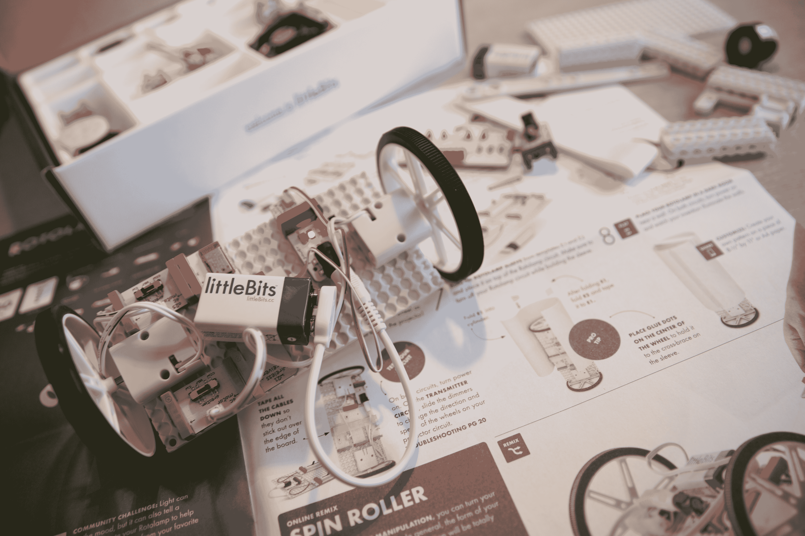
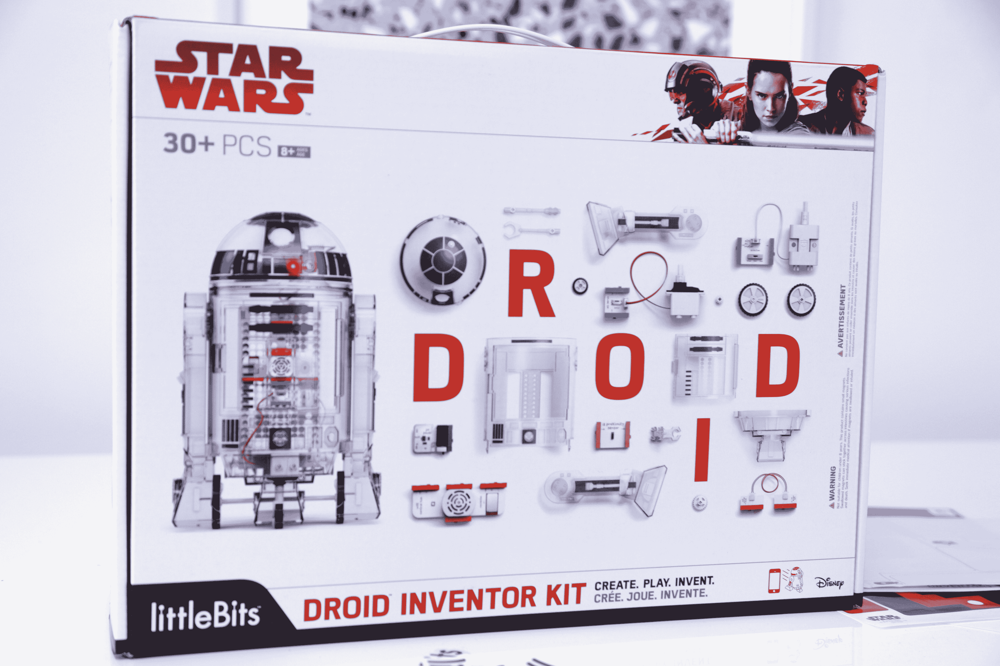
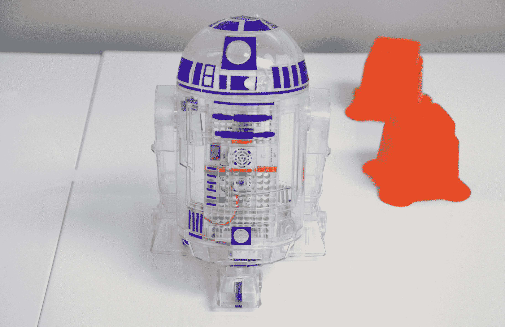

# littleBits 如何从副业发展到星球大战

> 原文：<https://web.archive.org/web/https://techcrunch.com/2017/11/04/how-littlebits-grew-from-side-project-to-star-wars/>

与许多最引人注目的创业公司一样， [littleBits](https://web.archive.org/web/20230323204543/https://techcrunch.com/tag/littlebits/) 一开始只是一个配角——没有期望，没有风险投资的早期推动。只是修修补补来打发时间。Ayah Bdeir 是一名麻省理工学院的毕业生，在纽约市建筑设计公司 eyeBeam 的研究员，当时该公司的种子刚刚萌芽。

“它从来就不是一种产品或一家公司。这只是我做的一个小项目。2009 年，我把它带到了创客博览会，”当我们坐在公司宽敞的曼哈顿公寓的一个角落里时，Bdeir 解释道。“当时只有我一个人在一个小摊位上，向朋友们炫耀它，突然一大群人走过来，孩子们开始排队和他们一起玩。我开始意识到，这是一个真正的机会，可以激励孩子们，让他们对教育感到兴奋。”

littleBits 在切尔西的办公室里，一切都很忙碌。该公司在 2014 年搬到这个地方，为其快速扩张的业务腾出空间，大约两年后，它已经显得人满为患。从某种程度上来说，这是在正确的时间推出的正确产品——在 Kickstarter 和 Indiegogo 充斥 STEM 玩具以及各大玩具公司开始尝试教孩子编程的几年前，littleBits 就已经迈出了第一步。

## 稍微大一点

但是创业公司的成功不仅仅是好的时机。在 2011 年创立公司之前，Bdeir 花了整整三年时间，开始修补公司的模块化构建模块。在他们最早的迭代中，构成公司产品核心的“比特”是为原型设计的。在一个从零开始启动硬件创业变得越来越可能的时代，Bdeir 认为她正在开发一个强大的工具，帮助发明家将他们的愿景变为现实。

首席执行官解释道:“设计师制造桌子和椅子，现在他们正在设计 DVD 播放器、咖啡机和鸟巢。”。“所以他们需要用电子学做原型；littleBits 是一个原型工具。它从来就不是真正为孩子们准备的。”

这可能是一条有点迂回的市场之路——但这是一个重要的区别。littleBits 最初是作为成年设计师的工具诞生的，这意味着该产品不需要经过委员会的设计过程，而委员会的设计过程通常是最好的儿童产品。虽然构成 Bdeir 想象中的受众的设计师类型不太可能是电气工程师或专业程序员，但核心产品不会受到我们经常与主流儿童产品联系在一起的任何贬低。

## 所有年龄

尽管人口结构发生了意想不到的变化，但 littleBits 的核心产品自最初构想以来实际上变化很小。在过去的六年里，这家初创公司已经扩大了它的产品范围，并与内容公司和教育项目建立了许多合作伙伴关系，但 Bdeir 在研究生休学期间首次创作的那些作品仍然是 littleBits 的核心。

“这不是一个容易烘烤的烤箱，”她笑着解释道。“这不是简化或过度简化。这是真正的工程，更容易使用。无论你是一个八岁的孩子还是一个真正的工程师，你与比特的互动都是一样的。改变的是市场营销。改变的是我们谈论它的方式。所以，不要说这是为了让你可以原型化你的下一个发明，这是为了让你可以发明一个很酷的东西或对机器人感到兴奋。”

该公司成功的基础是拥抱开放——无论是产品本身还是目标受众。对于前者，该公司强调尽可能提供兼容性。这意味着销售像乐高这样受欢迎的积木的适配器，创建一个针对《我的世界》玩家的套件，并使其套件与 IFFFT 和 Scratch 等协议一起工作。

## 一缕希望

就其受众的包容性而言，Bdeir 引用了她所称的公司的“隐藏使命”,即通过 littleBits 让女孩们接受工程和编程。当然，该公司从未回避这一事实，但它也从未刻意创造专门针对女孩的套件，以取代该类别传统上年轻的男性人口。相反，它的产品专门设计成中性的，明亮的颜色和手写的文字旨在吸引任何对 STEM 教育的踏脚石感兴趣的人。

这个使命延伸到了 littleBits 的最新产品——这种合作关系可能会给这家小公司带来变革。2016 年，该公司获得了加入迪士尼加速器的机会——这是一个难以拒绝的邀请。毕竟，这个项目帮助了专注于儿童的初创公司 Sphero 成为电子玩具领域的一股力量。2015 年，随着 BB-8 的上映，该公司从一个由智能手机控制的新奇事物变成了历史上最大的电影特许经营中最热门的商品。

“我们收拾好行李，我和另外三个同事，我们在洛杉矶度过了夏天，”Bdeir 说。“我们花了很多时间在迪士尼与不同的部门、创意人员、角色艺术家会面，试图找出我们可以一起做些什么。我们围着最佳匹配打转，那就是星球大战。”

LittleBits 也发现自己拥抱了一个机器人——尽管这家纽约公司选择了一个熟悉的最爱。为迎接 12 月的《最后的绝地武士》,原力于周五发布了大量产品，littleBits 机器人发明家套件是其中最引人注目的产品之一。以该公司熟悉的系统为核心，这个 30 件套迫使年轻的创作者们以长期受欢迎的旅行者机器人 R2-D2 为原型。

“当我们着手制作《星球大战》产品时，我们真正开启了机器人不仅仅是看起来像某种特定方式的机器人的想法，”Bdeir 说。“外壳是透明的。你可以看到里面。你可以对它进行定制，赋予它不同的功能，比如整理袜子机器人、保护兄弟姐妹机器人或送餐机器人。”

根据 Bdeir 的说法，新的《星球大战》电影也让 littleBits 有能力说出其“隐藏的使命”。“我们把雷伊作为导师。她是一个清道夫，一个问题解决者，一个修补者。她是你整个旅程的导师。”