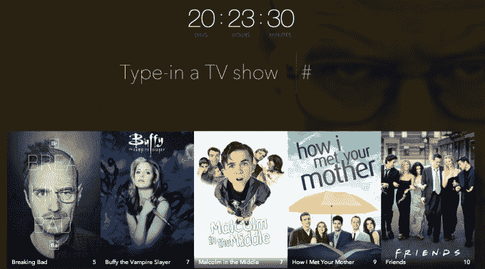

# 你在电视机前消磨了多少时间？这个工具告诉你 

> 原文：<https://web.archive.org/web/https://techcrunch.com/2014/04/12/how-much-time-have-youve-killed-in-front-of-your-tv-this-tool-tells-you/>

# 你在电视机前消磨了多少时间？这个工具告诉你

**周三的我:**哦天哪！这个周末我会很有效率的！我要做我所有的兼职项目。

**周六的我:**拧边项目！让我们再看一遍《绝命毒师》!

你有没有想过你花了多少时间看电视节目？可能很多吧。但是*多少呢？*

两周的价值？一个月？

这个工具为你处理数据。输入你看过的节目，然后输入你看过几季。它会告诉你每个节目消耗了你多少时间——更痛苦的是，它会把你所有节目的总时间加起来。

*老友记*每一集你都看了吗？那是 5 天。

坐过*输过*两次？那就是每个人又多了 3 天。

为《我是如何遇见你母亲》的最后三十分钟生气？没关系——毕竟，你花了 4 天才到达那里。

不要误会我的意思:我喜欢《T21》这部好电视剧。我至少完整地看了一遍上述所有的节目，通常在我工作的时候会随机播放一集这样或那样的节目。但是*该死的*，加起来快吗。

正如约翰·列侬经常([诬？](https://web.archive.org/web/20221207190041/http://quoteinvestigator.com/2010/06/11/time-you-enjoy/))引用:“你喜欢浪费的时间没有被浪费。”

但他也开创了怪异的披头士乐队。在那之后，地球上没有人能指责你浪费时间。

去他的。我要去外面搭个棚子什么的。