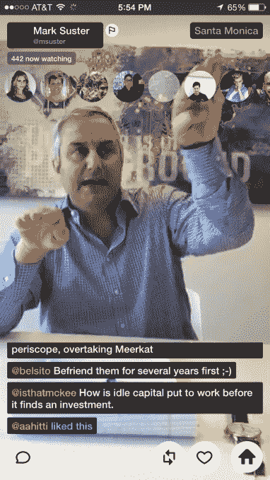

# Twitter 确认收购 Periscope，以下是直播应用的工作方式 

> 原文：<https://web.archive.org/web/https://techcrunch.com/2015/03/13/how-periscope-works/>

今天 Twitter [正式宣布](https://web.archive.org/web/20230130234551/https://twitter.com/kevinweil/status/576430215787769856)于一月份收购直播应用 [Periscope](https://web.archive.org/web/20230130234551/http://periscope.tv/) 。据几个消息来源称，它将作为一个独立于 Twitter 的应用程序推出，能够观看直播和之前播放的移动视频流。这种短暂性的缺乏是 Periscope 和最近推出的直播应用程序以及在技术社区像野火一样流行的之间的许多差异中的第一个。

Twitter 的凯文·韦尔今天在推特上发布了这一声明:

他指的是 Periscope 的这条推文:

3 月 4 日，TechCrunch 首次报道了 Periscope 和 Twitter 之间的联系，称两家公司正在进行收购谈判，交易可能已经完成。商业内幕[后来报道说交易确实已经完成。](https://web.archive.org/web/20230130234551/http://www.businessinsider.com/twitter-acquires-periscope-for-a-sizable-amount-2015-3)

## 如何潜望镜

潜望镜还没有推出，但是很快就会开始[扩展它的 beta](https://web.archive.org/web/20230130234551/https://twitter.com/periscopeco/status/576429979942006784) 。据说它是这样工作的。

当你打开 Periscope 时，你可以看到正在进行的直播或观看最近录制的节目。潜望镜将允许公共和私人广播。你可以在 Twitter 上弹出一个链接，让它出现在 Periscope 的主屏幕上，或者私下邀请几个朋友观看。

来自猫鼬的截图

观众的反馈是 Periscope 的主要组成部分。这就是这款应用如何让非广播员的人参与进来。您可以在流上发表评论，这些评论会在广播公司和其他观众面前弹出。然而，这些评论并没有被整合到 Twitter 上，所以在 Meerkat 上发现的评论没有那么令人寒心。观众还可以向广播员展示生动的心形图案以示感谢，有消息称这是一个令人愉快的设计创意。

为了提供一种即使在观看重播时也能感受到现场直播的体验，所有的评论和心声都将与视频同步重播，就像你正在实时观看一样。希望在 Periscope 上出现一个明星创作者社区，类似于在 Vine 和 Snapchat 上发展的生态系统。主流名人也可以成为一个主要的广播人口统计，使用 Periscope 一次亲密接触许多粉丝。

## 直播的未来

Periscope 引起了人们的热情，这要归功于早在 11 月份由一些 Twitter 创始人、顶级投资者和其他科技行业精英精心策划的私人测试版。[笑话是](https://web.archive.org/web/20230130234551/https://twitter.com/msquinn/status/572138383327297536)这是一个类似搏击俱乐部的测试版，在那里“潜望镜的第一条规则是你不能谈论潜望镜。”

当迪克·科斯特罗的公司正在追求 Periscope 时，一位消息人士称，该公司告诉 Periscope，它相信视频是未来 Twitter 的主要部分。为此，除了支付的现金(据[向](https://web.archive.org/web/20230130234551/http://www.businessinsider.com/twitter-acquires-periscope-for-a-sizable-amount-2015-3)报告约为[1 亿美元](https://web.archive.org/web/20230130234551/https://techcrunch.com/2015/03/04/twitter-in-talks-with-live-streaming-app-periscope/))之外，据说 Twitter 还提供了一份可观的股票补偿方案。这个想法是，如果 Periscope 可以让 livestreaming 吹起来，Twitter 的估值就会上升，创业公司的团队也会变得更加富有。

潜望镜的团队

不幸的是，Twitter 将不得不推出 Periscope，与初创公司 Life On Air 在 10 天内开发的更加粗糙的应用 Meerkat 进行疯狂的比较。 [Meerkat](https://web.archive.org/web/20230130234551/http://meerkatapp.co/) 不允许你观看录制的广播或建立私人流，它的整个身份、通信和分发系统都建立在 Twitter 上。

Twitter 似乎希望继续打磨 Periscope，直到它变得完美，但最终意外地错过了在最近一波直播应用中成为第一的机会。尽管我接触过的许多用过它的人都认为它比 Meerkat 好得多，但它仍需要努力超越 Meerkat 现有的网络效应。

一些人想知道移动直播是否会成为时尚。然而，Twitter 似乎确信，Periscope 可能成为其履行使命的重要组成部分，即“让每个人都有能力无障碍地即时创建和分享想法和信息。”而 Twitter 让你用文字描述“发生了什么？”，潜望镜会让你实实在在地向人展示。