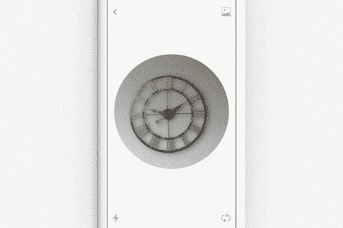
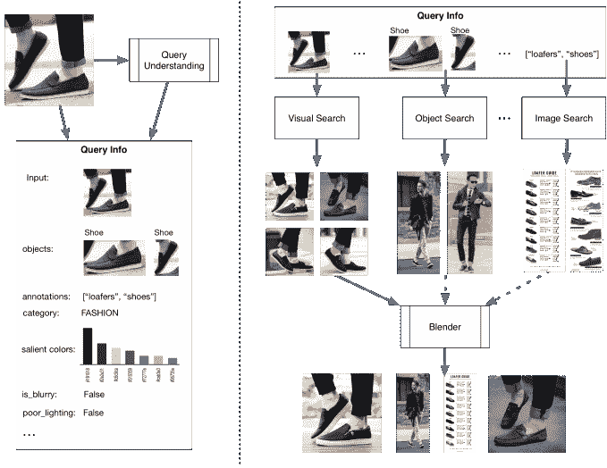
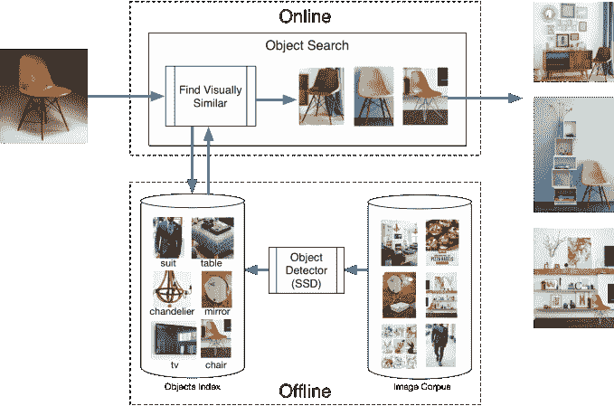

# Pinterest 的视觉搜索是如何从月光项目变成现实世界的搜索引擎 

> 原文：<https://web.archive.org/web/https://techcrunch.com/2017/02/22/how-pinterests-visual-search-went-from-a-moonlight-project-to-a-real-world-search-engine/>

大约在 2013 年和 2014 年的某个时候，深度学习正在经历一场革命，这要求几乎每个人都重新设定他们对事物如何工作的预期，并为人们利用计算机视觉所做的事情创造公平的竞争环境。

至少这是 Pinterest 工程师 Andrew Zhai 和他的团队所采取的理念，因为大约在那个时候，他和其他几个人开始在 Pinterest 内部开展一些月光项目，以建立计算机视觉模型。机器学习工具和技术确实已经存在了一段时间，但由于深度学习如何工作以及 GPU 的使用越来越多，该公司能够以全新的眼光看待计算机视觉，并看看它在 Pinterest 的背景下会如何工作。

“从计算机视觉的角度来看，我们有很多图像，视觉搜索是有意义的，”翟说。有这样的产品/数据集匹配。来到 Pinterest 的用户，他们经常处于这种视觉发现体验模式。我们在正确的时间处于正确的位置，技术正处于变革之中，我们有自己的数据集，我们非常专注于尽可能快地迭代，尽可能快地获得用户反馈。"

最终的结果是 Lens，Pinterest 本月早些时候推出的一款产品，允许用户用相机指向现实世界中的一个物体，并返回 Pinterest 的搜索结果。创意总监艾伯特·佩雷塔说，虽然去年推出了半测试版，但 Lens 是多年废弃原型和产品实验的结果，最终有望将世界集体变成一堆可以通过相机搜索的大头针。

当用户通过镜头看东西时，Pinterest 的视觉检测就会发挥作用，确定照片中的物体是什么。然后，Pinterest 的技术可以将图像框在椅子周围，并使用 Pinterest 现有的搜索技术进行查询。它使用某些试探法，比如它是哪种对象的置信度分数，以及它的上下文——比如它是主导对象、最大的对象、最受关注的对象还是其他对象。翟说，优先考虑的一部分是利用 Pinterest 现有的技术，如搜索，来建立自己的视觉搜索产品。

Pinterest 已经从用户那里收集了大量数据，这些用户最初在他们的图像中裁剪对象以搜索对象，并为他们的搜索绘制边界框。该公司有正反馈循环来确定这些搜索是否正确——如果用户参与搜索一把椅子的结果，那么它可能就是一把椅子。因此，该公司有很多方法来最初训练这些深度学习算法，以便将过程转移到相机照片上，并尝试做同样的事情。所有这些在未来都得到了回报，因为最初的 janky 项目给了该公司关键的数据集来构建更强大的东西。

Pinterest 的目标是模仿这项服务的核心用户体验:在 Pinterest 上闲逛和发现新产品或新概念。仅仅从谷歌视觉搜索中获得你可能期望的文字结果不足以将 Pinterest 的体验扩展到典型的搜索之外——用关键词和概念——到你用相机做的事情。还有其他方法可以达到这个结果，比如逐字阅读瓶子上的标签，或者问别人他们穿的是哪种鞋子。

“如果我在我的厨房里，面前有一个鳄梨，如果我们指向它，然后我们返回一百万张鳄梨的照片，这几乎是你能得到的最无用的东西，”佩雷塔说。“当有人在 Pinterest 上标记鳄梨时，他们期望的是四处逛逛。它可以从烹饪食谱到健康益处和在花园里种植。你知道相关的大头针，你不太明白它们为什么会在那里，但有时它们感觉就像你想看到的那样。”

Pinterest 面临的最大挑战之一是如何从用户生成的内容(如低质量的照片)跳到包含更专业的高质量照片的结果。视觉搜索工程经理 Dmitry Kislyuk 说，很容易将低质量的照片(如模糊或光线不足的照片)映射到其他低质量的照片。这主要是团队工作的第一个演示中返回的结果，因此团队必须找出如何获得更高质量的结果。这两个对象各自聚集在一起，所以公司必须基本上转发它们以提供相同的语义结果，并将它们放在一起。

总的来说，所有这些拼凑在一起，形成了一个强有力的论点，即 Pinterest 正试图成为视觉搜索的领导者。这在很大程度上被认为是 Pinterest 最大的优势之一。由于其庞大的数据集非常适合产品，所以图片的每一部分都可以很容易地分解成对其他产品的搜索。这些搜索在 Pinterest 早期就存在，但形式有限——用户也不知道该怎么做——但在过去几年里，它们开始越来越成熟。这是 Pinterest 吸引广告客户的部分原因，尽管它需要确保从一个被纳入创新预算的好奇心，跃升为与脸书(以及很快可能的 Snapchat)并列的主流产品。

Pinterest 的现代视觉搜索的许多成功和起源几乎完全符合 GPU 用于深度学习的兴起。处理器已经存在了很长一段时间，但 GPU 非常擅长并行运行进程，例如在屏幕上渲染像素，并且速度非常快。CPU 必须更加通用，但 GPU 擅长并行运行这些类型的进程，使后台发生的实际数学运算执行得更快。(这场革命也让全球最大的 GPU 制造商之一 NVIDIA 的股价在过去一年增长了两倍多，并成为深度学习和自动驾驶未来的关键组成部分。)

“深度学习的方法已经存在了 10 年或 20 年，但正是 2013 年和 2014 年左右的一篇论文表明，当你在 GPU 上提供这些方法时，你可以获得惊人的准确性和结果，”翟说。“这真的是因为 GPU 本身，没有它，这场革命可能不会发生。GPU 只关心矩阵乘法之类的具体事情，你做起来真的很快。”

实际过程是手机上发生的事情和网上发生的事情之间的小心舞蹈，以便建立更无缝的用户体验。例如，当用户通过手机查看某样东西时，Lens 的注释会迅速返回，而该公司会在后端完成图像搜索。这种感知的用户延迟有助于平滑体验，使其感觉更加实时。随着 Pinterest 开始进行国际扩张，这将是非常重要的，它必须开始解决低延迟领域等问题，可能会将更多业务转移到手机上。

Pinterest 的结果部分是大量新学习的结果，部分是运气，每个人的团队都必须放弃并重新学习他们所有的深度学习方法。除此之外，Pinterest 还有数十亿张图片，其中大部分都是高质量版本的图片，可以自然搜索，这是其他公司或学者可能没有的数据档案。整个“快速行动，打破常规”有点符合 Pinterest 的风格，Pinterest 试图让用户看到各种版本，以便找出最有效的版本，因为这个团队(不到 12 人)觉得它正在创造新的用户行为。

其他公司也有很多尝试将这项技术武器化为商业产品，像 Clarifai 这样的初创公司筹集了大量资金，并建立了元数据驱动的视觉搜索，供零售商和企业使用。谷歌总是一个拥有大量数据的隐现怪兽，尽管这是否会转化为商业产品是另一回事。与此同时，Pinterest 希望其专注于返回相关的想法，而不是直接的一对一图像结果——以及其背后的技术——将继续使其与众不同。

“我们试图用相机把你的世界变成 Pinterest，”佩雷塔说。“这并不是说我们在为用户创造全新的体验。感觉就像当我们把它钉上时，你会觉得整个世界都是用大头针做成的。那个东西，我给那把椅子拍了张照片，不仅仅是那把椅子的相似风格，还有它的背景。如果你要在 Pinterest 上找到那把椅子，那正是你期望找到的。那种流浪，那种发现。当我们在镜头前表现出色时，会感觉世界是由大头针组成的。