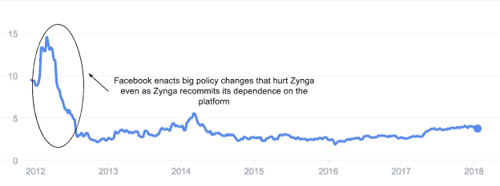
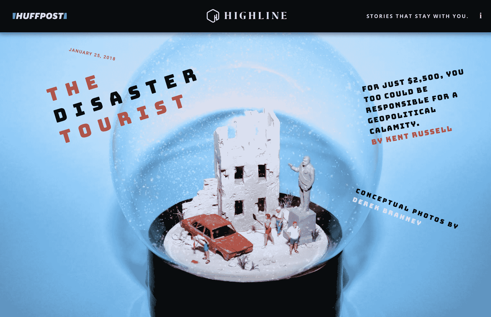

# 出版商如何在脸书的新闻订阅变化中生存

> 原文：<https://web.archive.org/web/https://techcrunch.com/2018/01/28/how-publishers-will-survive-facebooks-newsfeed-change/>

迈克尔·拉克撰稿人

迈克尔·拉克是首席运营官和联合创始人

[Omnivirt](https://web.archive.org/web/20221208110719/http://omnivirt.com/)

.

脸书[于 1 月 11 日](https://web.archive.org/web/20221208110719/https://newsroom.fb.com/news/2018/01/news-feed-fyi-bringing-people-closer-together/)宣布将改变其新闻订阅算法，将朋友和家人的帖子置于公共内容之上。告别来自 Tasty、CNN 和其他已经接受该平台的品牌的永无止境的赞助帖子。是时候向更多来自朋友的评论和分享的个人帖子问好了。听起来像脸书的原版，不是吗？

脸书的新闻订阅变化通过关注人与人之间有意义的互动，努力为用户创造更好的用户体验。这对其业务至关重要，因为这家科技巨头寻求回归其核心使命，不仅是连接人，而是有意义地连接人。在充满俄罗斯干涉、公众信任问题和内容监管问题的一年里(……[并加入参议院听证会](https://web.archive.org/web/20221208110719/https://www.youtube.com/watch?v=lbRydRmKOuI))，脸书现在专注于通过重建品牌和提供令人惊叹的用户体验来安抚公众。

但这让越来越多地利用脸书进行内容分发和盈利的媒体专业人士陷入困境。出版商尤其担心。但是他们应该这样吗？

**社交媒体时代的出版**

脸书的用户基础非常强大。随着～2B 全球每月活跃用户，脸书是一个重要的工具，出版商谁寻求增加他们的观众。通过这个社交媒体巨头，出版商找到了一个拥有无与伦比的流量的简单平台来分发内容。脸书通过培养出版商的关系使事情变得简单，努力使脸书成为不仅仅是张贴海报和你朋友的孩子的照片的目的地。

然而，对于脸书来说，这种策略将平台变成了用户被动滚动的目的地。马克·扎克伯格说，花在平台上的时间已经失去了作为脸书一个关键指标的光彩。尽管日活跃用户[季度环比增长](https://web.archive.org/web/20221208110719/https://s21.q4cdn.com/399680738/files/doc_financials/2017/Q3/Q3-'17-Earnings-Presentation.pdf)，过去两年平均增长率为 4.5%。“我预计人们花在脸书的时间和一些参与度指标将会下降。但我也希望你花在脸书的时间会更有价值。”在这个平台上，用户行为本质上具有很深的社会性和情感性，积极使用这个平台对脸书来说更有价值，因为它的生存依赖于积极参与的用户群。这一新的价值等式为脸书创造了一个更相关的基于时间的指标，扎克伯格在脸书 2017 年第三季度财报电话会议上报告说，“在这里，时间本身不是目标；我们真正想要的是时间花得值”。

这句话在 2012 年 YouTube 上的一次[战略讨论](https://web.archive.org/web/20221208110719/https://youtube-creators.googleblog.com/2012/08/youtube-now-why-we-focus-on-watch-time.html)中听起来太熟悉了，那次讨论关注的是观看时间而不是观看次数。YouTube 一直专注于增加观众人数，该视频平台的出版商盈利与浏览量密切相关。更多的浏览量意味着更多的广告。更多的广告意味着更多的钱。然而，YouTube 意识到，从长远来看，糟糕的视图对平台没有好处，并正在创建一种新形式的发布者，其唯一目标是创建视图，而不是在平台上推动有意义的时间。花时间在高质量的内容上会更有价值。从短期来看，一些出版商会赔钱，另一些会倒闭。鼓励点击和浏览的缩略图和标题将会消失。随着时间的推移，让人们有意义地参与进来的好内容将会胜出。

**对出版商的短期影响**

对于出版商来说，被动浏览赞助内容是一件好事。在一个争夺用户注意力竞争激烈的世界里，脸书让更多的眼球发现了他们的内容。出版商开始依赖脸书这样的社交媒体渠道来增加流量，当公共内容很容易被发现并在新闻提要上优先显示时，这种做法就奏效了。然而现在，出版商不能继续采用同样的内容分发和盈利策略，期待同样的结果。

我们之前已经看到脸书如何极大地影响出版商的业务成果，以及相应地调整自己的增长策略是多么必要。

想想 Zynga，FarmVille 热潮背后的移动游戏公司(我知道你已经成为这些作物的猎物)。Zynga 基于其在社交网络上的受欢迎程度，以脸书应用的形式推出了自己的游戏(截至 2009 年底，超过 20%的脸书用户在玩 FarmVille)。该公司随后于 2011 年上市。然而，对脸书的依赖最终损害了它的业务。当脸书[采取的政策](https://web.archive.org/web/20221208110719/http://www.adweek.com/digital/facebook-and-zynga-battle-over-credits-and-bigger-platform-issues/)损害了 Zynga 接触玩家和赚钱的方法(取消第三方推送通知和提出请求的能力，并收取 30%的收入)时，Zynga 面临一个选择:与脸书分道扬镳，专注于独立的自有和运营目的地，或者重新配置脸书的合作伙伴关系。Zynga 领导层[选择了后者](https://web.archive.org/web/20221208110719/https://beta.techcrunch.com/2010/05/18/facebook-and-zynga-enter-into-five-year-partnership-expand-use-of-facebook-credits/)，然后转向更强大的 O & O 和移动战略，结果是灾难性的:

*2012-2018 年 Zynga 股价(纳斯达克股票代码:ZNGA)*

**投资强劲的房地产并推动货币化**

为了在不断变化的社交媒体环境中获胜，出版商将寻求减轻他们对脸书产生观众流量的依赖，因为这种流量现在将会减少。虽然一些利用 clickbait 图片和标题的出版商可能无法在这一转变中取得成功，但那些真正创造出具有良好用户体验的好内容的出版商将会渡过难关。

这种最初的流量下降无疑会随着时间的推移而逐渐减少，因为用户仍然会寻找发现和消费出版商内容的解决方案，即使脸书不是这样。观众总是希望从他们喜欢的渠道和他们信任的品牌获得(更多)内容。获胜的出版商可以通过将他们的内容分发和货币化集中在脸书新闻源之外来提供这种解决方案。

出版商将会全力以赴于他们自己经营的房产，并确保他们在他们实际控制的目的地创造最好的用户体验。想想《赫芬顿邮报》的 [Highline](https://web.archive.org/web/20221208110719/http://highline.huffingtonpost.com/) 房产。致力于展示挑衅性的封面故事内容。Highline 也有无可挑剔的网站设计。通过投资这一产业的内容和 UX，赫芬顿邮报将 Highline 定位为用户友好的内容发现目的地，以及用户的日常习惯。

Highline 的登录页面设计友好

当谈到内容货币化时，出版商也必须创新他们的广告策略。通过超越“无聊的横幅广告”，并利用观众对更高质量和更具吸引力的内容的不断变化的偏好，出版商将越来越多地寻求提供更积极地吸引用户的广告解决方案。毫不奇怪，影响脸书新闻订阅决策的“主动参与”趋势同样适用于广告内容。

出版商已经意识到他们需要将自己与单纯的吸引眼球的地方区分开来。[今日美国的 Get Studios](https://web.archive.org/web/20221208110719/http://marketing.usatoday.com/get-creative) 是出版商如何投资品牌内容创作的一个例子(这是 Buzzfeed 过去几年战略的一大部分)。随着对程序化平台的可视性和 impcat 的质疑，越来越多的出版商开始提供大规模收购/高调的优质广告投放。此外，出版商开始将自己重新定位为技术公司(华盛顿邮报[现在提供软件服务](https://web.archive.org/web/20221208110719/https://www.fastcompany.com/40495770/the-washington-post-is-a-software-company-now)！).

我们已经看到像《纽约时报》这样的出版商在虚拟现实这样的新兴技术上投入巨资。我也看到出版商提供独特内容、格式和发行的能力如何为品牌带来新的收入来源。那些倾向于更新兴的内容和故事形式的出版商不仅会赢得观众，而且随着最近的这些变化，更多的广告收入将从脸书转移出去。

*【披露:我共同创立了 [OmniVirt](https://web.archive.org/web/20221208110719/http://www.omnivirt.com/) ，这是一个 360°虚拟现实广告平台，为出版商、品牌和代理机构提供服务，帮助他们驾驭媒体和广告的潮流】*