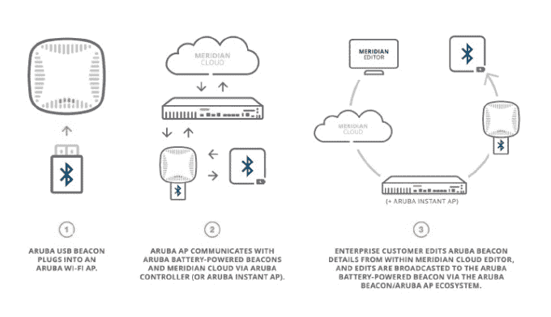

# 49 人队如何利用信标帮助你找到热狗和啤酒 

> 原文：<https://web.archive.org/web/https://techcrunch.com/2014/11/04/how-the-49ers-are-using-beacons-to-help-you-find-hot-dogs-and-beer/>

企业 Wi-Fi 提供商 [Aruba Networks](https://web.archive.org/web/20221007214107/http://www.arubanetworks.com/) 今天在圣塔克拉拉的旧金山 49 人队主场[李维斯体育场](https://web.archive.org/web/20221007214107/http://www.levisstadium.com/stadium-info/about-levis-stadium/)正式点亮了他们自己开发的 beacon 网络和配套的智能手机应用。经过过去几个月的测试，该部署现在可以为体育场观众提供一系列基于位置的服务，例如:无论体育场用户有多深入，都可以通过李维斯体育场应用程序快速准确地找到特许经营店、洗手间和座位。

这是第一个安装在如此大的空间内的室内定位系统之一——该体育场面积为 185 万平方英尺，有 6.8 万个座位——并预示着未来我们将拥有像 GPS 数据一样精确的室内定位。

在不久的将来，Aruba 和他们收购的软件公司 [Meridian](https://web.archive.org/web/20221007214107/http://meridianapps.com/) (我们在之前已经报道过的[)也计划在比赛期间在体育场内为特定事件和优惠启用位置感知推送消息。他们希望为用户创造更丰富的体验，甚至可能是对现代体育场的期望。](https://web.archive.org/web/20221007214107/https://beta.techcrunch.com/2011/03/22/meridian-for-iphone-in-store-turn-by-turn-maps-to-merchandise/)

信标体积小，[蓝牙低能耗](https://web.archive.org/web/20221007214107/http://en.wikipedia.org/wiki/Bluetooth_low_energy)硬件设备，广播范围有限，可用于与智能手机或其他可穿戴设备通信。信标可以放置在建筑物或零售空间内的多个位置，通过其单独的蓝牙信号覆盖该位置的特定区域(约 75 米)，然后可以允许参与者的智能手机或可穿戴设备与之通信，从而确定他们的位置。

然而，信标也可以触发用户设备上的特定内容或体验。例如，当你走进一个信标的区域时，你可能会收到一种推送信息。如果您进入另一个区域，您可能会收到不同的消息。这种不同的内容可以特定于每个信标的单独位置，从而在您所在的建筑物的不同区域实现定制内容。

这就是零售商对信标如此热衷的原因。尽管越来越多的人涌向网上零售商寻求更便宜、更方便的商品，但这些小设备可能有助于重塑零售体验及其相关价值。据 Aruba 称，与基于 Wi-Fi 的室内定位相比，消费者更喜欢信标，因为它天生对隐私友好。你选择进入的场馆应用寻找信标；信标不会找你。

回到手头的新闻，我与阿鲁巴/子午线公司的杰夫·哈德森交谈了一下新开发的历史，但也了解了这是如何在体育场工作的。

杰夫向我解释说，在苹果宣布他们正在进行日落 MAC 地址 Wi-Fi 三角测量(这是 Aruba/Meridian 当时所依赖的室内定位技术)之后，这两家公司决定采用新的苹果 iBeacon 标准，并建立自己的信标，以便能够更彻底地控制他们的系统。这一决定的结果允许他们创建两种不同的硬件信标、一个新的相邻 Wi-Fi 系统和一个远程软件管理控制台来控制它们。他们的一个信标带有内置的 1.5 至 2 年的电池，另一个只是一个小型的 USB 记忆棒信标，可以插入电源。*(*注——远程管理系统计划在 Q1 青奥会上推出)*

在当前李维斯体育场的情况下，硬件是这样工作的:
1 .大量阿鲁巴电池供电的信标部署在体育场各处。
2。少量的阿鲁巴 Wi-Fi 节点(可以覆盖更大的区域)也部署在整个体育场。
3。较小的 USB 型信标插在 Wi-Fi 节点的 USB 端口上。这允许许多电池供电的信标与 Wi-Fi 节点直接通信。
4。然后，Wi-Fi 节点将信标数据转发回阿鲁巴现场的单个软件控制器或为整个体育场服务的基于云的软件控制器。
5。控制器将数据转发回远程管理系统，IT 专业人员可以在其中监控和维护信标、检查电池寿命、发布固件更新等。

*因此，需要注意的是，为了访问完整的远程管理功能，Aruba Wi-Fi 和 Wi-Fi 控制器需要通过直接硬件或云对蓝牙信标可用。*

在李维斯体育场的例子中，实际上只有一个位置—体育场本身。体育场内可能有许多信标，但只有一个位置需要应对。在这种情况下，有必要在现场安装 Aruba 控制器来管理信标，并将它们的数据转发到云，然后再转发到管理控制台软件。正如我提到的，他们还没有进行这种远程管理，但很快就会了。

**游戏机从何而来？**
Aruba 从头开始构建自己的硬件能力，但实际上他们并没有从管理控制台开始。正如我们在几年前[报道的那样](https://web.archive.org/web/20221007214107/https://beta.techcrunch.com/2013/05/15/indoor-mapping-startup-meridian-adds-notification-zones-to-their-strategy/)，Meridian 之前构建了一个相当强大的控制台，用于创建和管理室内位置地图，以便在通过思科 Wi-Fi 路由器进行三角定位后识别消费者的移动设备。

例如，消费者可以使用智能手机应用程序浏览拉斯维加斯的某些赌场。当时，这使用无线三角测量。为了为消费者应用程序创建地图，赌场可以将他们的建筑蓝图上传到 Meridian 软件系统，该系统可以处理这些蓝图并为应用程序创建地图，而无需大量额外的工作。

一旦创建了地图，赌场也可以使用这些地图来查看他们的 Wi-Fi 路由器的位置。使用这个控制台系统，Meridian 基本上能够获得与体育场示例类似的结果，只是使用 Wi-Fi 而不是蓝牙信标，并且建筑物所有者只需做最少的工作。这意味着在比赛日上厕所更快，买啤酒和小孩更方便，这对场地所有者和球迷来说都是好事。