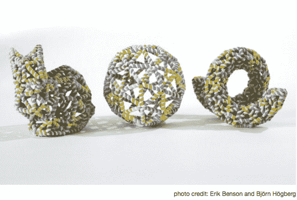
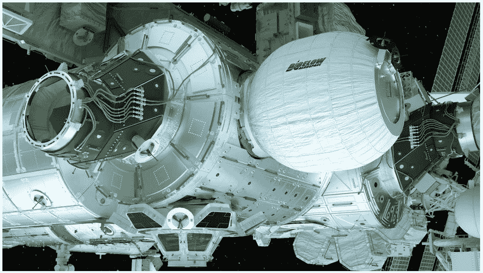

# 古老的折纸艺术如何激发尖端技术 

> 原文：<https://web.archive.org/web/https://techcrunch.com/2016/06/27/how-the-ancient-art-of-origami-is-inspiring-cutting-edge-technology/>

早在 3D 打印机出现之前， origami 就是在平面上创造出栩栩如生的形状的天才。折叠带来了随意折叠、弯曲和展开结构的能力，这在各种工程应用中具有巨大的潜力。从可消化的折纸药丸可以为侵入性手术提供替代方案，到可以紧密包装在飞机中并在发射后展开的太阳能电池板，折纸现代应用的核心是它的变形能力。

自 6 世纪佛教僧侣将纸从中国带到日本以来，折纸术就一直在发生变化。因为纸很贵而且不能广泛获得，它的第一次折纸应用是在宗教仪式上。

最初常见的形状之一是“十德”，一系列之字形折叠和切割的纸附在绳子或木头上，以表示净化仪式。接下来是“Mecho”和“Ocho”，在传统的神道教婚礼上，雄性和雌性蝴蝶被附在清酒瓶子上。到了 17 世纪，由于大规模生产纸张的出现，折纸术已经超越了它的仪式起源，成为一种流行的娱乐形式。数百万只纸鹤随之而来。

形式一直相对停滞，直到 20 世纪 50 年代，日本艺术家吉泽章用他复杂而逼真的动物形象启发了新一代的艺术家和科学家。接下来是物理学家罗伯特·朗，他一直是计算折纸的领军人物，将数学公式与折叠艺术结合在一起。在郎众多受折纸艺术启发的实用应用中，有一项就是提高汽车安全气囊的安全性。

[ted id=321]

这种多学科的交叉对于解决大量现实世界的工程问题有着巨大的潜力，这主要是因为折纸是一种顺从的机制。它的运动来自弯曲和偏转，而不是铰链或轴承，这种运动依赖于纸张的柔韧性。如果这些强度和柔韧性的原理应用到比纸更耐用的材料上，可能性是无穷无尽的。

## 折纸的微小潜力

去年，瑞典卡罗林斯卡学院的研究人员展示了 DNA 链的一系列折叠如何产生更好的药物输送方法。通过一系列折叠，一个形状像兔子的复杂计算机设计可以用人造 DNA 链组装起来。

因为形状是多维的，DNA 链在折纸结构的每个边缘上展开。这种方法源于一个被称为[欧拉回路](https://web.archive.org/web/20221207193124/http://mathworld.wolfram.com/EulerianCycle.html)的数学方程，它允许环状 DNA 分子在容易折叠的同时保持柔性。

“我们现在可以创造出可以折叠的结构，并在生理盐浓度下保持活力，更适合 DNA 纳米结构的生物应用，”首席研究员 bjrn hgberg 说。这种突破性的方法已经使癌症肿瘤的药物输送变得更加智能。

与此同时，麻省理工学院的研究人员开发了一种治疗儿童常见疾病的新方法:吞咽电池。想象一下，你可以吞下一粒小小的折纸药丸，它会在你的胃里膨胀，并在磁铁的帮助下，将电池从你的身体中取出。到目前为止，研究已经在猪的胃上取得了成功，但是还没有人被测试过。不需要麻醉的非侵入性手术的潜力是巨大的。

[https://web.archive.org/web/20221207193124if_/https://www.youtube.com/embed/f0CluQiwLRg?feature=oembed](https://web.archive.org/web/20221207193124if_/https://www.youtube.com/embed/f0CluQiwLRg?feature=oembed)

视频

麻省理工学院还开发了世界上最小的(也是最令人毛骨悚然的)自我组装机器人，它们可以行走、挖掘、游泳，然后化为乌有。

这些机器人只有 1.7 厘米，由磁铁和聚氯乙烯制成，夹在激光切割纸或聚苯乙烯层之间。当放置在加热元件上时，PVC 收缩，形成预先形成的切口，这些切口与表面下的电磁线圈一起，“驱动”机器人折叠和移动。

进一步的研究希望能制造出带有更多传感器的更小的自主机器人。因为这些机器人打算完全溶解，它们可能被用来消灭癌细胞或清理堵塞的动脉。

## 折纸变大

Origami 帮助太空研究的潜力是巨大的，因为它能够折叠紧凑存储，然后在部署时扩展。想象一下绕轨道运行的太阳能电池板可以从外太空发射能量。

毕格罗航空航天公司

因为太阳能电池板依赖于一个大的平面区域，所以挑战一直是如何将它们送入太空。答案？巧妙的折叠。这就是美国国家航空航天局正在研究的太阳能电池阵列原型的理论，这种太阳能电池阵列可以装在宇宙飞船中，直径只有 8.9 英尺，一旦展开，直径可以达到令人印象深刻的 82 英尺。

然后是美国宇航局的新[毕格罗可扩展活动模型](https://web.archive.org/web/20221207193124/http://www.nasa.gov/mission_pages/station/research/experiments/1804.html) (BEAM)，它看起来像一个巨大的气囊，可以膨胀以扩大空间站的可居住区域。这是第一次在空间站部署可扩展的栖息地，如果在国际空间站未来两年的测试中成功，这将是一个巨大的突破。

如果人类去火星旅行要成为现实，航天飞机需要能够扩展到比它们自身更大的尺寸。那么古老的 艺术折纸是如何融入未来太空探索的呢？为了自己找到答案，美国宇航局希望你建造自己的 origaBEAMi。一定要遵循地勤人员的程序，并且“精确无误地折叠，否则你的居住舱会有泄漏的危险。安全第一。”

折纸术已经存在了几个世纪，但我们才刚刚开始释放它改变世界的潜力。如果给药机器人和展开的空间站还不够令人印象深刻，我们还要感谢折纸在建筑、医学、机器人等领域的创新。谁知道折叠能打开这么多工程学的新领域？