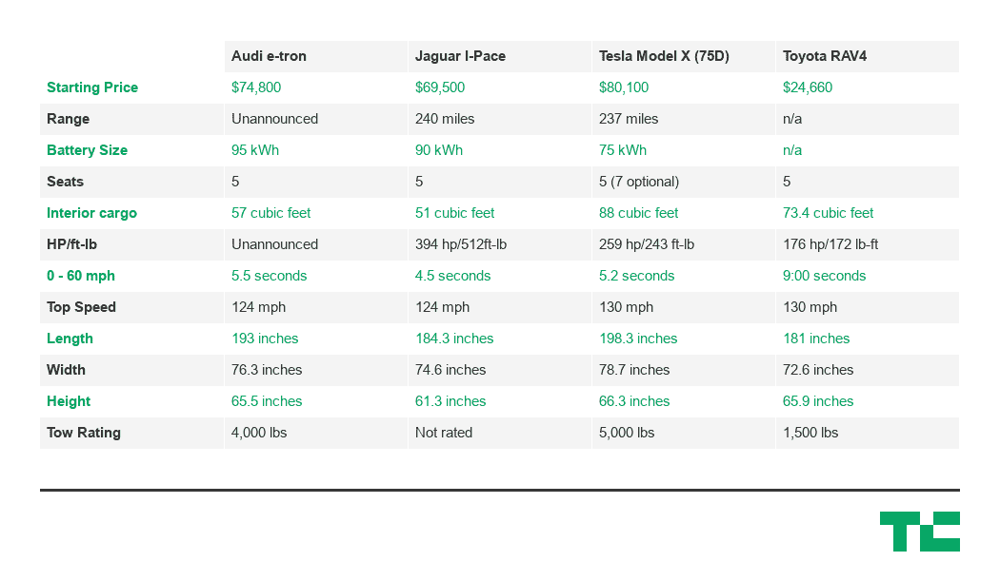

# 奥迪 e-tron 与特斯拉 Model X 和捷豹 I-Pace 的对比 

> 原文：<https://web.archive.org/web/https://techcrunch.com/2018/09/17/how-the-audi-e-tron-compares-to-the-tesla-model-x-and-jaguar-i-pace/>

# 奥迪 e-tron 与特斯拉 Model X 和捷豹 I-Pace 的对比

奥迪刚刚宣布了其首款量产电动汽车。这款名为 e-tron 的电动汽车是一款中型 SUV，搭载了多项技术，非官方续航里程超过 300 英里。它装备精良，起价为 74800 美元，介于捷豹 I-Pace 和特斯拉 Model X 之间。

e-tron 与捷豹 I-Pace 最为相似，尽管奥迪的装备略胜一筹。e-tron 在捷豹 90 千瓦时电池的基础上增加了 95 千瓦时电池。它也略大，额定牵引 4000 磅。

将 e-tron 与 Model X 进行比较变得很混乱。特斯拉销售的 Model X 有三种口味:温和型、热型和着火型。轻度版起价 72，100 美元，装有 75 千瓦时的电池，可行驶 237 英里。花费 88，600 美元购买 100D 及其额定行驶 295 英里的 100 千瓦时电池。购买者可以花 125，800 美元购买 P100D，它可以行驶 298 英里，0-60 秒的时间为 2.9 秒。

在 Model X 的每个版本上都可以购买自动驾驶模式。奥迪和捷豹在 e-tron 或 I-Pace 上不提供自动驾驶。

就规格而言，e-tron、I-Pace 和 Model X 各有优势。以下是丰田 RAV4(美国最畅销的 SUV)每辆车最重要的技术规格。

以下是我对每辆车优势的看法:

**奥迪 e-tron**

*   最佳价格电池比:购买者在基本型号上获得 95 千瓦时的电池。就性价比而言，奥迪的行驶里程是最超值的。
*   称职的控制:奥迪安装了与高端 A8 豪华轿车相同的双触摸屏系统。顶部屏幕处理信息娱乐，而底部屏幕处理气候控制和文本输入。当触摸时，两个屏幕都提供触觉和音频响应。
*   它看起来和感觉上都像奥迪:e-tron 并不突出，这对一些买家来说可能是一件好事。它看起来和感觉都像奥迪 SUV。
*   奥迪还没有发布范围:在奥迪可以宣传 e-tron 的范围之前，环保局必须认证 e-tron。没有这些数字，就很难确定电子加速器的位置。但今天在 e-tron 发布会上，该公司暗示了一个优于特斯拉 Model X 的范围。

**捷豹 I-Pace**

*   对 I-Pace 的早期评论称赞了它的驾驶性能:I-Pace 是一款跨界车，驾驶起来很像。它充满运动感和自信，是这里列出的三款电动汽车中姿态最低的。
*   I-Pace 是一辆捷豹:I-Pace 拥有最快的 60 英里/小时的速度，能够在 4.5 秒内达到目标。这和一辆 2016 款奥迪 TTS Coupe 一样。然而，更贵的特斯拉 P100D 要快得多，0-60 时间为 2.9 秒。
*   装备精良但最便宜:I-Pace 起价 69，500 美元，是这一系列中最便宜的。在这个价格上，它装备精良

**特斯拉 Model X P75**

*   这是一辆特斯拉:Model X 在路上里里外外看起来没什么不同。对一些人来说，这是一个很大的吸引，而其他人则回避引人注目的设计。
*   Model X 看起来很大:Model X 有五个座位，但可以在后部增加两个跳跃座椅。在所有座椅都放下的情况下，Model X 的可用储物空间为 88 立方英尺，仅比雪佛兰 Tahoe 小 6 立方英尺。
*   Model X 可以自动驾驶:Model X 可以配备 Autopilot，这是特斯拉的自动驾驶系统，可以自动驾驶 SUV。
*   更多选项:X 型 P100 提供了更多的范围，X 型 P100D 提供了更多的范围和疯狂的性能。

e-tron 将于 2019 年年中在美国市场上市，届时将有更多竞争对手进行比较。