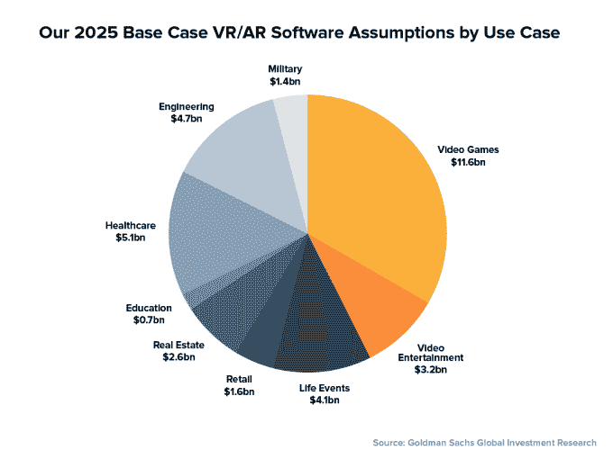
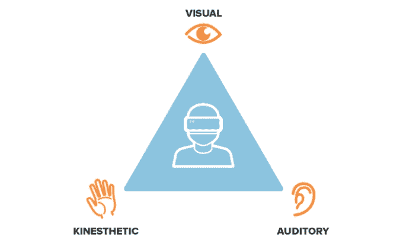
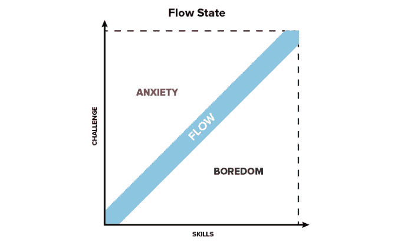

# 混合现实的发展将如何改变沟通、协作和工作场所的未来

> 原文：<https://web.archive.org/web/https://techcrunch.com/2016/01/30/how-the-growth-of-mixed-reality-will-change-communication-collaboration-and-the-future-of-the-workplace/>

科幻技术，见见华尔街。

投资银行高盛最近的一份[报告](https://web.archive.org/web/20230228195120/http://www.bloomberg.com/news/articles/2016-01-13/goldman-sachs-has-four-charts-showing-the-huge-potential-in-virtual-and-augmented-reality)预测，10 年内虚拟现实硬件将成为一个 800 亿美元的产业。这一“基本情况”预测假设，与智能手机和平板电脑相比，采用将缓慢，但是，该报告指出，“随着技术进步，价格点下降，以及一个全新的应用程序市场(包括商业和消费者)进入市场，我们相信 VR/AR 有可能催生数十亿美元的产业，并可能像 PC 的出现一样改变游戏规则。”

虽然围绕 VR(虚拟现实)和 AR(增强现实)的对话通常集中在游戏和视频娱乐上，但高盛的报告认为这些用例将占软件市场的不到一半。

作为一个偶尔玩游戏的人，想到戴上耳机，一头扎进我最喜欢的虚拟世界，感觉很有趣。但是，将我们的想象力局限于这些应用是忽视了由增强和虚拟技术创造的混合现实的无限潜力，它将影响每个企业和行业。

通过将模拟的、二维的工作方式与新的混合–现实体验相结合，我们可以改变我们沟通、合作和创造的能力。企业面临的挑战将不是提供更身临其境的体验，而是更有价值的体验。

## 通信方式的持续中断

电报淘汰了信息载体，电话被互联网打断，传统的电话会议被 VoIP 视频会议和支持屏幕共享的统一通信系统所取代。

在互联网出现之前，远距离通信技术的历史演变总是朝着复制人类联系的最清晰的形式发展:面对面的交谈。电报可能错过了人类的声音，但它的相对速度是向即时口头反应迈进了一步。

具有讽刺意味的是，1876 年亚历山大·格雷厄姆·贝尔通过电话线对他的助手托马斯·a·沃森说的第一句话是，“沃森先生，过来——我想见你。”

> 混合现实有可能允许远程团队的全球工作人员一起工作，并解决组织的业务挑战。

互联网上的大多数数字交流缺乏面对面交谈的口头、面部和身体语言暗示，但我们的信息和媒体(照片、视频、模因、gif、文章等)的影响力却很大。)使它成为一种具有不可否认的吸引力和价值的媒介。

当我可以发布一个状态，让我所有的朋友立刻知道，同时向他们展示我和表演者一起大声唱我最喜欢的歌曲的视频时，我为什么要打电话给朋友，告诉他们一场伟大的音乐会？

也就是说，说互联网上有时会出现沟通障碍是一种轻描淡写的说法，对于读过评论区的人来说，不需要进一步解释。

不要误会，一个互联的世界无疑是一个更美好的世界。我遵从马克·扎克伯格领导的 Internet.org 的使命宣言来做一个完美的总结:

“互联网对于增长我们拥有的知识并相互分享至关重要。对我们中的许多人来说，这是我们日常生活中的一大部分。但是世界上大部分地区都没有接入互联网。Internet.org 是由脸书领导的一项倡议，目标是将互联网接入和连接的好处带给世界上三分之二没有互联网接入和连接的人。想象一下，一份准确的天气预报会给种植庄稼的农民带来多大的不同，或者一部百科全书对一个没有课本的孩子有多大的作用。现在，想象一下当全世界都能听到他们的声音时，他们能做出什么贡献。我们联系得越多，情况就越好。”

但是我们联系得越多，我们联系得越好就越重要。

虚拟的、增强的和混合的体验存在于我们的现实世界和数字世界的交汇处将把面对面交流的人性带回我们的交流的进化中。

不要错误地将这些虚拟体验仅仅等同于科幻和游戏应用，在这些应用中，你有一个代理人，存在于一个不同的、替代的现实系统中。

混合 现实，或混合现实，融合现实和虚拟世界，产生新的环境，其中物理和数字对象共存并实时交互。

我并不是说插入矩阵是改善沟通的一种手段。我说的是世界各地的两个人戴上耳机分享他们选择的任何体验的能力——无论是坐在彼此旁边，亲自翻阅相册，还是参观他们梦想的目的地。

5 年或 10 年前，我们用文字交流。今天，我们用照片和视频进行交流和分享。明天，有了虚拟现实，我们将能够与经验交流。

## 这对职场的未来意味着什么？

首先，这意味着加强合作。混合现实 现实有可能让远程团队的全球员工一起工作，应对组织的业务挑战。无论员工身在何处，他们都可以戴上耳机和降噪耳机，进入一个协作的沉浸式虚拟环境。

语言障碍将变得无关紧要，因为 AR 应用能够实时准确地翻译。想象一下谷歌翻译在两个或更多人之间实时表演。

这也意味着劳动力更加灵活。尽管许多雇主仍然使用固定工作时间和地点的不灵活模式，但有证据表明，如果员工在工作地点、时间和方式上拥有更大的自主权，他们的工作效率会更高。有些员工更喜欢喧闹的工作场所，而有些人则需要安静。有些人早上工作最好，有些人晚上工作最好。

员工也从工作方式的自主性中受益，因为每个人处理信息的方式不同。学习风格的[经典 VAK 模型](https://web.archive.org/web/20230228195120/https://www.mindtools.com/pages/article/vak-learning-styles.htm)区分了视觉、听觉和动觉学习者。

视觉学习者会欣赏混合 现实的沉浸和视觉刺激。不说别的，听觉学习者将从困扰现代开放式办公空间的听觉干扰减少中受益。通过移动、触摸和做学习最好的动觉学习者将从能够在混合 现实中探索和合作中受益。导致动觉失调的电话会议可以被交互式、触觉式的工作模式所取代，比如白板会议。

员工在工作地点、时间和方式上的更大自主权将通过让他们以最适合自己的方式完成任务来最大限度地提高生产率。它将允许员工进入并在完全吸收的“流动”状态下工作。

著名心理学家[米哈里·契克森米哈](https://web.archive.org/web/20230228195120/https://www.ted.com/talks/mihaly_csikszentmihalyi_on_flow?language=en#t-13027)命名的“心流”指的是“一个人在进行一项活动时，完全沉浸在一种充满活力的专注感、完全投入和享受活动过程的精神状态。”

视频游戏玩家应该立即认识到这种精神状态，因为游戏设计特别擅长诱导心流状态，在这种状态下，时间一小时一小时地过去，玩家完全沉浸在游戏中。

Csikszentmihalyi 的理论认为，为了保持心流并“保持在最佳状态”，活动必须在活动的挑战和参与者的能力之间取得平衡。如果挑战太大，它会加剧焦虑——太容易了，它会加剧厌倦。

焦虑和无聊的交替对于现代劳动力来说太熟悉了。毫无疑问，我们尝试着去做一个项目，电子邮件，松散的信息和“你有时间吗？”办公桌旁的行人让我们无法集中注意力。焦虑抬起它丑陋的头。

我们终于完成了项目，当我们等待客户或组织领导的反馈时，沟通渠道奇迹般地安静了下来。这就是无聊的来源。

混合 现实有利于诱导心流状态，因为它能够让员工沉浸在与他们的学习风格、对刺激的偏好和能力相匹配的设计体验中。但也许更重要的是，它可以限制导致焦虑的分心和导致无聊的潜伏。

> 企业面临的挑战将不是提供更身临其境的体验，而是更有价值的体验。

分心的事物被我们能够设计的世界所消除，这些世界只会将必要的信息传递给我们正在做的工作。

当我们完成工作时，当我们的工作被数字化存储时，延迟，或者说一个动作和它的响应之间的时间，就被消除了。客户或主管能够随时以数字方式加入我们的工作流程，以跟踪和审查进度。

最后，但同样重要的是，混合 现实为有限资源的普遍问题创造了解决方案。

除了消除困扰全球商业的金钱旅行成本和花在红眼航班和时差会议上的时间机会成本，混合 现实减少了一种更稀缺的资源——房地产。

从宏观上看，人口在增加，而空间却没有。通过创建虚拟工作空间来减少对大型办公室的需求将使办公园区成为一个遗迹。

在微观层面上，想想你自己的办公室。会议室永远不够，工作空间永远不够。你刚刚在那块超赞的白板上写满了好点子？你的同事在你接完客户电话后 30 秒钟就来了，他需要把它删掉。

混合 现实在我们完成工作的同时记录我们工作的工作空间将不需要在那 30 秒内疯狂记笔记和手机拍照。

事实上，那 30 秒将不存在，因为无论我们坐在办公桌前、在家里还是在星巴克，访问一个设计完美的虚拟工作空间就像戴上你的耳机一样简单。