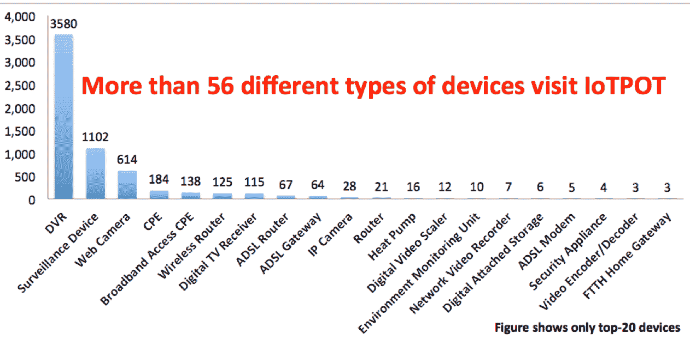

# “事物的不安全性”如何创造下一波安全机遇 

> 原文：<https://web.archive.org/web/https://techcrunch.com/2016/06/26/how-the-insecurity-of-things-creates-the-next-wave-of-security-opportunities/>

摩哂陀·拉姆辛哈尼撰稿人

[Mahendra Ramsinghani](https://web.archive.org/web/20221206121512/https://www.linkedin.com/in/mahendraram)

是的创始人

[Secure Octane Investments](www.secureoctane.com)

，投资云基础设施和安全初创公司。不投资的时候，他就忙着写博客，写书。他的第三本书《坚韧的创始人》将于 2022 年出版。

More posts by this contributor

2015 年安装了超过 50 亿台物联网设备。高德纳公司[估计到 2020 年这一数字将增长到 200 亿。不幸的是，专家们一致认为，安全性不仅是事后才想到的，而且经常遭到积极的抵制和规避。](https://web.archive.org/web/20221206121512/https://www.gartner.com/newsroom/id/3165317)

物联网设备对黑客很有吸引力，因为它们的登录凭证非常弱，是“全天候”的，并且几乎没有安全的通信渠道。黑客已经开始利用这些被攻破的设备发动 DDoS 攻击，甚至在 Instagram 和 Twitter 上出售 robo 的“赞”来徒劳无功。

来自惠普物联网研究的数据显示，80%的物联网设备未能要求足够复杂和长度的密码。多达 70%的设备没有加密通信。其中 60%的设备提出了用户界面的安全问题。在一项 [OpenDNS 物联网研究中，](https://web.archive.org/web/20221206121512/https://blog.opendns.com/2015/06/02/opendns-enterprise-iot-security-report/)23%的受访者表示，他们没有缓解控制措施来防止未经授权的设备访问他们公司的网络。

在横滨国立大学进行的一项物联网安全研究中，研究人员创造了一个物联网蜜罐来吸引熊。他们发现，自 2014 年以来，基于远程登录的物联网设备攻击激增。Telnet 是一种没有加密或验证的通信协议。所有数据都以纯文本形式传输。然而，许多工业和科学设备只有 Telnet 作为通信选项。

安全外壳协议(Secure Shell protocol，简称 SSH)是一个更好的选择，但它会增加带宽过载。更糟糕的是，一些物联网设备无法配置为 SSH，除非接口设备可以重新配置。70%的设备以明文通信，入侵变得很容易。

> 针对物联网的新恶意软件正在开发中。

开展 IoTPOT 研究的 Katsunari Yoshioka 说:“使用 Telnet 这样的超过 30 年的不安全远程访问服务进行全球访问在技术上很简单，也很容易解决。但大规模感染表明，有多少制造商并不真正关心，或者不知道如何保护他们的产品。”

一旦黑客获得访问设备的权限，下一步就是感染设备；最后一步是货币化。针对支持远程登录的物联网设备的五个不同的 DDoS 恶意软件家族已经被发明出来。你的 DVR 已经被黑客攻击并被用作僵尸网络——你只是不知道而已！

作为僵尸网络的 DVR:物联网设备受损。来源:Gartner。企业物联网包括能源:横滨国立大学研究，2016 年 1 月。

事实上，超过 56 种“类型”的设备，如无线路由器、DVR、IP 电话、网络摄像头甚至热泵都被发现受到了危害。以蠕虫样的行为向其他物联网设备传播感染，往往有助于黑客快速建立他们的 DDoS 僵尸网络军队。多达 83%的二进制文件是新的，换句话说，新的恶意软件正在开发以物联网为目标。

已经确定的一系列物联网不安全挑战包括 Belkin Wemo 家庭自动化设备和 LIFX 灯泡(两者都在固件中嵌入了密钥)，冰箱变成了发送垃圾邮件的僵尸网络，以及每个父母的噩梦，婴儿监控摄像头被远程观众入侵。

可穿戴设备在安全性方面同样糟糕。一项[惠普物联网研究发现](https://web.archive.org/web/20221206121512/http://go.saas.hpe.com/fod/internet-of-things)智能手表经常向多个后端目的地发送数据(通常包括第三方)。智能手表的通信在 90%的情况下会被
轻易截获，70%的手表固件在没有
encryption.的情况下传输 indeed,
30 %的手表及其应用程序容易受到帐户收割的攻击，使得攻击者能够猜测登录凭据并获得用户帐户的访问权限。虽然这些都是消费者的“东西”，但企业物联网游乐场才是赚钱更多的地方。

工业、楼宇自动化、能源、交通和医疗保健是我们将看到这些设备激增的垂直行业。物联网将在设备监控、维护、故障排除和自动化方面发挥积极作用。这笔钱变得惊人——[通用电气估计，目前每年有 200 亿美元](https://web.archive.org/web/20221206121512/https://www.ge.com/sites/default/files/GE_IndustrialInternetatWork_WhitePaper_20131028.pdf)花费在工业机器的维护上(100 亿美元用于航空，70 亿美元用于公用事业/石油&天然气，300 万美元用于机车，2 . 5 亿美元用于医疗保健)。

这种维护总计达 3.3 亿工时。换句话说，大量的数据可以优化零件和流程，减少维护成本和停机时间。其他巨头，如西门子、博世和霍尼韦尔等，都在跃跃欲试，想在物联网市场分一杯羹。Gartner 预计，到 2020 年，物联网总销量将达到 200 亿部。

| **类别** | **2014 年** | **2015 年** | **2016 年** | **2020 年** |
| 消费者 | 2,277 | 3,023 | 4,024 | 13,509 |
| 商业:跨行业 | 632 | 815 | 1,092 | 4,408 |
| 业务:特定于垂直行业 | 898 | 1,065 | 1,276 | 2,880 |
| **总计** | **3807** | **4902** | **6392** | **20797** |

按类别划分的物联网设备安装基数(百万台)，[来源](https://web.archive.org/web/20221206121512/https://www.gartner.com/newsroom/id/3165317) : Gartner，2015 年 11 月)

物联网管理层正在由 [Samsara](https://web.archive.org/web/20221206121512/https://www.samsara.com/about) 和 [Afero](https://web.archive.org/web/20221206121512/https://beta.techcrunch.com/2015/12/16/afero-uncloaks/) 等公司解决，而 [Veniam](https://web.archive.org/web/20221206121512/https://veniam.com/) 已经解决了整个“智能城市”的连接问题。[诺基亚推出了一个物联网平台，](https://web.archive.org/web/20221206121512/http://company.nokia.com/en/news/press-releases/2016/06/14/nokia-launches-new-impact-platform-for-fast-and-secure-delivery-of-iot-services)以及一个 3.5 亿美元的物联网基金。三星欲[在物联网](https://web.archive.org/web/20221206121512/http://www.wsj.com/articles/samsung-to-invest-1-2-billion-in-internet-of-things-startups-and-research-in-u-s-1466514005)部署 12 亿美元。

> 一旦黑客获得访问设备的权限，下一步就是感染设备；最后一步是货币化。

专注于物联网安全的初创公司，如 [Bastille Networks](https://web.archive.org/web/20221206121512/https://www.bastille.net/) (由 Bessemer 支持)，寻找射频签名，而 [ZingBox](https://web.archive.org/web/20221206121512/http://www.zingbox.com/) 和 [SmartOrbis](https://web.archive.org/web/20221206121512/http://www.smartorbis.com/) 正在尝试基于云的分析和设备行为异常。最近[与施耐德电气](https://web.archive.org/web/20221206121512/http://www.businesswire.com/news/home/20160208005030/en/Mocana%E2%80%99s-Security-Platform-Protect-Schneider-Electric%E2%80%99s-Next-Generation)联手加强其能源管理产品。

这个领域的新来者，Qadium 想要采取不同的方法，对所有设备进行分类，成为互联网的“谷歌街景”。该公司宣布了由 NEA 牵头的 2000 万美元的首轮融资，由彼得·泰尔创始人基金提供种子资金。Founders Fund 的 Trae Stephens 表示，Qadium 着眼于整个网络的能力，结合速度和规模，使其成为一个引人注目的机会。

Qadium 首席执行官 Tim Junio 表示，随着攻击面的扩大，Qadium 的编目方法将为其客户提供优势。“没有先验的能力来识别全球互联网的哪些部分与客户相关。为了解决这个问题，我们需要一个互联网规模的方法。我们创建了一个数据集来回答客户经常不知道该问的问题。在我们的研究中，我们没有想到会出现关键基础设施的错误配置，如果遭到破坏，可能会在某些市场上造成数百亿美元的全球价格波动。”

物联网前景广阔，充满挑战。首先，硬件设计的复杂性和内存/电池的限制造成了限制。对任何企业保险承保人来说，管理操作系统变体、通信协议和应用领域都不是一件容易的事情，这些企业保险承保人每年的保费收入超过 10 亿美元。然而，承销商需要物联网结构的可见性。

保险商实验室(UL)已经为各种设备推出了一个[网络安全保证计划(CAP)](https://web.archive.org/web/20221206121512/http://www.ul.com/newsroom/pressreleases/ul-launches-cybersecurity-assurance-program/) ，并提供了批准的印章。Trae Stephens 表示:“对于保险商而言，设备层的实时可见性对于开发稳健的风险溢价定价模型至关重要。在人的生命可能受到威胁的地方(医疗保健设备/胰岛素泵/发电厂)，监管力量可能会介入，以确保安全不再是事后的想法。

随着物联网市场的发展，收购开始升温。[亚马逊收购 2lemetry](https://web.archive.org/web/20221206121512/https://beta.techcrunch.com/2015/03/12/amazon-has-quietly-acquired-2lemetry-to-build-out-its-internet-of-things-strategy/) 。 [ARM 收购珊莎安防](https://web.archive.org/web/20221206121512/http://www.arm.com/about/newsroom/arm-expands-iot-security-capability-with-acquisition-of-sansa-security.php)。[参数化技术](https://web.archive.org/web/20221206121512/https://www.crunchbase.com/organization/parametric-technology)收购 [ThingWorx](https://web.archive.org/web/20221206121512/http://www.ptc.com/internet-of-things/technology-platform-thingworx) 和 [Axeda](https://web.archive.org/web/20221206121512/http://www.ptc.com/news/2014/ptc-completes-acquisition-of-axeda) 。[黑莓收购了 Certicon](https://web.archive.org/web/20221206121512/http://www.informationweek.com/personal-tech/smart-phones/blackberry-maker-acquires-certicom-for-1/213403835) 和 [SecuSmart](https://web.archive.org/web/20221206121512/http://www.zdnet.com/article/blackberry-acquires-secusmart-ups-voice-security-ante/) 以支持其产品。

随着设备数量的快速增长，收购者将会加强自身的安全态势。这应该是物联网安全初创公司的音乐。