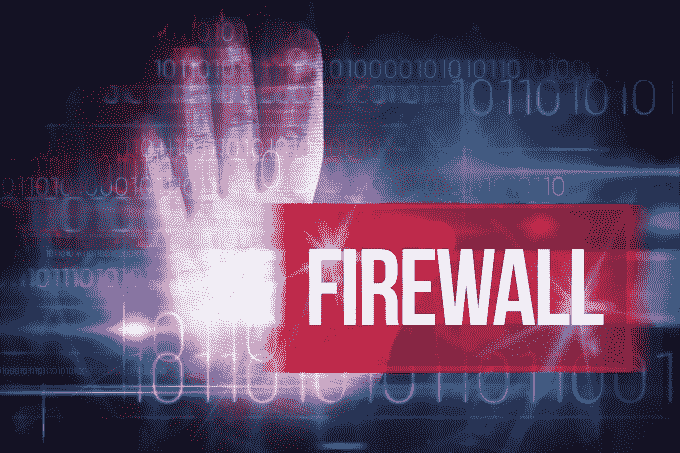

# 小型创业公司 Phantom Cyber 如何在 RSA  大获成功

> 原文：<https://web.archive.org/web/https://techcrunch.com/2016/03/08/how-the-tiny-startup-phantom-cyber-scored-big-at-rsa/>

摩哂陀·拉姆辛哈尼撰稿人

[Mahendra Ramsinghani](https://web.archive.org/web/20230316161343/https://www.linkedin.com/in/mahendraram)

是的创始人

[Secure Octane Investments](www.secureoctane.com)

，投资云基础设施和安全初创公司。不投资的时候，他就忙着写博客，写书。他的第三本书《坚韧的创始人》将于 2022 年出版。

More posts by this contributor

以任何标准来衡量， [幻影赛博](https://web.archive.org/web/20230316161343/https://www.phantom.us/) 都是安全领域里的大卫巨人。然而，它作为 [RSA 2016 创新沙盒大赛](https://web.archive.org/web/20230316161343/http://www.rsaconference.com/events/us16/agenda/innovation-sandbox-contest) 最具创新性的初创公司获得了最高荣誉。它筹集的资金比大多数其他竞争者都少。然而它的产品被认为是新颖的，甚至是开创性的。

在 Moscone North 的一个只有站立空间的活动上，10 家初创公司投了票。每个人都有 3 分钟的时间，如果超过时间，会有一个令人紧张的蜂鸣器切断他们的联系。

Greylock 合伙人 Asheem Chandna 的评审团；帕特里克·海姆(Patrick Heim)在 Dropbox 担任信托主管；谷歌安全副总裁格哈德·埃舍尔贝克；蕾妮·古特曼，皇家加勒比的 CISO；Rambus 公司的密码研究总裁 Paul Kocher 目睹了这一切。他们的角色是把这些广告分成碎片——一次轻轻撕碎一个。有一个演示者，评委甚至问市场是否关心公司的发行。但对幻影来说不是。

**十大竞争者 RSA2016 创新沙盒(数据:Crunchbase)**

| **公司** | **论文** | **年开始** | **筹集的资本(百万美元)** | **主要投资者** |
| [**幻影赛博**](https://web.archive.org/web/20230316161343/https://www.phantom.us/) | 安全自动化&流程编排 | 2014 | $9.2 | 基础资本，黑石 |
| [**巴士底狱**](https://web.archive.org/web/20230316161343/https://www.bastille.net/) | 物联网安全 | 2014 | $11.5 | 贝塞麦风险投资公司 |
| **[记仇网络](https://web.archive.org/web/20230316161343/http://illusivenetworks.com/)** | 欺骗网络 | 2014 年 | $22.0 | 团队 8，NEA，贝塞麦风险投资合伙人 |
| [**门罗安全** **城市**](https://web.archive.org/web/20230316161343/https://www.menlosecurity.com/) | 恶意软件防范 | 2013 年 | $35.0 | 萨特希尔，通用催化剂 |
|  | 运行时应用程序自我保护(RASP) | 2013 | $11.1 | 美国风险投资伙伴 |
| [**保护性**](https://web.archive.org/web/20230316161343/https://www.protectwise.com/) | 云网 DVR | 2013 年 | $37.1 | 三一风险投资公司，交联 |
| [**安全漏洞**](https://web.archive.org/web/20230316161343/http://www.safebreach.com/) | 模拟战争游戏 | 2014 年 | $4.0 | 红杉 |
| [**Skyport**](https://web.archive.org/web/20230316161343/https://www.skyportsystems.net/) | 应用安全 | 2013 年 | $30.0 | 索引风险投资，萨特希尔 |
| [**薇拉**](https://web.archive.org/web/20230316161343/https://www.vera.com/) | 数据安全 | 2014 年 | $31.0 | 电池，萨特希尔 |
| [**亦然网络**](https://web.archive.org/web/20230316161343/http://www.versa-networks.com/) | 企业/分公司安全 | 2012 年 | $57.3 | 红杉，威瑞森风险投资 |

**是什么让幻影成为“最具创新性的”**

根据 451 Research 的研究，每年有超过 100 家新的安全初创公司成立。再加上大约 1300 家现有的安全供应商，它们在市场上相互竞争。你有的只是一大堆噪音、困惑和模仿。

正如 451 Research 的 Brendon Daly 所说，安全是恐惧和贪婪同时存在的唯一领域。传统的投资回报率驱动的销售通过驱动对更高收入的更多贪婪来练习贪婪。安全供应商经常通过培养恐惧来满足他们的贪婪，这与武器供应商没有什么不同。也没有军火商祈祷世界和平。

厂商驱动的 FUD(害怕不确定性和怀疑)疲劳导致了一连串的不信任和短期疯狂。有传言说 CISOs 甚至已经雇佣了 *违约后的替死鬼* 盛行 *。*

大型企业经常处理多达五十种安全产品。让它们相互集成/互操作，以便 CISO 能够看到全局是一场噩梦。

在如此混乱的淘金热中，Phantom 的平台充当了行业的一层结缔组织，简化并自动化了安全团队的生活。幻影应用程序可以跨 40 种不同的技术执行 120 种不同的操作，允许调查、搜索和遏制。它的哲学方法很新鲜——让安全社区通过其 Github 库 共享剧本 [，使其平台开放和可扩展。通过南北向 API 集成，调查和遏制可以变得更快。](https://web.archive.org/web/20230316161343/https://github.com/phantomcyber/playbooks)

**为什么世界关心自动化**

[Dropbox](https://web.archive.org/web/20230316161343/https://www.linkedin.com/in/patrick-heim-57a45)信任负责人 Patrick Heim 是 RSA Sandbox 2016 的评委之一。他指出，安全自动化之所以吸引人，有三个挑战:

*   高技能安全专业人员的短缺要求我们尽可能提高他们的效率。
*   对于手动流程，检测事件和响应事件之间的时间可能太长，无法防止重大损失。
*   需要一个涉及众多供应商的同类最佳战略来抵御敏捷威胁。

他说:“安全自动化通过集成不同的产品、减少检测到响应的时间以及提高熟练的安全工程师的生产力，吸引了所有这三种限制”。

根据 [Oliver Friedrichs，](https://web.archive.org/web/20230316161343/https://www.linkedin.com/in/oliverfriedrichs)Phantom 的 CEO 所说，超过 75%的安全团队患有警报疲劳症，并且经常忽略警报。 在 [一个 7 步自动化过程](https://web.archive.org/web/20230316161343/https://www.youtube.com/watch?v=goq4Q5sB1l0) 中，他演示了 Phantom 如何能够自动地包含恶意软件。

“有了众多的信息安全智能分析提供商，我们有了更多的数据，但这也造成了新的瓶颈。弗里德里希斯说:“分析师们在一个仓鼠轮子上，试图跟上，而行动循环是必要的。如果你看看 NSA 是如何从每天处理 [65 起事件发展到每天数万起](https://web.archive.org/web/20230316161343/http://www.federaltimes.com/story/government/show-reporter/rsa2016/2016/03/03/nsa-automating-cybersecurity/81276640/) 事件的，价值主张就开始变得清晰起来。

作为约翰·霍普金斯大学 [主动网络防御计划的一部分，](https://web.archive.org/web/20230316161343/http://cyber.jhu.edu/) Phantom 与多个联邦机构合作了超过 11 个月，致力于集成自适应网络防御技术的开发。

对于 Friedrichs 来说，他练习沙盒推销超过 50 次，以完善 3 分钟的推销，他以前见过这一切。这是他的第四次创业，之前有三家安全公司被迈克菲、赛门铁克和 Sourcefire 等公司收购。

他在 Immunet(被 Sourcefire 收购，source fire 又被思科收购)的高级恶意软件创新现已覆盖 10，000 多家公司。Phantom 的团队已经发展到 20 人，弗里德里希斯对他的联合创始人 Sourabh Satish 和团队在过去两年里为 Phantom 做好准备给予了很大的信任。

现在的挑战是确保 Phantom 本身不会受到威胁。随着风险变得集中，安全平台需要确保稳健性并构建保护层。“我们强化了操作系统，增加了具有多个批准层的双因素身份认证，加密了存储的凭据，并定期使用外部公司进行测试，”Friedrichs 说。

Phantom 自动化企业 SOC(安全运营中心)的目标是一个开始。“我们正在创建一个新的连接安全软件类别，并雄心勃勃地要建立一个可扩展的公司，”他补充道。

“我们的竞争对手是编写 Python 脚本在内部完成这项工作的工程师，”Friedrichs 说。验证机会是火眼近期 [收购 Invotas](https://web.archive.org/web/20230316161343/https://www.fireeye.com/company/press-releases/2016/02/fireeye-announces-acquisition-of-invotas-international-corporati.html) 。这为幻影打开了一片天地。在对 803 名受访者进行的 451 项调查中，大多数人认为淘汰供应商势在必行。这对 Phantom 来说可能是个好兆头。

Phantom 的早期投资者之一， [Jay Leek，黑石的 CISO](https://web.archive.org/web/20230316161343/http://www.rsaconference.com/speakers/jay-leek)说“Phantom 是自动化从警报到调查和补救的工作流程中的先行者。一旦大规模部署，这种自动化可以让一个 FTE(相当于全职)做多达五个全职员工的工作。我们现在可以通过消除人为错误来提高运营职能的一致性。如果检测到破坏性的恶意软件，我们可以通过一次点击或“关闭开关”来隔离计算机。这就是为什么我们认为这是如此重要。”

在这场大卫和歌利亚的创新之战中，大型安全公司似乎被这一集成和自动化的机会弄得措手不及。像 Goliath 一样，他们沉重的官僚主义盔甲将他们压得喘不过气来，即使他们尝试了，也没有现有的实体可以让所有供应商成为安全的“瑞士”。这就是创新型创业公司的优势所在。