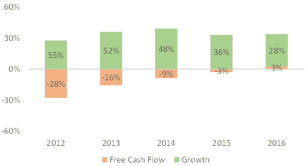
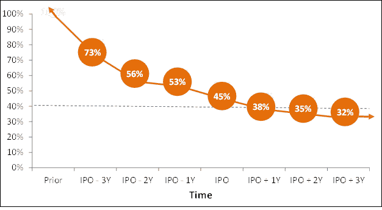
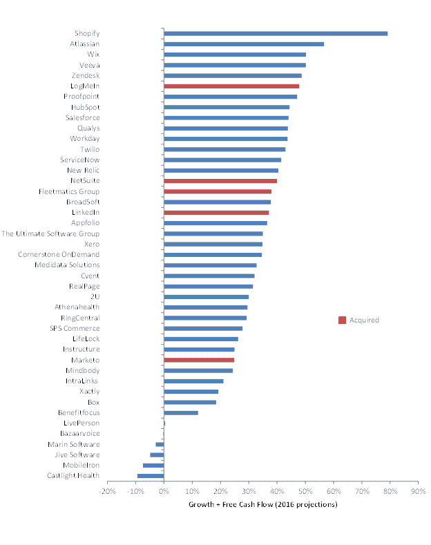

# 如何在没有真正尝试的情况下评估一家公司的健康状况

> 原文：<https://web.archive.org/web/https://techcrunch.com/2016/11/28/how-to-estimate-a-companys-health-without-really-trying/>

杰夫·爱普斯坦是贝塞麦风险投资公司的运营合伙人。

More posts by this contributor

Josh Harder 是 Bessemer Venture Partners 的副总裁，专注于软件、移动和电信领域的投资。

More posts by this contributor

在过去的几个月里， [NetSuite](https://web.archive.org/web/20230109110600/https://www.crunchbase.com/organization/netsuite) 、 [Marketo](https://web.archive.org/web/20230109110600/https://www.crunchbase.com/organization/marketo#/entity) 、 [LinkedIn](https://web.archive.org/web/20230109110600/https://www.crunchbase.com/organization/linkedin#/entity) 、 [Fleetmatics](https://web.archive.org/web/20230109110600/https://www.crunchbase.com/organization/fleetmatics#/entity) 和 [LogMeIn](https://web.archive.org/web/20230109110600/https://www.crunchbase.com/organization/logmein#/entity) 各自被收购或合并，总价值超过 500 亿美元。照这样下去，SaaS 上市公司可能会成为濒危物种。显然，私募股权投资者和大型科技公司感觉到了机会和价值。

## 被选中的公司和其他公司有什么区别？

[40](https://web.archive.org/web/20230109110600/http://avc.com/2015/02/the-40-rule/)法则是一种常见的风险投资和管理技巧，用于将规模经营最好的 SaaS 公司与其他公司区分开来。40 法则的计算非常简单——只需将公司当前的增长率和盈利能力相加。这个简单的计算可以让你比较一个 100%增长但利润率为-60%的公司和一个盈亏平衡增长 40%的公司，或者一个增长 10%但利润为 30%的公司。

我们的投资组合公司和潜在投资者经常问我们如何平衡增长和盈利能力。自然，公司关注增长，但是增长是有代价的。因此，我们对长期存在的 40 法则采取了一种新的方法来优化“有效增长”

输入贝塞麦的“效率得分”，它通过公司的增长百分比+自由现金流(FCF)利润率的总和来衡量公司的效率。这个简单的计算量化了给定云业务的增长效率。在公司生命周期的不同阶段，它们的效率得分是变化的。但对于上市几年后的普通上市公司来说，超过 40 的效率得分被认为是很高的。

例如:SaaS 上市公司 2016 年的预测平均年增长率为 28%，FCF 利润率为 3%，效率得分为 31%。目前，不到一半的 SaaS 上市公司的综合增长率和 FCF 利润率超过 40%。

但是效率分数真的有意义吗，或者只是董事会议上的一个简单的讨论点？

事实上，我们发现一家公司的效率得分与一家 SaaS 上市公司的收入倍数有超过 70%的相关性，收入倍数是一家公司的估值除以其收入，是投资者如何为股票定价的标准指标。收入倍数最高的 SaaS 上市公司的平均效率为 44 %;最底层的四分之一人口仅占 9%。

公众投资者为把钱投到哪里而苦恼，但是只要两个数字和 15 秒钟，你就能很好地了解一家公司的价值。

图表 1:收入倍数和公司的效率得分之间有很强的相关性(来源:CapIQ 和 BVP)

公司变好了吗？

在过去的四年里，SaaS 公司的平均效率得分惊人地一致，从 28%到 31%。然而，随着 SaaS 上市公司的成熟，得分的构成发生了很大变化。2012 年，SaaS 上市公司的平均年增长率为 55%，而在 FCF 亏损了-28%，到 2016 年，增长率下降到 28%，平均利润率为 3%。这种转变是可以预测的——随着 Salesforce 和 Workday 等公司变得越来越大，它们的增长率下降了，盈利能力提高了。

图表 2:2012-2016 年 SaaS 上市公司的平均增长和 FCF 利润率(来源:CapIQ 和 BVP)

事实上，SaaS 公司通常在首次公开募股前几年的效率得分最高。目前的云公司在上市前三年的平均效率得分为 73%，而上市后为 35%左右。最好的云公司(那些上市的公司)在年轻和快速成长的时候效率惊人。随着它们的成熟，FCF 随着增长的下降而增长，但企业的整体效率往往会变得更低，因为盈利能力的提高很少能弥补高速增长。

## SaaS 上市公司效率得分@ IPO

图表 3:SaaS 上市公司首次公开募股的效率得分(资料来源:CapIQ 和 BVP)

那又怎样？

关注效率得分的不仅仅是公众投资者。下图是 SaaS 上市公司名单，按 2016 年效率得分排名。其中四家公司，Fleetmatics、LinkedIn、LogMeIn 和 Marketo，已经被收购(或者，就 LogMeIn 而言，被合并)。这四家公司中，有三家在被收购时是效率排名前 11 的公司。这些公司处于完全不同的行业——分别是车队管理、社交网络和远程连接——但它们的增长和相对盈利能力使它们成为表现最佳的公司。

更重要的是:与它们的效率得分相比，所有这些公司的交易都相对便宜。十大效率公司的交易中值为 8 倍，但 Fleetmatics 的交易中值为 4.8 倍，LinkedIn 为 6.9 倍，LogMeIn 为 6.9 倍。难怪战略收购者看到了便宜货！

图 4:按效率得分排列的 SaaS 上市公司(资料来源:CapIQ 和 BVP)

那么，哪家 SaaS 上市公司会是下一个呢？

我们的选择是网络安全公司 Qualys T1。Qualys 是效率得分最高的 10 家公司之一，拥有 23%的 FCF 利润率和 21%的增长率，但交易收入仅为 5.5 倍，大大低于类似公司的交易水平。