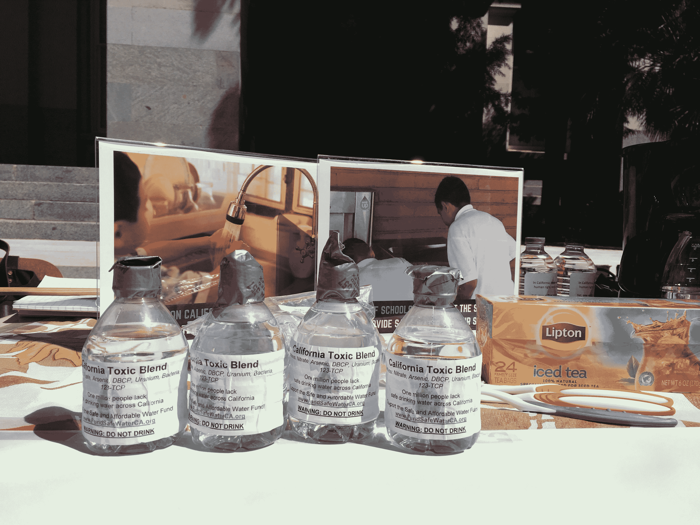

# 如何帮助自来水被污染的加州人

> 原文：<https://web.archive.org/web/https://techcrunch.com/2018/09/02/how-to-help-californians-whose-tap-water-is-tainted/>

[David Gorn](https://web.archive.org/web/20221208042710/https://calmatters.org/articles/author/david-gorn/)

是的特约撰稿人

[CALMatters](https://web.archive.org/web/20221208042710/https://calmatters.org/)

之前是公共媒体的编辑和记者，包括 NPR 及其加州电视台。

凯伦·刘易斯了解水资源问题。这位 67 岁的老人住在康普顿，她的水龙头流出的水被来自旧水管的锰(一种类似铁的金属)染成棕色。

水是由陷入困境的洛杉矶县供水区提供的。该地区一直被行政丑闻和管理不善的指控所困扰，它也无法筹集到修复褐水所需的资金。

刘易斯已经参加了无数的社区会议，听了多年的解释，她已经受够了。“什么都没有改变，”她说。“他们不会改变。”

路易斯是估计 360，000 加州人 中的一员，他们不能安全地饮用流向他们家的水。这不是一个新问题。特别是在中央山谷，过量的砷、硝酸盐和其他可能导致癌症和先天缺陷的物质已经污染了饮用水。在康普顿，居民一直生活在恶臭的棕色水中，因为修理管道的成本很高，许多人买不起持续供应的瓶装水。

现在，在该州长期干旱和密歇根州弗林特臭名昭著的水危机之后，加州提出了许多新的解决方案。

*   周五，立法者搁置了两项支持者认为会有所帮助的法案。根据一项自愿的措施，该州几乎所有的供水区都将每月向用户收取额外的 95 美分，除非用户选择不支付。最初由民主党州参议员比尔·莫宁(Bill Monning)提出的强制性税收，没有获得必要的三分之二投票通过，莫宁将其缩减。
*   莫宁还提高了对牛奶场和化肥厂的 T2 税，这些行业是该州一些地下水中硝酸盐的主要来源。代表这些行业的协会支持该法案，部分原因是付费公司将免于清理硝酸盐污染的水。立法者估计，这两项法案合起来每年可以筹集超过 1 亿美元。来自派拉蒙的民主党人、议会议长安东尼·伦登(Anthony Rendon)周五拒绝对这两项措施进行投票。
*   11 月，加州选民将决定 [提案 3](https://web.archive.org/web/20221208042710/https://ballotpedia.org/California_Proposition_3,_Water_Infrastructure_and_Watershed_Conservation_Bond_Initiative_(2018)) ，该提案将允许该州借贷近 90 亿美元来资助各种水利基础设施项目:蓄水、大坝维修、流域改善、渔业和其他栖息地的恢复。选民在 6 月份批准了一项超过 40 亿美元的债券措施，其中一些用于清理水道。
*   在今年夏天的州预算协议中，超过 2300 万美元被用于更安全的饮用水，另外 500 万美元用于解决儿童保育中心的含铅问题。

本周，积极分子在加州国会大厦外集会，试图为这两项议案争取支持。总部位于弗雷斯诺的非营利组织正义与责任领导顾问(Leadership Council for Justice and account ability)的联合主任菲比·西顿(Phoebe Seaton)说，这些措施不会解决该州的所有饮用水问题，但这两项措施产生的资金可以用于运营，而不仅仅是基础设施项目。

“它们如此重要的原因是它们提供了运营维护所需的收入，”西顿说。投票结果显示债券资金只能用于基础设施的改善。

“这意味着帮助…一些地区获得偿付能力，这样他们就可以申请拨款，”她说。"它们是债券基金的补充."

对康普顿居民来说，那是天籁之音。他们的水利区是莫宁法案的典型代表。西顿说，对该学区来说，关键的一步是实现财务上的平衡，这样它就可以获得必要的拨款进行改善。她说，没有这些法案提供的运营资金，Sativa 区将继续衰落。

全州贸易团体水资源机构协会的副执行主任辛迪·塔克说，另一项税收不是办法，可能会引起更多的问题，而不是解决问题。

“这是加利福尼亚州的一个社会问题，该州应该对此做些什么，”塔克说。

她说，自愿收费的选择退出条款可能会导致水公司计费系统的混乱。

“水务机构有自动化的电子系统，”塔克说，让人们选择支付部分账单与此背道而驰。“有一个城市告诉我，仅仅改变他们的系统就要花费 100 多万美元。”

她说，许多顾客可能甚至不知道他们已经支付了额外的费用，特别是如果他们使用自动支付功能的话。

塔克说，如果顾客无意中支付了自愿费用，他们可以得到退款，从而引发另一个复杂的会计程序。

“这只是一场逻辑噩梦，”她说。

西顿有不同的看法:“在这个问题上有很多想法。这就是为什么(应该会有)一个通知期来包括人们。”

她指出，该法案要到 2020 年才会生效——有足够的时间解决一些后勤细节。

刘易斯只是想从她水龙头流下的棕色物质中解脱出来。

“这不安全，”她说。“不可能是安全的。”

*[CALmatters.org](https://web.archive.org/web/20221208042710/http://calmatters.org/)**是一家非盈利、无党派的媒体公司，致力于解释加州的政策和政治。*