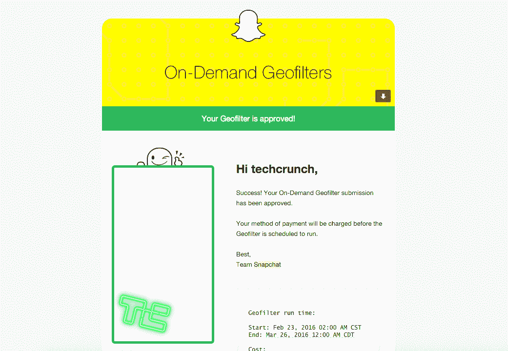

# 如何制作按需 Snapchat 地理过滤器

> 原文：<https://web.archive.org/web/https://techcrunch.com/2016/02/23/how-to-make-snapchat-geofilter/>

昨天，Snapchat 以按需地理过滤器的形式开辟了新的收入来源。新的按需 geofilters 允许任何人向 Snapchat 付费，在特定时间内在特定区域创建和分发自定义过滤器。

我们想看看推出一个定制过滤器有多快多简单，所以我们决定在旧金山的 TechCrunch 总部创建一个。这个过程是这样的。

**第一步——进入 Snapchat 的按需地理过滤器页面**

点击[这里](https://web.archive.org/web/20221208121855/https://www.snapchat.com/on-demand)并点击“立即创建”系统将提示您使用 Snapchat 帐户登录。

**第 2 步——下载模板并创建您的设计**

登录系统后，您可以选择下载模板或上传您的设计。如果这是你的第一次竞技，你需要下载模板。模板看起来像这样。

**步骤 3–设计您的按需地理过滤器**

下载并解压文件后，你会看到十几个 Adobe Photoshop 模板。挑一个适合自己需求的，开始设计吧。这是我们的天才设计师 Bryce 为 TechCrunch 设计的。

**第四步——上传你的设计**

另存为 PNG 文件，并将文件上传到 Snapchat 的按需 Geofilter 页面。你会得到一个它看起来会是什么样子的模型。这是我们的。

**第 5 步——选择日期和地点**

我们决定让我们的过滤器运行一个月，但你可以只运行一天，甚至几个小时。选择日期后，您将被带到地图上选择地理围栏的位置。

输入地址。画栅栏。得到一个估计。我们办公室一个月的费用大约是 200 美元。结账。

**第 6 步——等待 5 分钟**

你会立即收到一封电子邮件，告诉你你的信用卡已经被扣费。不到 5 分钟，我们的 geofilter 就获得了批准。

我们昨天下午 2 点左右提交了过滤器，它在下午 2 点 05 分获得批准，并在今天上午 12 点 05 分启动。很快，对吧？

Snapchat 还在凌晨 12:05 发送了另一封电子邮件，让我知道 geofilter 已经上线。

**第七步–玩**

我们的过滤器现已启用。这是它实际运行的样子。你也可以关注 TechCrunch [Snapchat 账户](https://web.archive.org/web/20221208121855/https://www.snapchat.com/add/techcrunch)(仅限手机)，看看我们下个月是如何使用它的。

[gallery ids="1281904，1281907，1281906"]

简单快捷。从开始到结束整个过程花了大约一个小时。[您还可以获得关于您的过滤器如何执行的分析](https://web.archive.org/web/20221208121855/https://geofilters.snapchat.com/metrics)，但不是立即可用。你必须等到第二天才能得到分析，它们看起来就像这样。在最初的 24 小时内，我们的过滤器使用了 35 次，超过 24000 名用户看到了该过滤器。还不错。

Snapchat 似乎有一个真正的赢家，我相信你会在下一次婚礼、节日或派对上看到新的定制按需地理过滤器的运行。我们甚至可能会看到一些朋友互相钓鱼。