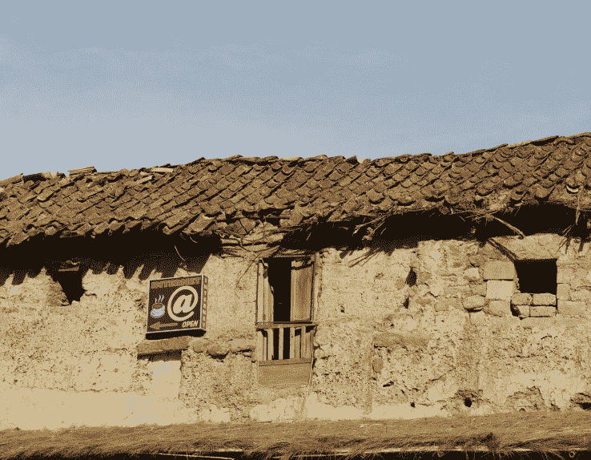

# 如何让发展中国家的互联网免费

> 原文：<https://web.archive.org/web/http://techcrunch.com/2015/06/01/how-to-make-the-internet-truly-free-in-developing-countries./>

当大多数美国人听到“网络中立”这个术语时，他们的目光开始变得呆滞，困惑开始出现，并且几乎立即被厌倦占据。但在印度这样的新兴市场，网络中立意味着一切。

以住在印度班加罗尔的 22 岁女性 Priya 为例。像我们在美国的许多人一样，她的安卓智能手机(售价 90 美元)永远不会遥不可及。像我一样，她在上班的路上访问脸书，与她的朋友联系，计划他们每周的集体晚餐。和你一样，她也通过十几个其他应用程序来观看体育比赛、阅读新闻或欣赏家人的照片。

但是，与西方人不同的是，Priya 最大的挑战是弄清楚她可以使用这些应用程序中的哪些，以及使用多长时间。Priya 和其他 90%的印度手机用户一样，使用昂贵的现收现付数据套餐。

在印度，连接的主要障碍之一是纯粹的自付费数据可能会造成严重后果。那些拿最低工资的人需要工作 17 个小时才能买得起 500 兆的移动数据[计划](https://web.archive.org/web/20160512012040/http://blog.jana.com/2015/01/26/the-data-trap/)；仅支付一个小时的连接费用就要花费长达三个小时的工作。(相比之下，在美国，一些运营商每月无限量数据的费用仅略高于三个小时的最低工资。)

这就是为什么拥有 Internet.org 平台的脸书和 Airtel Zero 等公司试图通过免费使用应用程序来弥补印度和其他发展中国家客户的成本差距。虽然他们的动机是高尚的，但他们的模型也有局限性，挑战网络中立性——不要让你的目光停留在这里——互联网应该包含自由和平等内容的原则。

在印度和其他发展中国家，关于网络中立的争论比在美国要复杂得多。例如，在美国，维护网络中立的斗争最近与康卡斯特试图控制人们从网飞或其他流媒体服务传输内容的速度联系在一起。在这种情况下，这意味着您的电影加载可能会慢一点。

在印度，这不是速度的问题，一个应用或一部电影的加载速度可能会比另一个慢一点(这在美国引发了巨大的道德问题)，但这完全是访问的问题。通过使用像 Internet.org 或 Airtel Zero 这样的平台，一些互联网被提供，而一些则没有。例如，提供低数据版本的应用程序，有些完全不在列表中。

但是像 Priya 这样的人想做的不仅仅是浏览维基百科和与脸书上的朋友聊天——他们想在 YouTube 上观看视频，并下载一个新的本地文件共享应用程序。他们想要完整的互联网体验，而不是其中的一小部分。(一个应用程序是否比另一个慢，在优先级列表中是相当低的。)

Internet.org 和 Airtel Zero 表示，他们的使命是将互联网带给那些没有互联网的人，这无疑是无私的。然而，虽然他们的服务给了许多人第一次上网的机会，但这并不是没有意义的。

例如，Internet.org 对任何第三方应用开放，只要它们不消耗大量数据，并且应用开发者符合脸书的参与指南。Airtel Zero 允许人们免费使用批准的应用程序，所有其他应用程序都要收取正常的数据费用。

最近几周,[对这两种努力的强烈反对是，这种情况会阻止人们使用更小的本地应用，因为成本太大了。当你可以免费使用脸书的时候，为什么要有偿使用一个刚刚起步的社交平台呢？这意味着对所有内容一视同仁的开放、公平的互联网环境并不存在。](https://web.archive.org/web/20160512012040/http://techcrunch.com/2015/05/04/facebooks-internet-org-project-is-now-a-platform/)

将互联网带给下一个 10 亿人的棘手之处在于，必须有人为那些管道、电线和无人机支付费用，以将这些比特传输到这些发展中国家。不会是印度政府。如果是脸书、谷歌或像 Airtel 这样的大型运营商，显然会有与他们的利他努力相关的财务激励。

所以这就引出了一个问题，还有什么其他的解决方案？

将免费开放的互联网引入印度等市场的最佳方式是采用广告支持模式。这是今天大多数媒体的工作方式，可以追溯到电视和广播的开端。当电视和广播首次出现时，广告商使得消费者免费使用这些媒体成为可能。(如果你看看这个网页，你会发现对于大多数媒体来说，这仍然是事实。)那么，如果广告商让免费访问应用程序和在线内容成为可能，而没有围墙或限制，会怎么样？

Mozilla 在孟加拉国与 Grameenphone 的合作，以及 T2 与 Orange 在多个非洲国家的合作，都是通过广告提供无层级开放互联网接入的例子。

孟加拉国 Grameenphone 的想法是，用户在手机市场上观看一个简短的广告后，每天可以收到 20MB 的无限制数据。通过 Orange，购买 Mozilla 智能手机的非洲特定地区的消费者可以在购买手机的同时获得一段时间内无限制的免费互联网服务。这两项努力都是为了增加 Mozilla 手机的销量，以此作为对免费无限制互联网接入的回报。

另一个在印度的例子是百事可乐的非常成功的[活动](https://web.archive.org/web/20160512012040/https://www.youtube.com/watch?v=7krmYhK3PWY)和 [FreeCharge](https://web.archive.org/web/20160512012040/https://www.freecharge.in/) (一家初创公司最近被 Snapdeal[收购](https://web.archive.org/web/20160512012040/http://articles.economictimes.indiatimes.com/2015-04-09/news/60979747_1_kunal-bahl-rohit-bansal-snapdeal)，这是印度消费者互联网领域迄今为止最大的一笔收购)，在那里购买苏打水可以获得免费互联网。它是这样工作的:你买了一瓶百事可乐，将瓶盖内的密码输入你的手机，你就可以获得价值 10 卢比的免费连接。FreeCharge 并没有限制你用这 10 卢比可以看到或访问的内容；这取决于消费者。

目前，2190 亿美元花在新兴市场的广告上，但超过 90%花在传统的广告模式上，如广告牌和电视广告。当然，如果技术社区为这些新连接的人群搭建了平台，有足够多的渴望品牌愿意付费进入这些人群(并抵消接入互联网的数据成本)。然后，就像免费的广告支持的有线电视，或免费的广告支持的广播，我真的相信广告可以成为互联网的门户，而不是看门人。

Featured Image: [Galyna Andrushko](https://web.archive.org/web/20160512012040/http://www.shutterstock.com/gallery-62698p1.html)/[Shutterstock](https://web.archive.org/web/20160512012040/http://www.shutterstock.com/)