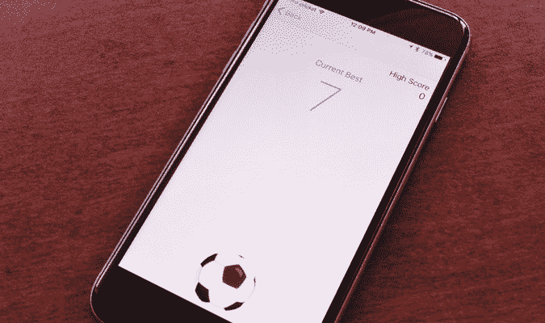

# 如何玩 Facebook Messenger 新出的超级上瘾(还有隐藏！)足球游戏

> 原文：<https://web.archive.org/web/https://techcrunch.com/2016/06/15/how-to-play-facebook-messengers-new-super-addictive-and-hidden-soccer-game/>

# 如何玩 Facebook Messenger 新出的超级上瘾(还有隐藏！)足球比赛

还记得三月份被塞进 Facebook Messenger 的篮球迷你游戏复活节彩蛋吗？

现在那里藏着一个新的。这一次，是足球。这基本上是一个数字版本的 [Keepie Uppie](https://web.archive.org/web/20230404151914/https://en.wikipedia.org/wiki/Keepie_uppie) ，或者被称为“试图将足球保持在空中，直到你累了或者扭伤脚踝或者是时候吃橘子片了。”

去看比赛的秘密和你去看篮球比赛的方式超级相似——都是关于表情符号的。

## 怎么玩

*   请确保 Facebook Messenger 已更新。
*   与一个朋友或一群朋友聊天。
*   发送足球表情符号
*   点击您刚刚发送的足球表情符号。

嘭！足球迷你游戏已启用。就像篮球比赛一样，它会在聊天线程中记录每个人的高分。

我目前的最高分是 18 分，大概比我在现实生活中的分数多 17 分。

*(如果对你不起作用，请参见第 1 步。您必须更新 Messenger，它才能正常工作。)*