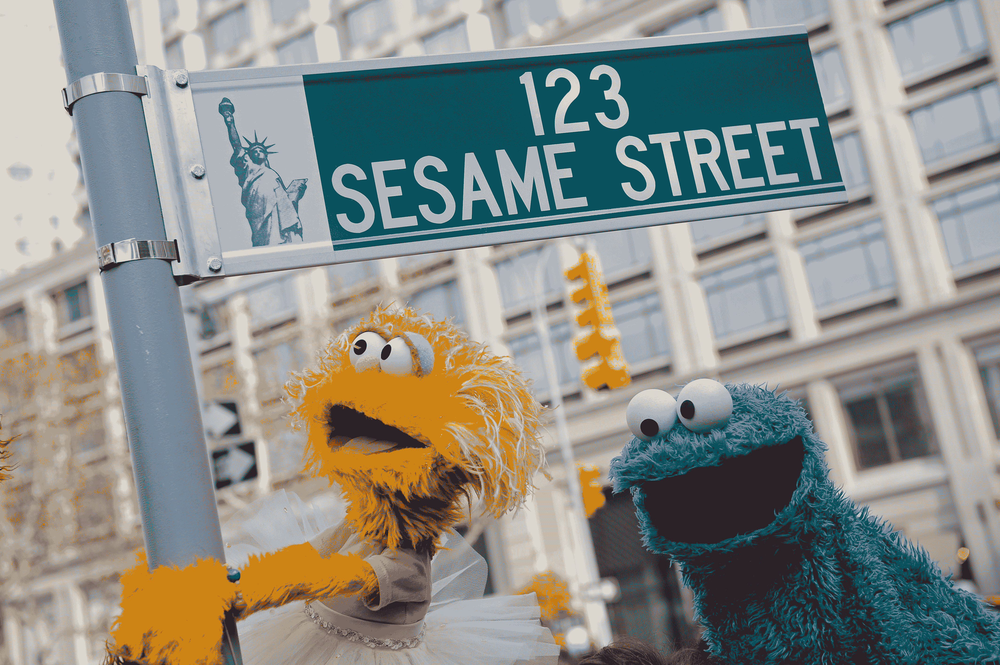
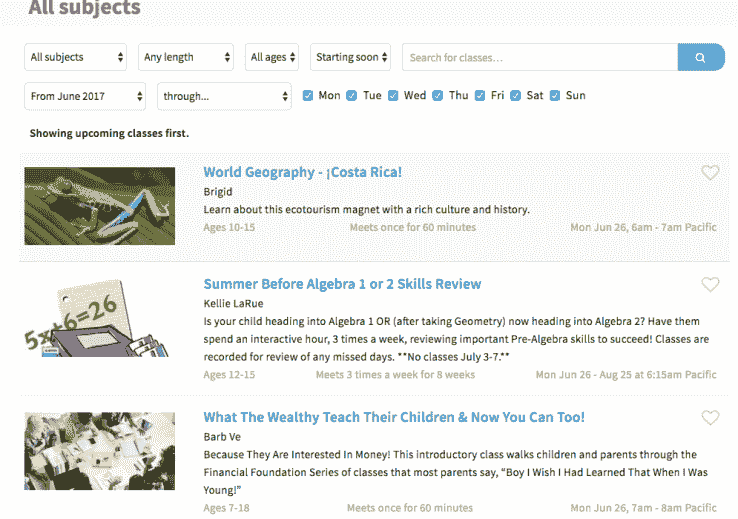

# Outschool 来到芝麻街，为其 K-12 在线学习市场 TechCrunch 募集了 140 万美元

> 原文：<https://web.archive.org/web/https://techcrunch.com/2017/06/26/how-to-raise-from-sesame-street/>

现在，孩子们有可能参加一个课程，了解如何去芝麻街，这要感谢由芝麻街与合作基金牵头的投资者为 Outschool 及其在线学习市场提供的 140 万美元的新资金。

[Outschool](https://web.archive.org/web/20221216204159/https://outschool.com/) 毕业于[Y Combinator](https://web.archive.org/web/20221216204159/https://techcrunch.com/2016/03/22/y-combinator-demo-day-winter-2016/)的 2016 年冬季批次，其最初的定位是为在家上学的孩子提供在线课程。该公司现在自称是一个在线市场，从专业教师到日常专业人员，任何人(经过该公司审查)都可以向从幼儿园到高中的学生出售模块化的在线直播课程。

这一宣传足够吸引人，足以让该公司进入芝麻街……或者至少进入由芝麻街工作室(芝麻街背后的非营利组织)和合作基金(部分专注于社会影响的风险投资基金)合作的风险投资工具[coll ab+Sesame](https://web.archive.org/web/20221216204159/http://www.sesameworkshop.org/?gclid=Cj0KEQjw4cLKBRCZmNTvyovvj-4BEiQAl_sgQqiY6CTdEubrK3YYZgK5HZrYdHqnjuiAW8He9AzXJsYaAjIw8P8HAQ)。该轮额外投资者包括 Y Combinator、SV Angel、Caterina Fake、FundersClub、Spectrum 28 和 Learn Capital。

2009 年 11 月 9 日，在西 64 街和百老汇，芝麻街木偶角色佐伊(左)和饼干怪兽(右)在临时路牌旁合影

大约两年前，芝麻街工作室获得批准，在 Tanya Haider 的指导下，将一定比例的运营储备投资于初创企业。

作为该公司负责战略、研究和风险投资的执行副总裁，海德尔一直在积极寻找合作伙伴和投资机会，在儿童学习和玩耍的方式之间建立联系。

“数字媒体正在改变孩子们娱乐和教育的方式，”海德尔说。“我们认为这将是一个好主意，鼓励…与其他公司合作，鼓励他们的工作。在 1900 年百老汇的高墙之外，有很多好的想法，这就是我们现在所在的地方。”

海德尔说，从一开始，校外教育就像是一项很好的投资。海德尔说:“创建一个帮助教师赚取额外收入的市场是一个好主意。”。“从我们的角度来看，这种模式的伟大之处在于，面向儿童的最终产品非常棒。孩子们在学校环境之外也从中获得了一些东西。”

事实上，Outschool 的课程是一个相对便宜的在线市场中实用、奇怪、奇怪的实用和极其奇怪的混合。

以下是 Outschool 联合创始人阿米尔·纳特霍最喜欢的一些课程:

> 什么是乘法？–初级–数学–一次性课程–5 美元
> 
> [你决定:担任民事案件的陪审员](https://web.archive.org/web/20221216204159/https://outschool.com/classes/you-decide-act-as-a-juror-for-a-civil-case-lUaSol0U)——中级——社会研究——一次性课程——12 美元
> 
> [《我的世界》语法！](https://web.archive.org/web/20221216204159/https://outschool.com/classes/minecraft-grammar-O3FDvex2)–中级–英语–短期课程–25 美元
> 
> 侏儒、巨魔和仙女:北欧民间传说和故事–中级–社会研究–短期课程–30 美元
> 
> [法语介绍](https://web.archive.org/web/20221216204159/https://outschool.com/classes/intro-to-french-elementary-dCr8SQEN)——初级——世界语言——学期课程——85 美元
> 
> [法医学](https://web.archive.org/web/20221216204159/https://outschool.com/classes/forensic-science-9TcC5BKP)–中/高年级–科学–学期课程–100 美元
> 
> [经济思维介绍](https://web.archive.org/web/20221216204159/https://outschool.com/classes/introduction-to-economic-thinking-semester-course-SQz03nD6)——高等——社会研究——学期课程——170 美元
> 
> [《我的世界》莎士比亚](https://web.archive.org/web/20221216204159/https://outschool.com/classes/minecraft-shakespeare-IlILwx5w)–中/高级–英语–学期课程–245 美元
> 
> [哈利·波特的科学:魔法世界的遗传学](https://web.archive.org/web/20221216204159/https://outschool.com/classes/the-science-of-harry-potter-genetics-in-the-wizarding-world-iHS0T9tu)–中/高年级–科学–学期课程–288 美元

Nathoo 毕业于牛津大学，是 Square 的前产品经理，他的父母都是教师，他长期以来一直在考虑将技术应用于教育。Nathoo 和他的联合创始人尼克·格兰迪(Nick Grandy)一起着手创建一个市场，将科技人群中非常流行的终身学习原则应用到学生身上。尼克·格兰迪曾是一名物理教师，也是 Airbnb 的第一名员工。

“看着 Airbnb 和 Lyft 正在做的事情，我们开始思考在线学习的市场方法，”Nathoo 告诉我。

Nathoo 和 Grandy 都表示，这些课程为世界各地的学生打开了一个新的学习世界，尽管参加校外课程的 20，000 名学生中的大多数人都在美国或加拿大。

私人市场模式在教育领域已经被证明是成功的。教师支付教师能够将其关于教师可以向其他教师出售成功教案的市场的想法转变为一项数百万美元的业务，这项业务筹集了大量资金，并将教师变成了现金如雨的百万富翁。

在 Outschool，任何人都可以申请教一门课，但未来的老师要经过公司的审查，包括面试以确定是否合适。每一个潜在的课堂描述都要经过校外团队的审核，而且公司有一个标准政策，在每节课结束后，学生和家长都有反馈的机会。

Outschool 的产品样本

纳特霍说，教师的范围从公立或私立学校的专业教育工作者、大学教授到研究生、业余爱好者或特定职业的专业人士。

根据 Nathoo 的说法，教师设定价格，根据课程的持续时间，价格从每个学生 5 美元到更高的金额不等。

Outschool 的下一步将是开始让学生建立超越课堂经验的投资组合。纳特霍告诉我，随着越来越多的人尝试不同的方式让有才华的人找到他们想要的工作，随着学生继续他们自己选择的教育道路，在线作品集可能会非常有吸引力。

在 Collab+Sesame，这篇论文绝对具有吸引力。

Collab+Sesame 的负责人、Collaborative Fund 的合伙人劳伦·洛克捷夫(Lauren Loktev)说:“真正严格的高中、大学和成人补充学习有很多模式。但是 Outschool 专注于发展兴趣和培养在线性课堂环境之外学习的机会。Loktev 说，这种多学科和开放的方法使孩子们能够以一种更自我导向、最终更有趣的方式追求自己的兴趣。