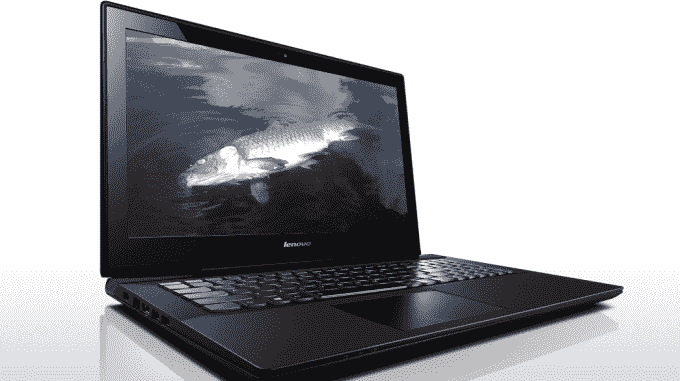

# 联想发布工具，清除预装在笔记本电脑上的粗略可利用的“超级鱼”垃圾

> 原文：<https://web.archive.org/web/https://techcrunch.com/2015/02/20/how-to-remove-superfish-lenovo/>

# 联想发布工具，清除预装在笔记本电脑上的粗略可利用的“超级鱼”垃圾

本周早些时候，有消息称联想已经在许多 Windows 电脑上预装了一个名为“SuperFish”的粗略广告软件程序长达数月。

然后，研究人员开始发现令人讨厌的漏洞——也就是说，超级鱼正在使用一些非常丑陋的黑客技术来修补你计算机的加密证书，这样做的方式似乎让你的其他“加密”通信(通过 HTTPS 的所有内容)在你使用共享 WiFi 连接时(比如在咖啡店)不安全

今天早上，美国国土安全部敦促联想笔记本电脑用户移除该工具。

即使没有安全隐患，SuperFish 也相当粗略。它的目的？在谷歌搜索结果出现在你的屏幕前捕捉它们，然后悄悄地修改它们以包含更多的广告。

联想现在正忙着灭火；他们昨天透露，他们已经在一月份关闭了服务器端所有与 SuperFish 相关的东西——这虽然是一个好的步骤，但并没有解决笔记本电脑中隐藏的丑陋的安全缺陷问题。

为此，联想刚刚发布了一套[自动删除工具](https://web.archive.org/web/20221007062650/http://support.lenovo.com/us/en/product_security/superfish_uninstall)，他们承诺该工具将“确保所有主流浏览器完全删除超级鱼和证书”

他们还公布了移除工具的源代码以供审查，并提供给那些想自己编译该工具的人。

如果你还记得呢？他们还提供了如何在同一页面上手动移除超级鱼的分步指南。

**联想在就此事发布的最新声明中表示:**

> 基于用户对这种体验的抱怨，我们在 1 月份下令停止 Superfish 预加载，并关闭了服务器连接。然而，直到昨天我们才知道这个潜在的安全漏洞。我们意识到这是我们的失误，将来我们会做得更好。现在，我们正专注于修复它。
> 
> 从那时起，我们在现有知识的基础上，尽可能迅速果断地采取行动。虽然这个问题对我们的 ThinkPads 没有任何影响；任何平板电脑、台式机或智能手机；或任何企业服务器或存储设备，我们认识到所有联想客户都需要了解情况。我们为出于任何原因在用户中引起这些担忧深表歉意，我们正在从经验中学习，并改进我们的工作和方式。我们将继续采取措施，使客户更容易删除软件和相关的潜在易受攻击证书，以便他们可以继续满怀信心地使用我们的产品，这是他们所期望和理应得到的。

*【原始死鱼照片】由 Flickr 上的[本·布罗菲](https://web.archive.org/web/20221007062650/https://www.flickr.com/photos/lfb/3845801887/in/photolist-k4gPmZ-c6QRHL-6RQJV6-gyYyP-oWrLph-59t8A5-59t9WE-8NCdUc-4Y5qpD-a218Un-7ByBpZ-31Mvw-gkWsZ2-bfjcKt-6kknuT-27bof1-pmjaiz-5kvX4H-65jGCx-47gmeL-656Qon-pfiCL9-54uayR-oZQyRe-6ohwgj-4TBNEr-dEg3s8-e89bY-21tzgt-5dQ33j-dbLUrB-fNGmf8-7hEkQ4-4tiiqN-nNqCEi-9pxbzw-94PtJd-wHgMH-7gCgor-cVvwC-8hBkmF-5zYmGn-4E4Yc-e7FAV3-foH7EG-4ZKbGW-de8QkZ-56FSR9-4zz4mH-4G8PkV)拍摄；修改后的知识共享空间】*