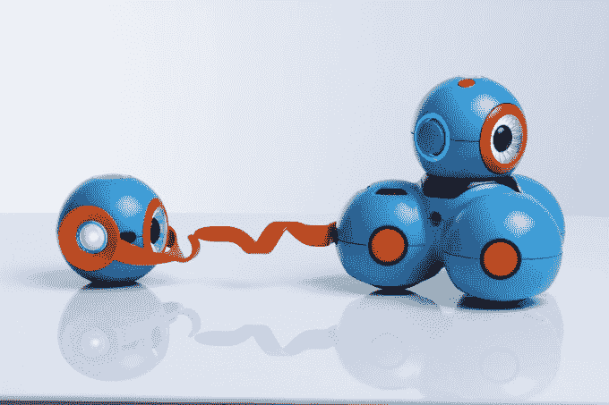
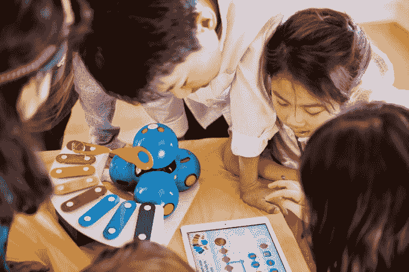
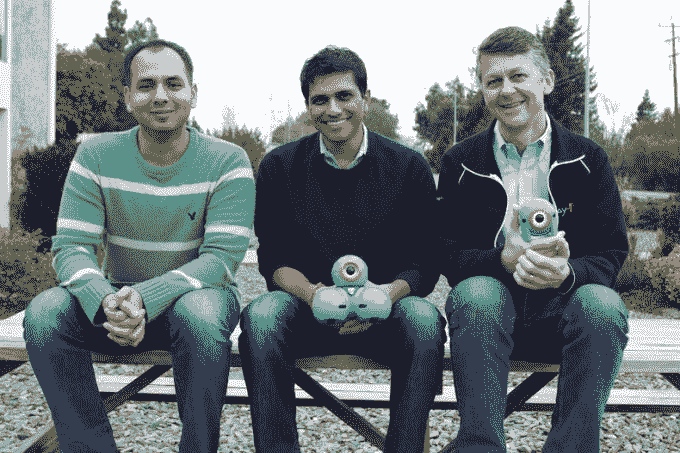

# 看看 Play-i 成功的众筹活动 

> 原文：<https://web.archive.org/web/https://techcrunch.com/2014/04/26/how-to-run-a-successful-crowdfunding-campaign/>

**编者按:** *[维卡斯·古普塔](https://web.archive.org/web/20221209185801/http://www.crunchbase.com/person/vikas-gupta)是 [Play-i](https://web.archive.org/web/20221209185801/http://play-i.com/) 的联合创始人兼首席执行官，这是一家为儿童编程制造机器人的公司。*

在短短六个月内，Play-i 通过我们的众筹活动，从一个想法变成了一个工作原型，并获得了 144 万美元的预购订单。我们正在制造机器人 Bo 和 Yana，帮助 5 岁以上的儿童学习编程概念和创造性解决问题。我们于 2013 年 10 月 28 日启动了众筹活动，仅用了四天时间就达到了 25 万美元的目标。两周后，我们达到了 50 万美元，月底达到了 144 万美元。

我们接待了来自 180 个国家的游客和来自 80 个国家客户的订单，尽管我们向大约 20 个国家发货。在我们的活动之前，最大的消费机器人众筹项目筹集了 18.8 万美元。企业家经常问我们，为了开展一场有效的活动，我们做了些什么。所以我分享我们的策略和我们一路走来学到的东西。

我是波和亚娜

## **Self Starter vs. Kickstarter 或 Indiegogo**

在决定是使用我们自己的网站还是像 Kickstarter 或 Indiegogo 这样的众筹平台时，我们查看了过去项目的大量数据。我们的目标客户是 5-10 岁孩子的父母，他们与倾向于支持 Kickstarter 上的项目的人群并不重叠。Kickstarter 项目 75%的支持者也是第一次支持。Kickstarter 的网络收益很低，我们需要做大部分工作来吸引人们到我们自己的项目页面。

我们决定举办自己的活动有四个主要原因:

1.  **分析学。**我们希望获得客户访问我们项目的数据，深入了解下车点、站点热图、流量来源等等。第三方平台没有给我们这些能力。
2.  **费用。**所有第三方平台都收取了可观的交易费用。中间商是产品对消费者涨价的一个重要原因，我们希望保持价格合理。
3.  **用户体验。**我们希望控制用户体验，打造我们的品牌。第三方平台往往会给客户带来混乱的布局，尤其是如果他们不熟悉这个平台的话。有无尽的奖励和链接部分，可以将客户从我们的项目转移到网站的其他地方。我们想让事情变得简单。
4.  **焦点**。当你在一个众筹平台上发起时，媒体故事的一部分将不可避免地与平台本身有关。我们希望记者写的每一篇文章都关注我们的机器人。

我们觉得我们必须在我们的网站上发布，按照我们的方式。我们使用了 [selfstarter](https://web.archive.org/web/20221209185801/https://github.com/lockitron/selfstarter) ，这当然不是一个微不足道的过程。你需要有设计和工程资源来把它做好。

## **优化网站**

我们花了很多时间来弄清楚网站应该如何为客户服务。我们不希望我们的页面过于混乱，所以我们主动删除了与客户做出购买决定无关的信息。每一个字都是精心选择的，行动的号召是明确的。我们还保留了奖励页面，客户可以在这里简单直接地选择他们的承诺。

## **培养早期买家受众**

在我们发起活动的几个月前，我们开始积极地建立我们的邮件列表，这些人希望被告知我们的项目。我们创建了一个关于 STEM 和育儿的博客，这是我们的目标受众关心的话题。在没有任何关于产品本身的信息的情况下，我们通过社交媒体、口碑和在线广告将我们的受众扩大到了几千人。

随着发布日期的临近，我们亲自在湾区的科技公司和母公司展示了我们的原型。我们的朋友和早期的支持者在社区组织和传播方面发挥了很大的作用。

## **俯仰压力机**

我们很幸运，也很感激许多记者对报道我们的发布新闻感兴趣。大约在我们的活动开始前一个月，我们提出并安排了现场演示和对我们的宣传感兴趣的记者采访。

我们联系了我们在技术和主流新闻渠道认识的人，这样我们就可以得到报道相关教育和/或消费技术新闻的记者的个人介绍。在发布前两周，我们拜访了旧金山和纽约市的主要出版社，向他们展示了这些机器人。我们还通过 Skype 采访了身在国外的记者。

## 向早期买家提供**优惠**

我们在太平洋标准时间早上 5 点为我们的发布会安排了媒体，我们知道当我们的活动公开时，我们的流量会激增。我们需要马上建立社会证明，所以我们为最初的几个买家创造了特殊的优惠。

我们的第一批 1000 名支持者获得了限量版的机器人专属套装，作为提前回来的奖励。在我们的活动开始前几个小时，我们给现有的观众和朋友发了电子邮件，这样他们就可以成为第一批支持这个项目的人。这给了我们一个良好开端所需要的动力。

## **增加个人特色**

我们给各个层次的支持者额外津贴。每个阶段都有不同的专属机器人装备给支持者:第一个 1K，第二个 2K，最后是 4K。这种稀缺模型为人们创造了一个提前回归的理由。

作为一家公司，我们相信从客户开始。我们亲自回复了收到的每一封电子邮件、对脸书的每一条评论以及 Twitter 上的每一个问题。我们让他们对我们将编程带给每个孩子的使命感到兴奋。我们还根据支持者的反馈在更新中发布了额外的功能和挑战目标。他们成为我们故事的一部分，他们中的许多人帮助我们宣传我们的运动。

## **发布激动人心的拉伸目标**

我们确保我们发布的所有挑战目标都是实质性的、令人兴奋的。尽管我们有很多关于延伸目标的想法，但我们只发布了几个我们确信会吸引我们的支持者的想法。

我们最好、最值得关注的延伸目标是，如果我们实现了一个新目标，我们现有的支持者就可以获得一些有价值的东西，而无需增加购买。当我们达到 100 万美元时，我们为支持者(购买了附件包)免费提供了智能手机附件，并生动地展示了它可以给他们的机器人带来的好处和能力。结果，我们看到更多的人分享和发布了我们的活动。这对我们的客户和我们来说都是双赢。

## **重新营销以吸引顾客回头客**

随着活动的进行，我们使用在线广告向已经访问过我们网站的客户进行再营销。我们从第一天就计划好了；因此，我们在活动开始前设置了适当的像素，并在稍后打开了再销售支出。我们使用一个名为 [Adroll](https://web.archive.org/web/20221209185801/http://www.adroll.com/) 的平台来运行我们的重新定位活动。事实证明，这对于我们将客户带回我们的网站非常有效，尤其是在活动接近尾声的时候。

作为一家硬件创业公司，我们的入门固定成本比软件创业公司高得多。建立适当的生产需要大量的资金投入。我们的众筹活动帮助我们证明了对我们机器人的需求，并成为我们筹集 A 轮资金的跳板。

Play-i 创始人索拉博·古普塔、维卡斯·古普塔和米卡勒·格里夫斯