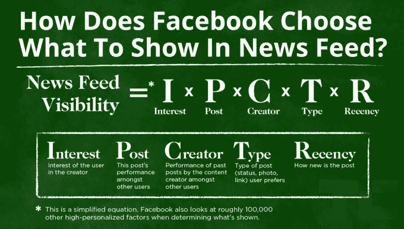

# 脸书的 Feed 现在惩罚请求赞或分享重播的页面

> 原文：<https://web.archive.org/web/https://techcrunch.com/2014/04/10/how-to-show-up-in-news-feed/>

# 脸书的 Feed 现在惩罚请求赞或分享重播的页面

你不够聪明，骗不了脸书。要求用户“喜欢这个帖子！”该公司[今天](https://web.archive.org/web/20230404150552/https://newsroom.fb.com/news/2014/04/news-feed-fyi-cleaning-up-news-feed-spam/)表示，反复分享相同的链接或照片，或者用充满广告的网站链接引诱和交换人们，现在将会破坏你的页面在新闻提要中的影响力。分享独特有趣的内容，你就没事了。

上周，我写了一篇深度指南，介绍了[为什么脸书的页面覆盖范围在自然下降，以及新闻订阅是如何工作的](https://web.archive.org/web/20230404150552/https://techcrunch.com/2014/04/03/the-filtered-feed-problem/)。TL；dr 是越来越多的页面和朋友争夺人们阅读 feed 的有限时间。越来越多的竞争加上有限的关注等于范围越来越小。

保持自己影响力的方法是分享那些被广泛喜欢、评论、分享和点击的帖子。这些信号告诉脸书的新闻订阅算法，你的帖子值得展示给更多人。下面是提要如何选择显示内容的简化公式。它列出了脸书关注的五大因素，但还有成千上万的其他因素。

今天的声明，是脸书推动增加新闻订阅工作透明度的一部分，列出了会让你的页面被隔离的因素。其中许多可能已经存在了一段时间，脸书去年开始惩罚图像模因的使用，但现在这些违法行为可能会受到更严厉的惩罚。规则如下:

*   不要明确要求用户喜欢、评论或分享你的帖子，无论是文本还是照片。脸书会发现这一点，并减少你的影响
*   不要重复分享相同的内容。是的，它可能对你很重要，但是你的粉丝不希望在他们的订阅中多次看到它。如果你需要分享同一个链接，每次用不同的描述或照片。
*   不要说一个链接导致一件事，当它真的去别的地方。也就是说，不要说“查看我们的照片库”，而是将它们链接到一个除了广告什么也没有的电子商务购买页面或网站。脸书可能会看到用户在点击你的链接半秒钟后又开始浏览他们的提要，因为在另一边的是一个骗局，并为此痛打你一顿。

脸书关心页面和业务，但它更关心未来几年人们享受新闻的乐趣。把饲料弄得更糟，你就不会再出现在那里了。