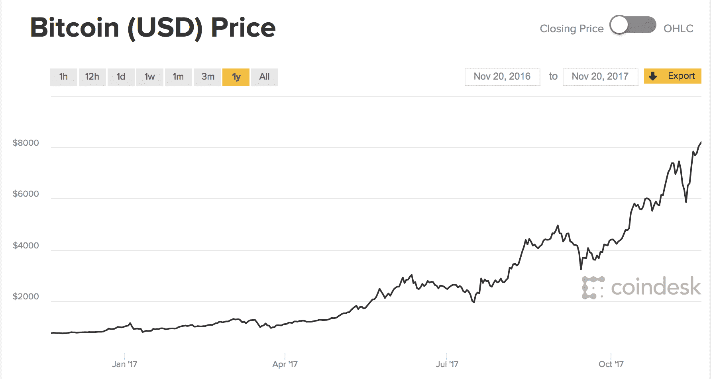
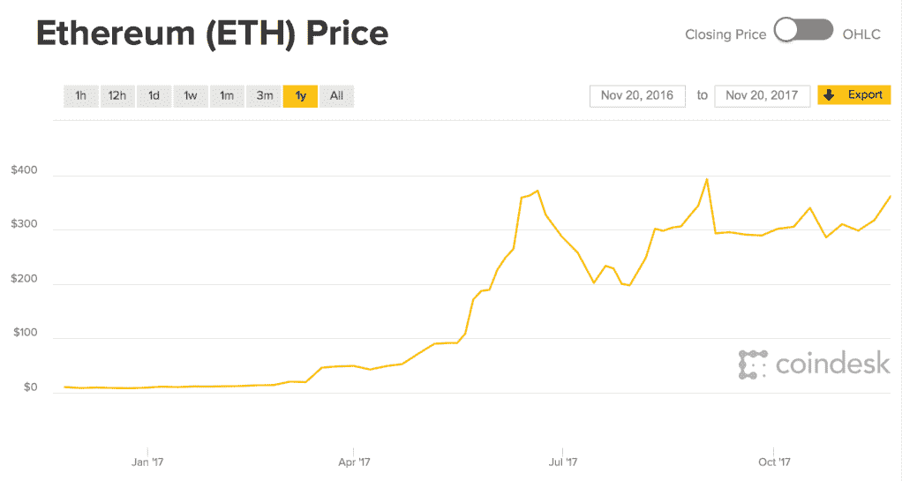

# 如何在节日餐桌上谈论加密货币 

> 原文：<https://web.archive.org/web/https://techcrunch.com/2017/11/20/how-to-talk-about-cryptocurrency-at-the-holiday-dinner-table/>

你正坐下来享用美食，而你的阿姨总是领先一步，提到她想开始投资比特币。你冻僵了，一滴肉汁从长柄勺上掉了下来。是你发光的时候了。

你能行的。

首先，你知道 crypto 的状态非常非常好。对于加密货币来说，今年是辉煌的一年。截至今年，比特币从一年前的 738 美元上涨至 8220 美元。如果你在 2016 年 11 月投资 7000 美元比特币，你现在应该已经有六位数了。以太坊也是如此，从 2016 年的 9 美元涨到 2017 年的 350 美元。看看这些图表:

 

这足以让你的阿姨想卖掉她的避暑别墅，把它们都倒进区块链！但是她应该吗？

大概不会。

有趣的是，随着价格的上涨和波动变得更容易管理，关于加密投资的讨论已经平息。原因有很多，但最主要的一个是，密码世界喜欢保持安静，偷偷地获利。这意味着如果你打算进入，你最好果断行动。当然，你可以涉足，但如果你想看到真正的回报，我不认为价格会回落到 3000 美元甚至 5000 美元。我们几乎处于未来几个月的固定点，除非出现闪电崩盘，否则不要指望会有太大变化，除非美国证券交易委员会(SEC)出台一些疯狂的监管措施。

我们已经进入了一个奇怪的加密货币时代。这项技术已经足够成熟，任何人都可以实现区块链解决方案——从小型金融科技公司到万事达卡——但还没有足够的信任成为真正的普遍价值商店。然而，最近的 Segwit2x 故障基本上向世界表明，区块链的“统治者”，即拥有数百万密码的鲸鱼和矿工，希望 BTC 避免成为公用事业，更多地作为商品。他们不想把区块链变成信用卡交易服务，而是想要一种以电子方式存储和转移大量现金的方式。

以太坊，另一方面，将是公用事业。价格应该会一直上涨到明年 1 月以后，但一旦第一批精心策划的 ico 失败，价格可能会大幅下跌。一旦第一批真正的 ico(真正的代币销售，着眼于货币管理和快速致富计划)开始推出，它将再次上升。这将在第一和第二季度发生。你如何挑选一个好的代币销售？现在你不能。你最好的选择是买一点乙醚，避免出现更奇怪的代币溶液。在我看来，代币是未来的。只是不是现在的形式。

最终，以太坊网络将发展到处理更多的交易，比特币将保持不变，成为那些不想把金币放在地下保险箱的人的保障和堡垒。

你姑姑还在缠着你征求意见吗？如果她拥有，她应该持有。如果她不拥有，她不妨试一试。开立一个比特币基地账户，买几百美元的 BTC 和乙醚。让她看着它移动，并开始适应自己的新闻周期，更重要的是，炒作周期。记住:结果可能不同，这并不构成投资建议，就像我说“嘿，你应该试着学习使用 Linux。“回到 1992 年，当它流行起来的时候，你可能会得到一份相当不错的薪水。

加密货币正在进入主流。它目前的受欢迎程度有一些问题，主要是人们在不了解它的情况下进入市场。这没什么——纳斯达克(NASDAQ)几十年来一直在这么做，未经训练的交易员凭直觉对复杂的公司进行猜测——但在加密领域，这项技术与价格密不可分，误解 CoinDesk 等服务发布的消息可能会给你带来很多麻烦。在某种程度上，忠于加密的人喜欢他们的世界是不可预测的这一事实。在另一个程度上，这造成了一些紧张的时刻。

告诉你的家人，加密货币最终会取代我们在电脑之间汇款的方式。告诉他们，有很多聪明人在做很多很酷的事情，即使在几年前也是不可能的。告诉他们，不，联邦调查局不会因为比特币交易而逮捕他们，也不会很有效地利用比特币来打电话或在网上购买数公斤可卡因。归根结底，这是一场赌博，但这是一场混合了华尔街的高风险世界和命令行的高科技世界的赌博。它复杂、迷人、有趣。如果它变得比这少，那么可能是时候套现了。