# 如何训练你的人类:设计更健康的习惯 

> 原文：<https://web.archive.org/web/https://techcrunch.com/2016/02/20/how-to-train-your-human-designing-for-healthier-habits/>

More posts by this contributor

认识一下乔。他 35 岁左右，有两个孩子。努力控制自己的腰围，他决定要减掉 20 磅。他购买最新的可穿戴设备和最好的健身应用程序来跟踪他的食物和运动。他在第一周虔诚地追踪，并设法减掉了几磅。

但是到了第二周，他就不那么兴奋了。到了月底，他完全停止了，体重又回升了。他对自己的外表不满意，并责怪自己的失败。

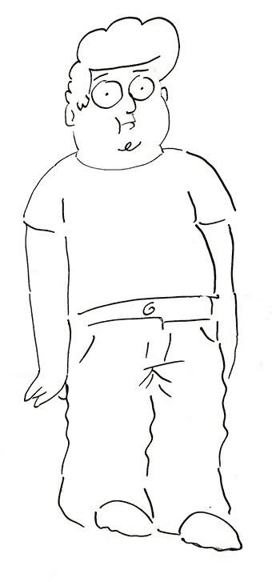

那么，为什么乔很难改变自己的行为呢？因为我们每天做的 45%的决定都是习惯，我们做这些决定时没有经过太多思考。

无聊、饥饿、一项活动、一段时间或一种情绪等线索会触发我们做某些动作或例行公事。当我们完成例行公事时，我们会得到物质或情感上的回报。经常这样做会让我们陷入习惯形成的怪圈。

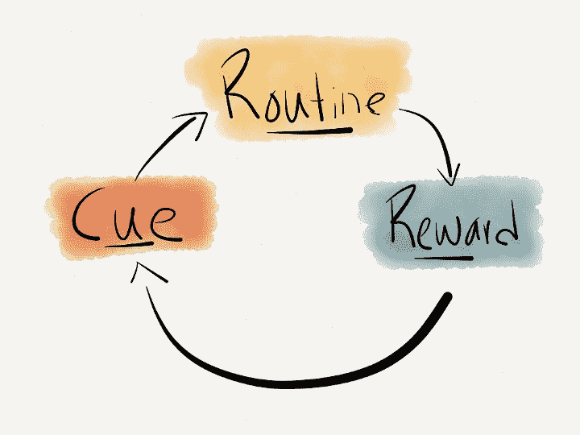

让我们再看看乔。假设乔下班后想去健身房。

但当他回到家(提示)，他坐在电视机前(例行公事)，他感到快乐和放松(奖励)。通过每天重复这一循环，乔把回家的暗示与看电视和放松联系起来。这种模式[铭刻在他的神经通路](https://web.archive.org/web/20221207034545/http://www.nytimes.com/2012/03/11/books/review/the-power-of-habit-by-charles-duhigg.html?_r=0)中，久而久之成为一种习惯。这就是为什么乔很难改变他的习惯。

改变习惯是可能的，但需要有意识的反复努力。科技可以提供帮助。

技术有能力在亲密的层面上与用户互动。作为技术的设计者，我们有机会影响我们的用户，而不仅仅是鼓励新的行为。如果做得好，我们的产品有潜力促进和加强积极的长期习惯。

使用 [Nir Eyal 的挂钩模型](https://web.archive.org/web/20221207034545/http://www.nirandfar.com/hooked)作为框架，我将深入探讨我们如何才能构建塑造用户习惯的产品，并在现有的医疗保健应用程序中看到这些原则的作用。

## 挂钩模型

Nir Eyal 关于习惯形成产品的挂钩模型可以帮助我们设计改变用户行为和增加应用程序参与度的解决方案。

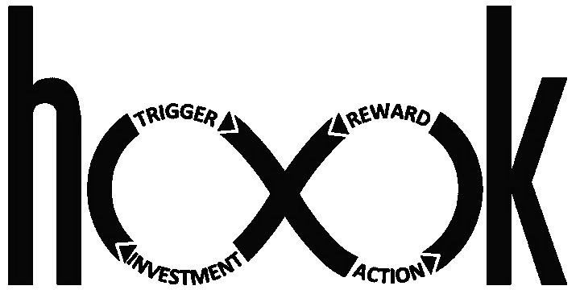

挂钩模型指出，为了形成习惯，用户需要被发送一个触发信号，然后导致一个动作(我们想要形成的习惯)。当用户采取行动时，奖励鼓励他们在未来重复该行动。

通过多次重复这个动作，用户开始投资你的产品。

让用户经历一次又一次的钩子循环有助于用户形成习惯，增加他们对产品的长期参与。

## 扳机

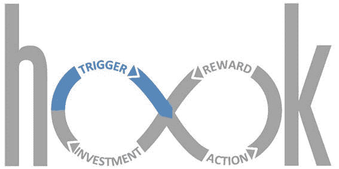

当开始形成新习惯时，触发器往往来自产品本身。这可以是电子邮件、通知、短信、可穿戴设备振动等形式。

作为设计师，我们通常很少注意通知:它更多的是对我们设计的产品的事后思考。然而，触发器是让用户打开应用程序的关键。

为了有效，一个触发器必须是及时的，有趣的和可操作的。

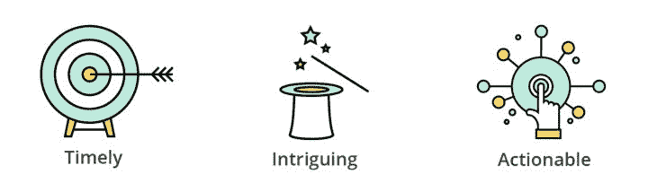

**及时。**触发需要在用户最有可能采取行动的时刻发生。下午 3 点向用户发送称重通知不如清晨提醒有效。

耐克的 FuelBand 就是一个及时触发的好例子。

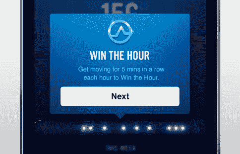

通过“赢得一小时”，耐克鼓励您更加活跃。一天中的每个小时，您都会收到一个提醒，要求您连续移动五分钟，并“赢得”这个小时。它鼓励您立即采取行动，成为绝佳的触发因素。

**有趣。**用户每天都会收到大量的通知，要想引起注意还有很大的竞争。有趣的触发因素是一种超越噪音的方式。

MyFitnessPal 是一款运动和食物跟踪器，它使用重复通知来提醒您采取行动。CarrotFit，也是一个运动和食物追踪器，使用了卑鄙(和有趣！)和鼓励采取行动的各种通知。

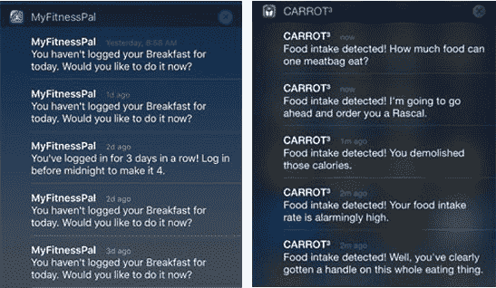

**可操作。**最重要的是，触发器需要可操作。如果没有对目标行为的直接调用，触发器在形成习惯方面就不太有效。

在每周结束时，Fitbit 会通过电子邮件向用户发送一份他们每周表现的总结，以及他们与前一周的表现相比如何。

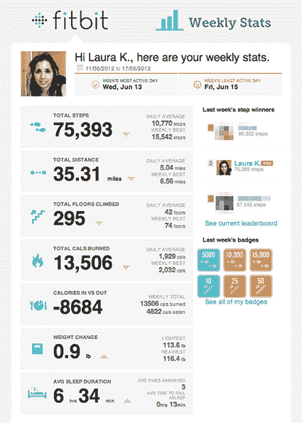

由于用户甚至不需要登录来查看他们的统计数据，这封邮件可以激励不活跃的用户。然而，电子邮件并没有明确呼吁用户下一步应该做什么。没有明确的行动号召，Fitbit 就让用户自己决定怎么做。

在你的触发器中提供清晰的行动号召[在用户参与度和性能方面都非常有效](https://web.archive.org/web/20221207034545/https://www.youtube.com/watch?v=AxtCp198pPQ)。Shapeup 在其性能电子邮件中使用简单的行动呼吁，如“停得更远”和“走楼梯而不是电梯”，以使其用户的体重减少一倍。

## 内在触发器

虽然及时、有趣和可操作的触发对于让用户采取行动很重要，但为了创造重复的习惯，触发需要来自用户自身。

积极的情绪反应(例如，需要归属感、满足无聊感)和消极的情绪反应(例如，无聊、孤独、抑郁、愤怒)是形成习惯的最强大的激励因素。

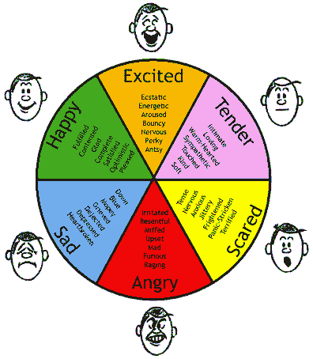

用户通过在每次使用过程中将强烈的情感反应与你的产品联系起来，从而形成习惯。为了引起强烈的情感反应，我们需要识别用户的痛点并致力于解决它。

为了做到这一点，Nir Eyal 推荐了 5 个为什么的方法。总的想法是不断地问为什么，直到你设法触及一个内在的痛点。

让我们来看看 Joe 和 Jessica，他们都购买了可穿戴设备。

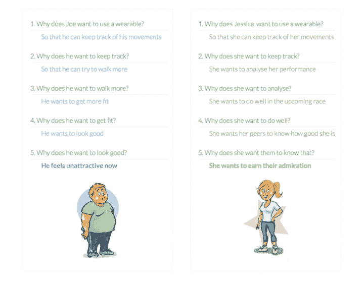

乔和杰西卡都想跟踪他们的运动和锻炼情况。但随着我们不断追问原因，我们意识到他们购买可穿戴设备的内在动机是不同的。

当产品为具有不同内在动机的用户使用一揽子触发器时，它们无法创造习惯。触发因素从未内在化，因为它们没有针对正确的痛点。

通过根据用户的内在动机对他们进行分组，我们现在可以发送非常具体的通知。

对于那些主要需要得到认可的用户来说，可以使用像“*看起来不错”*和*“你做得很好”*这样的通知*。糖尿病管理应用 OneDrop 使用积极的通知来保持用户的积极性。*

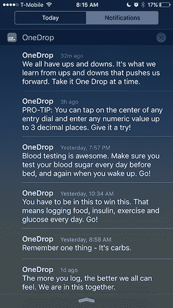

对于那些主要需要赞美的用户来说，像*“你今天击败了竞争对手”*和*“你成功了”*这样的通知可能会很有效。

有针对性的触发会促进更多的行动，通过重复使用，用户会对你的产品产生情感反应。这成为一个内部触发器，促进未来与应用程序的交互和参与。

## 行动

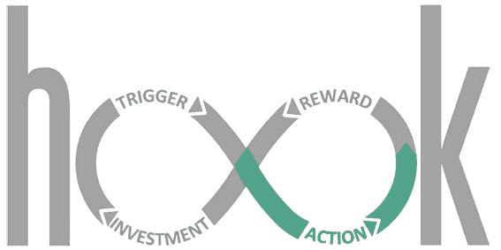

为了让用户采取行动，仅仅有触发器是不够的。我们还需要理解用户采取这些行动的动机和能力。

[福格的行为模型](https://web.archive.org/web/20221207034545/http://www.behaviormodel.org/) (FBM)指出，完成任务的动机和完成任务的能力对某人是否会采取行动有很大的影响。

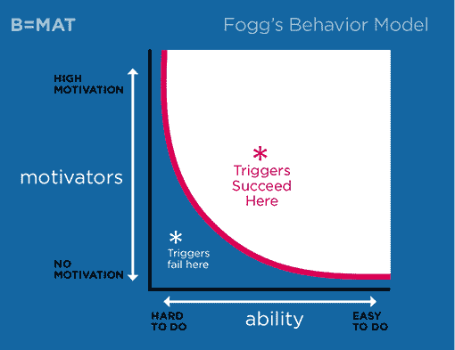

FBM 指出，只要有人在作用线以上，触发器就有可能成功地引发行动。当一个人能力低，动力低，触发器就不起作用。如果用户受伤了，并且对跑马拉松不感兴趣，再多的诱因也无法让他去跑步。

FBM 的基础是试图让用户超越激活阈值，这可以通过增加他们的动机或能力来实现。

## 不断增强的动力

有几种方法可以增加动力。人们受到以下三个因素之一的高度激励:

**增加快乐/减少痛苦:**

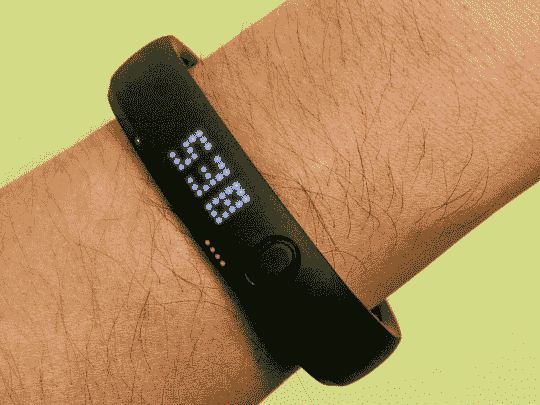

[耐克的 Fuelband](https://web.archive.org/web/20221207034545/http://www.nike.com/us/en_us/c/nikeplus-fuel) 使用腕带上的小 led 来显示你一天的进度。彩色指示器通过增加用户从升级到结束时获得的乐趣来增加用户的动力。

契约应用程序让用户承诺他们一周的目标。因此，用户承诺，每次他们未能完成承诺，他们将损失 X 美元。[输钱模拟大脑的高度疼痛。](https://web.archive.org/web/20221207034545/http://www.eurekalert.org/pub_releases/2007-05/sfn-ssr050407.php) Pactapp 试图通过减轻用户损失金钱的痛苦来激励他们。

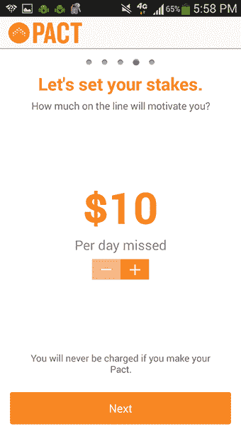

**希望/恐惧:**

另一种激励用户的方式是通过提供希望或减轻恐惧。当用户预期会有好事发生时，这种希望会激励他们采取行动。MyFitnessPal 用能够达到当天目标的希望作为一个触发器，鼓励你采取更多的步骤。

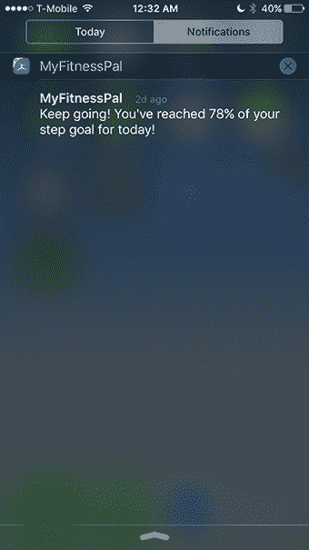

**社会接受/拒绝:**

作为社会动物，社会接受和拒绝是增加动力的有效方法。Fitocracy 在提供社会认可方面做得非常好。社区是他们产品的重要组成部分。所以当一个用户在 Fitocracy 上完成一项活动时，平台上的其他用户会给他们道具，激励他们坚持下去。这种接受和认可的形式，以及成为社区一员的感觉，是用户继续使用 Fitocracy 的强大动力。

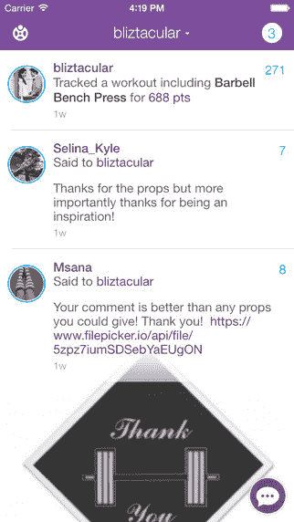

除了被社会接受，[人们非常积极地避免被群体排斥。](https://web.archive.org/web/20221207034545/http://www.apa.org/monitor/2012/04/rejection.aspx)在 Nike groups 中，有一个追踪器向你显示有多少其他用户实现了他们的小组目标。这增加了用户继续锻炼的动力，达到他们的团体目标，不让他们的团体失望。

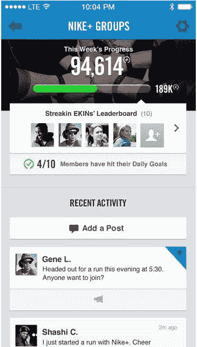

## 增强能力

增加能力的方法不是通过培训或资源，而是通过使任务更简单。这可以通过减少花费的时间，或者减少所需的体力或脑力劳动来实现。

例如，MyFitnessPal 向您显示您之前添加的饭菜的完整列表，帮助您一键跟踪食物，而不必再次搜索或输入信息。通过简化食物跟踪过程，MyFitnessPal 增强了用户的能力，使他们更有可能跟踪他们的食物摄入量。

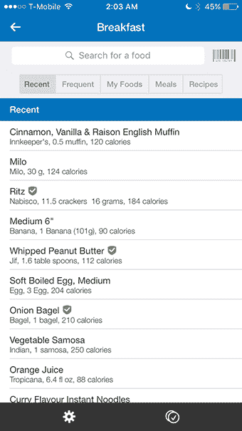

理解用户的动机和能力并设计合适的触发器只是成功的一半。触发器可以帮助用户采取行动，参与你的应用程序。但是他们在采取行动后的体验对于决定用户是否想要再次采取行动是至关重要的。

为了创造形成习惯的产品，我们还需要了解用户如何因采取某些行动而获得奖励，以及我们如何调整这些奖励来让用户重复这一行动。