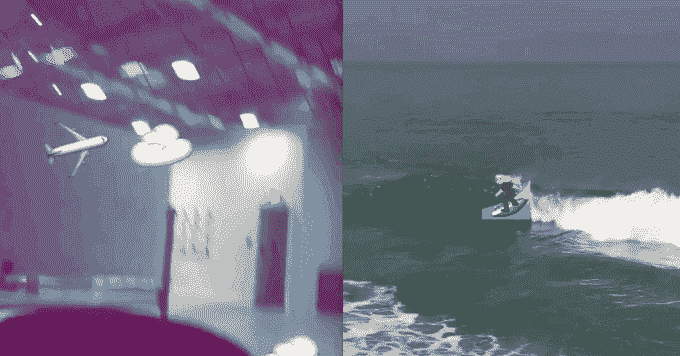

# Snapchat 通过 3D 贴纸增强真实性 

> 原文：<https://web.archive.org/web/https://techcrunch.com/2016/04/13/how-to-use-snapchat-3d-stickers/>

# Snapchat 通过 3D 贴纸增强了真实性

今天 Snapchat 发布了新的 3D 贴纸，可以贴在视频中的物体上，无论它们或你的相机如何移动，都可以贴在上面。当你的宠物四处走动时，给它添加一个表情符号，或者当你放大时，给它一个月亮太阳镜。

通过将增强现实带给大众，3D 贴纸可以释放新的创造力。他们今天在 Android 上推出，很快就会在 iOS 上推出。要使用它们，只需录制一段视频，点击屏幕顶部的贴纸按钮，将贴纸放在要贴的物体上，然后长按贴纸。

那么 Snapchat 是如何开发出这个很酷的新功能的呢？该公司拒绝告诉我更多的是他们的团队内部开发的。

但是经过一些研究，我了解到 Snapchat 最近挖走了 [Vuforia](https://web.archive.org/web/20230120235958/https://developer.vuforia.com/) 的工程副总裁 Eitan Pilipski ，这是一项增强现实技术，拥有“将体验与环境中特定事物联系起来的能力”这正是 3D 贴纸的作用。你可以在这个视频中看到 Vuforia 的技术将 Viewmaster 点粘贴到风景上。

https://youtu.be/rohLgtLQrK4?t = 45s 秒

通过使用机器视觉来识别视频中的不同对象，Snapchat 可以在它们移动时跟踪它们，并保持贴纸同步。我问过 Snapchat 接下来是否会推出 3D 绘图，但该公司不愿透露其计划。但是你可以想象这将如何让你通过在你的脸上画画并让涂鸦随着你移动来有效地创建你自己的动画镜头。

通过其动画镜头和现在的 3D 贴纸，Snapchat 正在推动视频应用的极限。当脸书仍在试图通过收购动画镜头制造商 MSQRD 来迎头赶上时，Snapchat 已经开始了下一项创新，可能会吸引青少年用户，让他们的社交媒体有些光彩。

