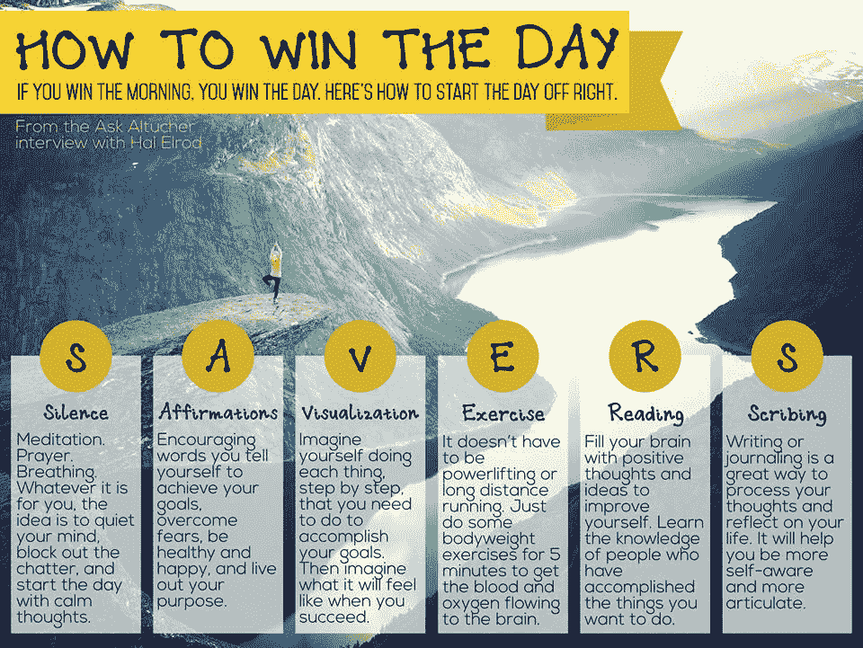

# 如何赢得胜利

> 原文：<https://web.archive.org/web/https://techcrunch.com/2015/07/25/how-to-win-the-day/>

詹姆斯·阿尔图彻撰稿人

More posts by this contributor

哈尔·埃尔罗德死了六分钟。他驾驶的汽车迎面撞上了一辆卡车。他的女朋友坐在他旁边，没有被抓伤。车顶切开了他的头部，造成脑损伤。

他脸部、手臂和全身的骨头都断了，昏迷了六天(在此期间，他的女朋友和他分手了)。当他从昏迷中醒来时，医生告诉他可能再也不能走路了。

你是你生命的炼金术士。宇宙，完美了 140 亿年，给了你茁壮成长所需的一切。然而，我们经常想要强行改变宇宙来满足我们自私的需求。真是白痴！

我肯定哈尔不想撞上那辆卡车。不想被告知他可能无法再行走。我不想因为这一次事件而经历多年的治疗和不幸。

这就是炼金术的用武之地。我们一生中都会有这样的机会。我们都被赋予了将不幸变成黄金的工具。

十五年后，哈尔做了父亲，经营着一家成功的企业，并且是《奇迹的早晨》[这本书的畅销书作者。](https://web.archive.org/web/20230326051057/http://www.amazon.com/The-Miracle-Morning-Not-So-Obvious-Guaranteed/dp/0979019710)

我喜欢播客的原因是因为我可以打电话给哈尔说“我能和你谈谈这本书吗？”所以几周前，我在“问”。多么伟大的骗局播客啊！

宇宙是矛盾的。它是无限开放的，然而我们无法逃避它。它 99.9999%是空的，但却充满了一切。原子完全随机地四处弹跳，然而却被最精确的方程式所定义。爱因斯坦说过“上帝不掷骰子”，然而每一刻都是不可预测的。

我们永远不会理解这种矛盾，也不应该去尝试。尝试导致了神话、误解、战争和痛苦。哈尔没有反抗宇宙对他的安排。他把恐惧和痛苦变成了钻石。

他现在称之为“奇迹早晨”的钻石是他一点一点拼凑起来拯救自己的生命。现在他用同样的方法拯救了成千上万人的生命。

我喜欢他的日常做法，因为它完全符合我所说的选择自己的“日常实践”:每天努力改善 1%的身体、情感、心理和精神健康。

在我和 Hal 谈过之后，我整理了这张描述他的方法的信息图。

当我们阅读事实而不是诗歌时，我们大脑的不同部分被激活。因为我们试图记住的事实…和诗歌，我们试图揭开文字与艺术混合的神秘。

我们是如此的无知和孤独，被这个浩瀚的世界，这个讲述了一切却没有揭示任何东西的故事所淹没。然而我们都在一起。

如果我们每时每刻都把生活中的事实变成诗歌会怎么样？放弃赋予意义的尝试，把我们所有的时期都变成问号？

做这些日常练习，或者奇迹般的晨间惯例，是我们开始揭开这个秘密的方式。也许这一件事是我唯一真正相信的事。剩下的…我是大眼刚出生想学。

我小时候，我祖父常对我说，“如果宇宙有尽头，那另一边是什么？”他会不停地重复，因为我们都想弄明白。我绞尽脑汁想这个问题，因为没有答案。但它乞求一个。

我从未像哈尔那样死去。也许这是不理智的，但我有点嫉妒他这样做。死了的人余生都有一个故事。今天早上我要准备去死。今天早上，这就是我的生活方式。

*听我和哈尔·埃尔罗德[的播客](https://web.archive.org/web/20230326051057/http://traffic.libsyn.com/askaltucher/AA20Ep294.mp3)。*