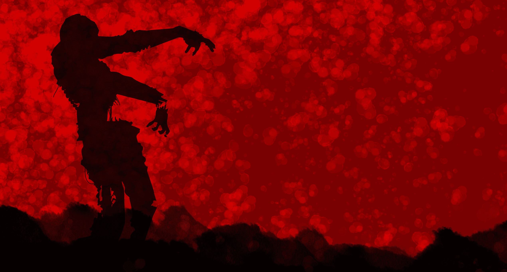

# 风险投资激励如何促进僵尸公司

> 原文：<https://web.archive.org/web/https://techcrunch.com/2015/08/06/how-venture-capital-incentives-promote-zombie-companies/>

萨特维克坦特里撰稿人

萨特维克·坦特里是

[FormSwift](https://web.archive.org/web/20220901054220/http://www.formswift.com/)

，这是一个帮助组织实现无纸化的 SaaS 平台。

感觉就像每隔一天:又一家公司筹集了一大笔资金。

我们倾向于假设一家正在融资的公司一定经营得很好。然而，事实是，风险投资基金的激励驱使它们为那些早就应该倒闭的公司提供资金。

这些“僵尸公司”——真正被炒作的初创公司，以高估值筹集了大量资金，然后陷入停滞——是钱坑，最终导致整个基金的回报缩水，并从实际上推动大部分回报的高增长公司转移了宝贵的资本。

这些僵尸企业还损害了投资者的回报，降低了员工股票期权的价值，并误导公众对私有企业健康状况的认识。

## 僵尸走在我们中间

在最终出售或关闭之前，很难确定哪些公司是僵尸公司——高管和风投不想公开披露这一信息。也就是说，有一些公司可能会因为危险信号而落入僵尸类别。

例如，LivingSocial 经历了一轮“下跌”，将它的评估价值[从 57 亿美元转移到其中的近四分之一](https://web.archive.org/web/20220901054220/http://www.businessinsider.com/what-down-rounds-do-to-startups-2013-2)。下行轮次表明业务可能有问题，它们会削弱公司的士气和建立备份的动力。不足为奇的是，LivingSocial 的创始人 Tim O'Shaughnessy 在 LivingSocial 从亚马逊获得相当于“[紧急救助](https://web.archive.org/web/20220901054220/http://www.inc.com/minda-zetlin/5-business-lessons-from-livingsocials-tale-of-woe.html)”的资金后辞去了首席执行官一职。

另一个指标是关键管理人员的雇佣率和裁员率。几个月前刚刚筹集了 9000 万美元的食品初创公司 Hampton Creek 今年早些时候宣布将裁员近五分之一。大约在那个时候，也就是在 Hampton Creek 新任首席战略官阿里·帕托维(Ali Partovi)上任 9 天后离职近 6 个月后，其他几名员工也自愿离职。

虽然风险资本主义是建立在风险之上的，但当前的风险投资者薪酬结构并没有消除风险；它只是在一个更长的时期内传播，让它发展，直到结果可能是爆炸性的。尽管这种趋势令人不安，但在看到自己的投资失去关键员工之前，或者在另一个估值泡沫变得更加严重之前，风投们仍有时间扭转这种行为。

## 僵尸是如何复活的

为了理解是什么驱使风险资本家创造僵尸，我们需要看看他们是如何得到补偿的。风险投资家通常从基金业绩的上涨中获利 20-30%。当基金表现良好时，这种套利意义重大，并使风险投资的激励与其有限合伙人投资者(向风险投资捐款的人或组织)的激励完美结合。

然而，创投资本家也可以获得管理费，通常是筹集资金总额的 2-3 %,每年支付。一只管理着 10 亿美元的基金将产生 2000 万至 3000 万美元的管理费。这些都是不计业绩的薪酬。

当基金表现不佳时，风险投资家在套利上赚不到钱，但他们继续通过管理费获得丰厚的报酬，只要他们继续筹集新的基金。

> 风险投资的最大秘密是，对一只成功基金的最佳投资等于或超过该基金其余部分的总和。彼得·泰尔

风投通常每 2-4 年筹集一次新资金。然而，从历史上看，退出(清算)一项投资需要 [5-12 年](https://web.archive.org/web/20220901054220/http://www.flagcapital.com/media/26401/050915_venture_portfolio_management_-_age_of_unicorn_-_final.pdf)。为了在筹集资金时向潜在投资者传达基金的成功，风投们展示了他们投资组合公司的估值持续上升，这很好——如果这些数字没有被人为夸大的话。

如果一家企业表现不佳，合理的做法是停止向它砸钱，然后关闭它。如果风险投资公司这样做，在筹集下一轮资金时，它有法律义务向有限合伙人报告这一损失。

但如果风投选择让公司继续运营，僵尸就崛起了。

通过人为地维持公司的生存，风投可以告诉有限合伙人，公司的估值保持不变，甚至还在上升。它当然不想显示公司比投资时做得更差。因此，风投有时会不遗余力地保持估值虚高。

这导致僵尸公司依靠风险投资维持生存。该公司接受了一次又一次的资本注入，尽管它没有达到目标，这都是因为风投不愿意注销投资。

## 避免僵尸末日的选择

如果风投发现他们一直在维持一个僵尸企业，他们可以做三件事:出售、引入新的管理层或者将业务转向更好的方向。这些选择都不容易。然而，正确的方法可以阻止僵尸的末日。

科技企业家可以通过确定他们的“[本地最大值](https://web.archive.org/web/20220901054220/http://www.saastr.com/saas-acquisitions-if-you-sell-do-it-at-a-local-maximum/)”来尽自己的一份力量僵尸通常有一个估值，使其走上成为独角兽的轨道，但随后其团队没有执行，以当地最高价出售的机会错过了。

创始人必须考虑筹集资金的意义和期望，并评估它们是否实际可行。如果他们不是，那最好要么少融资，要么卖掉公司。这对每个人都有好处。

与此同时，有限合伙人应该极其密切地关注风险资本家如何获得报酬。风投公司赚的钱应该来自套利，而不是以有限合伙人为代价人为地最大化个人支出。但由于 95%的回报集中在前 5%的基金中，至少 90%的风投主要通过管理费获得补偿。

正如彼得·泰尔[所说](https://web.archive.org/web/20220901054220/http://www.fool.com/investing/general/2015/02/13/7-insights-for-investors-from-peter-thiels-zero-to.aspx)，“风险投资的最大秘密是，对一只成功基金的最佳投资等于或超过该基金其余部分的总和。”

这意味着风投需要在赢家身上花更多时间，更快地关闭输家。这不仅对公司创始人和员工公平，而且有助于获胜者获得更大的成功。但这只有在风险投资家停止试图给僵尸注入活力的情况下才会发生。