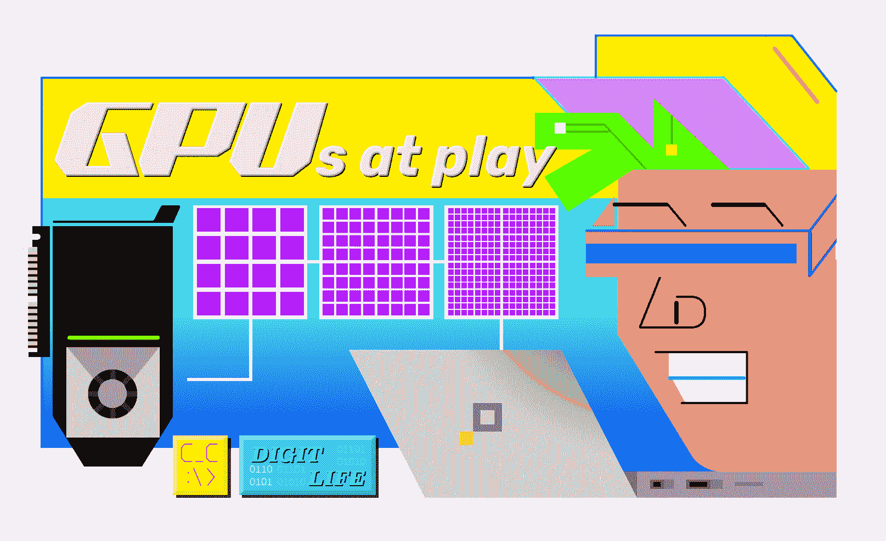

# 视频游戏技术如何让神经网络成为可能 

> 原文：<https://web.archive.org/web/https://techcrunch.com/2017/10/27/how-video-game-tech-makes-neural-networks-possible/>

[Ophir Tanz](https://web.archive.org/web/20230124042412/https://www.linkedin.com/in/ophirtanz/)

是的首席执行官

[GumGum](https://web.archive.org/web/20230124042412/http://gumgum.com/)

这是一家人工智能公司，在计算机视觉方面有着特殊的专长。GumGum 将其能力应用于各种行业，从广告到全球职业体育。Ophir 拥有卡内基梅隆大学的学士和硕士学位，目前居住在洛杉矶。

More posts by this contributor

坎布朗卡特撰稿人

[Cambron Carter](https://web.archive.org/web/20230124042412/https://www.linkedin.com/in/cambron-carter-5358a06a/)

领导图像技术团队

[GumGum](https://web.archive.org/web/20230124042412/http://www.gumgum.com/)

在那里，他为各种各样的应用设计计算机视觉和机器学习解决方案。Cambron 拥有路易斯维尔大学的物理和电气工程学士学位以及电气工程硕士学位。

More posts by this contributor

当 id Software 的约翰·卡马克在 1993 年发布《毁灭战士》时，他丝毫没有想到他那血淋淋的第一人称射击游戏——第一个以 3D 环境为特色的游戏之一，也是当时最受欢迎的游戏之一——会引发一场机器处理信息的革命。

六年后 ，Nvidia 发布了 GeForce 256，这是第一款专门为蓬勃发展的游戏行业制作 3D 图形的图形处理单元(GPU)。自那以来的 17 年里，GPU 不仅成为高端游戏的主要产品，这是其发展的最初主要原因，也是人工智能(AI)重大进步的驱动力。

由于越来越强大的 GPU 的诞生，深度机器学习和神经网络已经准备好改变社会的几乎每个方面——从我们从事的工作和驾驶的汽车到我们去看医生时得到的诊断。

在“神经网络的无数学指南”的第一([神经网络变得容易](https://web.archive.org/web/20230124042412/https://techcrunch.com/2017/04/13/neural-networks-made-easy/))和第二([为什么深度学习的未来取决于好的数据](https://web.archive.org/web/20230124042412/https://techcrunch.com/2017/07/21/why-the-future-of-deep-learning-depends-on-finding-good-data/))部分，我们分别解释了深度学习如何工作以及为什么数据对 AI 的成功如此重要。在本系列的第三部分中，我们将重点关注一些帮助迎来当今深度学习热潮的处理发展。首先，理解 GPU 和 CPU 工作方式的差异是有帮助的。

## GPU 与 CPU

到目前为止，您已经熟悉了术语“中央处理器”，即 CPU。计算机内部的大脑处理代码，允许它做任何事情，从计算数字到播放高清视频，再到无缝地同时运行几个程序。还记得那个没完没了的“Intel Inside”营销活动吗？这都是关于中央处理器。

但是 CPU 不是你电脑的唯一大脑。该机器还包含其他一些在特定任务中比 CPU 更好的硅片。其中最重要的是图形处理单元(GPU)。这些芯片在某些方面类似于中央处理器，但在其他方面有很大的不同。

大多数现代 CPU 有两到八个“核心”(本质上是迷你 CPU)，每个核心可以同时处理不同的操作。这些核心中的任何一个都可以处理你扔给它们的任何操作，并且它们可以在它们之间无缝切换。这就是为什么你可以一边看视频，一边下载软件，和你的好朋友聊天，而不会有任何打嗝的感觉。

想象一个杂技团演员在玩棒球、保龄球瓶、斧头、苹果和鸡蛋。偶尔，他会咬一口苹果，扔掉斧头，捡起燃烧的火把。那是一个 CPU，本质上是一个可以轻松进行多任务处理的万能工具。

相比之下，现代的 GPU 有成千上万个内核，但它们的设计要简单得多。每个内核只能做一件特定的事情，但它们可以在完全相同的时间，非常快速地，一遍又一遍地做这件事。

GPU 马戏团表演者只能处理保龄球瓶——但他一次可以玩 10，000 个，而 CPU 实际上无法处理那么多保龄球瓶，因为它忙于灵活和多任务处理。

这使得 GPU 非常适合需要大量重复功能的操作，例如在游戏环境中生成用于创建 3D 图形的数十亿个多边形。这也使它们成为训练神经网络的理想选择，神经网络必须在大量数据上反复运行相同的操作。

## 运行中的 GPU

GPU 通过每秒进行数十亿次复杂的数学计算来发挥其魔力。

视频游戏环境由微小的三角形组成，这些三角形以不同的方式组合起来，形成了你在屏幕上看到的土地、天空、山脉、宇宙飞船和眼睛瞪得大大的怪物。这些三角形由不同的数字组成，这些数字表示它们在环境中的位置、它们相对于其他三角形的角度、它们的颜色、纹理等等。GPU 处理这些数字，并在平板屏幕上将其转化为像素。每当屏幕刷新或场景发生变化时，即使是轻微的变化，GPU 也必须进行更多的数学运算来生成新的像素。这就是《使命召唤》或《侠盗猎车手》丰富的 3D 游戏环境的结局。

对于每秒 60 帧运行的高清显示器，GPU 必须一次生成 1.2 亿个像素。即使是非常强大的 CPU 也可能需要一两秒钟来绘制一个帧。但是，将工作分配给数千个 GPU 核心，所有核心同时运行，这几乎是瞬间发生的(这个过程被称为并行)。

不严格地说，这是雇用米开朗基罗在你的天花板上画一幅壁画，还是雇用数千名工匠，每个人负责一平方英寸的表面积。

GPU 的强大马力是 2010 年美国空军能够通过菊花链连接 1760 台索尼 PlayStation 3 游戏机来建造超级计算机的原因。当时，它是美国国防部最强大的计算机，但它比传统的超级计算机便宜 90%以上，只使用十分之一的电力。

## 公羊里的大象

使用 GPU 进行图像识别的工作过程正好相反。处理器不是将数字转换成图片，而是将图片转换成数字。

假设你建立了一个由数千个 GPU 组成的神经网络，每个 GPU 都有数千个核心——本质上是一台超级计算机。你想教这台超级计算机如何识别一头大象。利用一种被称为监督学习的方法，你首先要向网络输入成千上万张大象的图像，这些图像是从每个可以想象的角度拍摄的，每张都标有“大象”。该网络将绘制每张图像的每一条边缘、纹理、形状和颜色，试图识别与带有该标签的图像一致的数学模式。

在这一过程中，你可能会想放入不包含大象的图像，这样网络就不会得出它将看到的所有东西都是大象的结论。这有助于网络逐步调整其模型并提高其整体准确性。因此网络可以调整其模型并提高其精度。该网络将对每幅图像连续进行这一过程，并在每次新的过程中改进其大象搜索算法。

当你向你的超级计算机展示一张新图像时，它会预测这张图像实际上是否是厚皮动物。如果神经网络出错了，你就把它送回去进行更多的训练(这个过程被称为反向传播)。当它停止提高识别图像的能力时，训练就结束了。

最酷的是:你还没有告诉网络，大象有暗灰色的皮肤，长而灵活的鼻子，圆形的背和粗壮的腿。你刚才说，“这里有一堆叫做‘大象’的东西，去找出它们的共同点。”实际上，网络教会了自己大象长什么样。

## 摧毁数学的武器

GPU 如此擅长训练神经网络的一个原因是，它们擅长一种叫做矩阵乘法的东西，这意味着它们可以将一个数字表(比如图像某个部分的像素值)乘以另一个表(另一部分的值)。因为神经网络在很大程度上依赖于矩阵乘法，所以使用 GPU 大大减少了训练它们的时间——在某些情况下，从几个月或几周到几天甚至几个小时。

现代 GPU 往往有大量的板载内存，因此它们可以处理数字，而不必将数据来回传送到计算机的主内存，这是一项计算成本高昂的任务。这使得他们更快。它们也非常具有可扩展性；您投入的 GPU 越多，它们一次可以处理的计算就越多。它们是可编程的，因此您可以教它们执行不同的任务，如手写或语音识别。

## 弱小的人类

GPU 驱动的神经网络在识别图像中的事物方面有多好？他们比人强。2015 年，谷歌和微软都在年度 ImageNet 计算机视觉挑战赛中设计了比人类更准确识别图像中事物的深度神经网络。图形芯片制造商 nVidia 声称在短短三年内使用 GPU 将训练神经网络[的速度提高了 50 倍](https://web.archive.org/web/20230124042412/https://blogs.nvidia.com/blog/2016/01/12/accelerating-ai-artificial-intelligence-gpus/)。

GPU 进步这么快的原因:钱。在全球范围内，视频游戏去年带来了 1000 亿美元的收入，超过了电影、音乐和书籍的总和。游戏惊人的盈利能力允许对 GPU 和其他技术的研发进行大量投资。去年， [Nvidia 花费超过 20 亿美元开发了一个 GPU](https://web.archive.org/web/20230124042412/https://www.technologyreview.com/s/601195/a-2-billion-chip-to-accelerate-artificial-intelligence/) ，专门用于深度神经网络，而谷歌和其他公司正在开发新的[张量处理单元](https://web.archive.org/web/20230124042412/https://en.wikipedia.org/wiki/Tensor_processing_unit)，专门用于神经网络，可以有效地处理更多的数据。

这种投资在一些领域获得了回报，远远超出了青少年紧张不安的拇指。谷歌使用 [GPU 驱动的神经网络来识别 Android](https://web.archive.org/web/20230124042412/https://www.wired.com/2015/12/facebook-open-source-ai-big-sur/) 中的语音命令，并翻译谷歌地图中的外国街道标志。脸书用它们来识别你朋友的面孔，并定制你的新闻源。神经网络为一些无人驾驶汽车提供了智能，使它们能够从树上辨别停车标志。它们帮助诊断医生在核磁共振成像中“看到”肿瘤和健康组织之间的差异，并检测癌症的早期预警信号。他们能够定位核电站部件中的裂缝。

他们也很擅长玩超级粉碎兄弟游戏。

有一天，由 GPU 驱动的深度神经网络实现的发现可能会救你的命，这是第一人称射击游戏的一个令人印象深刻(尽管具有讽刺意味)的副产品。